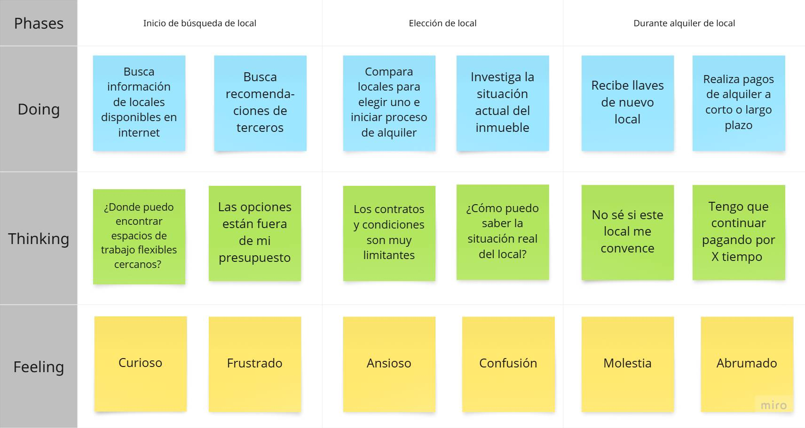
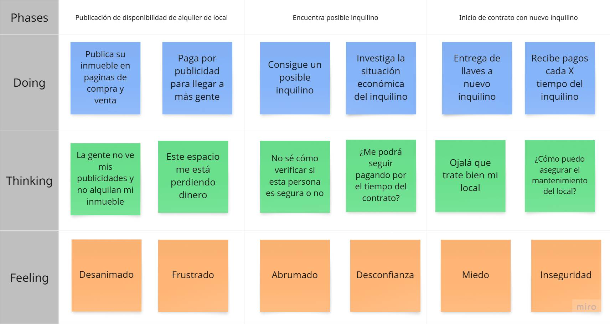

 # **COURSE PROJECT**

  

<strong>Universidad Peruana de Ciencias Aplicadas</strong>

<strong>Ingeniería de Software</strong> 
Aplicaciones Web  
<strong>Profesor:</strong> Naldo Reupo-Masayon Gastulo

<h2 align="center">INFORME</h2>

<h3 align="center">Startup: WorkStation</h3>

<strong>Producto:</strong>

<h3 align="center">Team Members:</h3>

| **Member**                           | **Code**     |
|--------------------------------------|--------------|
| Rodrigo Liberato Saldaña      | U202215623  |
|Emilia Durán Santander         | U201914541  |
|Jeremy Quijada Magro           | U202219657  |
|Sandro Dinklange Arevalo       | U202313419  |
|Jorge Luis Díaz Fiestas      |  U20231D534  |
|Sebastián Gutarra Velapatiño   | U20241A314  |

<strong>Abril 2025</strong>

# Registro de Versiones del Informe

| Versión | Fecha       | Autor(es)                                                                                                  | Descripción de la modificación                                                                                                                                                       |
|---------|-------------|------------------------------------------------------------------------------------------------------------|---------------------------------------------------------------------------------------------------------------------------------------------------------------------------------------|
| TB1     |   |  | |                                                                                     |

# Project Report Collaboration Insights

TB1: 

# Student Outcome
| Criterio específico                                                                                 | Acciones realizadas | Conclusiones |
|------------------------------------------------------------------------------------------------------|---------------------|--------------|
| **Trabaja en equipo para proporcionar liderazgo en forma conjunta**                                          |              |
| **Crea un entorno colaborativo e inclusivo, establece metas, planifica tareas y cumple objetivos.**                           |                     |              |
|                                                                                                      |                     |              |

# Contenido
- [Registro de Versiones del Informe](#registro-de-versiones-del-informe)
- [Project Report Collaboration Insights](#project-report-collaboration-insights)
- [Student Outcome](#student-outcome)

## Capítulo I: Introducción
- [1.1 Start-up Profile](#11-start-up-profile)
  - [1.1.1. Descripción de la Startup](#111-descripción-de-la-startup)
  - [1.1.2. Perfiles de integrantes del equipo](#112-perfiles-de-integrantes-del-equipo)
- [1.2. Solution Profile](#12-solution-profile)
  - [1.2.1 Antecedentes y problemática](#121-antecedentes-y-problemática)
  - [1.2.2 Lean UX Process](#122-lean-ux-process)
    - [1.2.2.1. Lean UX Problem Statements](#1221-lean-ux-problem-statements)
    - [1.2.2.2. Lean UX Assumptions](#1222-lean-ux-assumptions)
    - [1.2.2.3. Lean UX Hypothesis Statements](#1223-lean-ux-hypothesis-statements)
    - [1.2.2.4. Lean UX Canvas](#1224-lean-ux-canvas)
- [1.3. Segmentos objetivo](#13-segmentos-objetivo)

## Capítulo II: Requirements Elicitation & Analysis
- [2.1. Competidores](#21-competidores)
  - [2.1.1. Análisis competitivo](#211-análisis-competitivo)
  - [2.1.2. Estrategias y tácticas frente a competidores](#212-estrategias-y-tácticas-frente-a-competidores)
- [2.2. Entrevistas](#22-entrevistas)
  - [2.2.1. Diseño de entrevistas](#221-diseño-de-entrevistas)
  - [2.2.2. Registro de entrevistas](#222-registro-de-entrevistas)
  - [2.2.3. Análisis de entrevistas](#223-análisis-de-entrevistas)
- [2.3. Needfinding](#23-needfinding)
  - [2.3.1. User Personas](#231-user-personas)
  - [2.3.2. User Task Matrix](#232-user-task-matrix)
  - [2.3.3. User Journey Mapping](#233-user-journey-mapping)
  - [2.3.4. Empathy Mapping](#234-empathy-mapping)
  - [2.3.5. As-is Scenario Mapping](#235-as-is-scenario-mapping)
- [2.4. Ubiquitous Language](#24-ubiquitous-language)

## Capítulo III: Requirements Specification
- [3.1. To-Be Scenario Mapping](#31-to-be-scenario-mapping)
- [3.2. User Stories](#32-user-stories)
- [3.3. Impact Mapping](#33-impact-mapping)
- [3.4. Product Backlog](#34-product-backlog)

## Capítulo IV: Product Design
- [4.1. Style Guidelines](#41-style-guidelines)
  - [4.1.1. General Style Guidelines](#411-general-style-guidelines)
  - [4.1.2. Web Style Guidelines](#412-web-style-guidelines)
- [4.2. Information Architecture](#42-information-architecture)
  - [4.2.1. Organization Systems](#421-organization-systems)
  - [4.2.2. Labeling Systems](#422-labeling-systems)
  - [4.2.3. SEO Tags and Meta Tags](#423-seo-tags-and-meta-tags)
  - [4.2.4. Searching Systems](#424-searching-systems)
  - [4.2.5. Navigation Systems](#425-navigation-systems)
- [4.3. Landing Page UI Design](#43-landing-page-ui-design)
  - [4.3.1. Landing Page Wireframe](#431-landing-page-wireframe)
  - [4.3.2. Landing Page Mock-up](#432-landing-page-mock-up)
- [4.4. Web Applications UX/UI Design](#44-web-applications-uxui-design)
  - [4.4.1. Web Applications Wireframes](#441-web-applications-wireframes)
  - [4.4.2. Web Applications Wireflow Diagrams](#442-web-applications-wireflow-diagrams)
  - [4.4.2. Web Applications Mock-ups](#442-web-applications-mock-ups)
  - [4.4.3. Web Applications User Flow Diagrams](#443-web-applications-user-flow-diagrams)
- [4.5. Web Applications Prototyping](#45-web-applications-prototyping)
- [4.6. Domain-Driven Software Architecture](#46-domain-driven-software-architecture)
  - [4.6.1. Software Architecture Context Diagram](#461-software-architecture-context-diagram)
  - [4.6.2. Software Architecture Container Diagrams](#462-software-architecture-container-diagrams)
  - [4.6.3. Software Architecture Components Diagrams](#463-software-architecture-components-diagrams)
- [4.7. Software Object-Oriented Design](#47-software-object-oriented-design)
  - [4.7.1. Class Diagrams](#471-class-diagrams)
  - [4.7.2. Class Dictionary](#472-class-dictionary)
- [4.8. Database Design](#48-database-design)
  - [4.8.1. Database Diagram](#481-database-diagram)

  ## Capítulo V: Product Implementation, Validation & Deployment
- [5.1. Software Configuration Management](#51-software-configuration-management)
  - [5.1.1. Software Development Environment Configuration](#511-software-development-environment-configuration)
  - [5.1.2. Source Code Management](#512-source-code-management)
  - [5.1.3. Source Code Style Guide & Conventions](#513-source-code-style-guide--conventions)
  - [5.1.4. Software Deployment Configuration](#514-software-deployment-configuration)
- [5.2. Landing Page, Services & Applications Implementation](#52-landing-page-services--applications-implementation)
  - [5.2.1. Sprint ](#52x-sprint)
    - [5.2.1.1. Sprint Planning n](#5211-sprint-planning-n)
    - [5.2.1.2. Sprint Backlog n](#52x2-sprint-backlog-n)
    - [5.2.1.3. Development Evidence for Sprint Review](#5213-development-evidence-for-sprint-review)
    - [5.2.1.4. Testing Suite Evidence for Sprint Review](#5214-testing-suite-evidence-for-sprint-review)
    - [5.2.1.5. Execution Evidence for Sprint Review](#5215-execution-evidence-for-sprint-review)
    - [5.2.1.6. Services Documentation Evidence for Sprint Review](#5216-services-documentation-evidence-for-sprint-review)
    - [5.2.1.7. Software Deployment Evidence for Sprint Review](#5217-software-deployment-evidence-for-sprint-review)
    - [5.2.1.8. Team Collaboration Insights during Sprint](#5218-team-collaboration-insights-during-sprint)

# Introduccion

# Capitulo 1

## 1.1 Start-Up Profile
### 1.1.1. Descripción de la Startup
  WorkStation es una aplicación web innovadora diseñada para facilitar la reserva eficiente de espacios de trabajo en oficinas compartidas. Su propósito es conectar a freelancers, trabajadores remotos, startups y empresas de todos los tamaños con espacios de coworking disponibles en su ciudad o alrededor del mundo.

  La plataforma permitirá a los usuarios buscar, comparar y reservar escritorios, salas de reuniones, oficinas privadas y otros recursos disponibles en tiempo real. Cada espacio contará con información detallada como ubicación, precios, horarios, disponibilidad, fotos, servicios incluidos (Wi-Fi, café, impresoras, etc.), y valoraciones de otros usuarios

  Considerando la flexibildad y la adaptabilidad como puntos esenciales para el crecimiento de las startups y los trabajos freelance, WorkStation brinda una solución que compite con la rigidez de los contratos tradicionales, y propone una instancia mucho más moderna para este espacio de trabajo que las empresas necesitan.

### 1.1.2. Perfiles de integrantes del equipo
| Foto                       | Alumno       | Descripción        |
|---------------------------|--------------|-------------------|
|   | Quijada Magro Jeremy Alexander |  |
|    | Liberato Saldana Rodrigo   | Estudiante de Ingenieria de software que planea en efocarse en Ciencia de datos y Ciberseguridad. Planeo dar apoyo en el grupo de manera activa y tomar el rol de lider para encaminar al equipo a cumplir la meta en comun, realizar un buen trabajo con nuestra propuesta.    |
|    |    |     |
|    |    |     |
|    |    |     |
|    |    |     |

## 1.2. Solution Profile

### 1.2.1 Antecedentes y problemática

- **Who (¿Quiénes son los involucrados?)**  
  Los principales usuarios son freelancers, trabajadores remotos, pequeñas empresas, startups y nómadas digitales que requieren espacios de trabajo profesionales, cómodos y flexibles sin necesidad de alquilar una oficina a largo plazo.  
  Además, los propietarios y administradores de espacios de coworking forman parte clave, ya que buscan visibilidad, gestión eficiente de sus reservas y captación de nuevos clientes.

- **What (¿Qué se necesita?)**  
  Se necesita una plataforma centralizada e intuitiva que permita a los usuarios buscar, comparar, reservar y pagar por espacios de coworking en diferentes ubicaciones, con información clara y disponibilidad en tiempo real.  
  Actualmente, el proceso de reserva suele ser manual, lento y disperso en múltiples canales no estandarizados (webs propias, redes sociales, WhatsApp, etc.).

- **Where (¿Dónde ocurre el problema?)**  
  En ciudades con alta actividad profesional y creciente demanda por espacios flexibles, como Lima, Arequipa, Medellín, Bogotá o CDMX. La necesidad puede extenderse a nivel nacional e internacional a medida que el trabajo remoto se consolida.

- **When (¿Cuándo surge esta necesidad?)**  
  La necesidad es continua y puede surgir en cualquier momento. Muchos usuarios requieren espacios por horas, días o semanas. Además, algunos necesitan soluciones de último minuto para reuniones o trabajo inmediato.

- **Why (¿Por qué existe esta necesidad?)**  
  El mundo laboral ha cambiado. La pandemia aceleró el trabajo remoto y la cultura freelance. Las personas necesitan trabajar en ambientes productivos y profesionales, pero sin compromisos de largo plazo. Sin embargo, no existe una solución eficiente y masiva que integre toda la oferta disponible y facilite el proceso de reserva.

- **How (¿Cómo se puede solucionar?)**  
  Mediante el desarrollo de una aplicación web llamada WorkStation, que permita a los usuarios explorar una variedad de espacios de coworking, visualizar disponibilidad, leer reseñas, aplicar filtros, hacer reservas en tiempo real y pagar desde una sola interfaz.

- **How Much (¿Cuánto costaría y cómo se monetiza?)**  
  Los precios varían según ciudad, tipo de espacio, servicios y duración. La plataforma podrá mostrar precios claros y actualizados. El modelo de negocio se sustentará en comisiones por reserva, planes de suscripción para coworking o membresías premium para usuarios frecuentes.

### Descripción de la Problemática
En los últimos años, el trabajo remoto y el modelo freelance han experimentado un crecimiento significativo en Perú y América Latina. Según Statista (2023), más del 20% de los trabajadores peruanos realiza actividades de forma independiente o remota, y esta tendencia continúa en aumento. Sin embargo, este cambio en la modalidad laboral no ha sido acompañado por soluciones tecnológicas que respondan de manera efectiva a las necesidades de espacio físico flexible, accesible y bien ubicado.

Por otro lado, el mercado de espacios coworking también ha crecido rápidamente en Lima, con más de 300 centros operando actualmente, especialmente en distritos como Miraflores, San Isidro y Surco (Andina, 2023). A pesar de esta expansión, muchos de estos espacios enfrentan dificultades para ocupar sus instalaciones de forma constante, especialmente en horarios valle o días con baja demanda. La mayoría de propietarios aún dependen de canales informales (WhatsApp, redes sociales o referidos) para captar nuevos usuarios, lo que limita su visibilidad y su capacidad para escalar comercialmente.

Esta desconexión entre la **alta demanda de espacios temporales de trabajo** y la **oferta disponible sin digitalización adecuada** genera ineficiencias notorias: usuarios que no encuentran espacios adecuados en tiempo real, y propietarios que pierden ingresos por no contar con una plataforma de reservas automatizada. Además, la falta de sistemas de gestión y comparación centralizada crea una experiencia fragmentada, poco confiable y lenta para ambas partes.

En este contexto, **WorkStation** surge como una solución tecnológica que busca cerrar esta brecha, permitiendo a freelancers, startups y profesionales acceder fácilmente a espacios de trabajo mediante una plataforma web intuitiva, al mismo tiempo que otorga a los propietarios herramientas de visibilidad, control de disponibilidad y generación de ingresos más eficientes.

### 1.2.2 Lean UX Process
#### 1.2.2.1. Lean UX Problem Statements
##### Dominio del Problema
El proyecto WorkStation se desarrolla en el dominio de los espacios de trabajo compartidos (coworking), una industria en expansión que responde a la evolución del trabajo remoto, el crecimiento del autoempleo y la economía de los servicios digitales. A pesar de esta expansión, la interacción entre la oferta (espacios disponibles) y la demanda (profesionales independientes o empresas en crecimiento) aún se encuentra fragmentada y desorganizada, especialmente en el mercado peruano, donde no existen plataformas digitales de gran alcance que faciliten esta conexión de manera eficiente.

#### Segmentos de Cliente
1. **Freelancers, startups y profesionales remotos**: Personas entre 22 y 40 años que requieren espacios de trabajo flexibles, temporales y bien ubicados. Este segmento prioriza la autonomía, la conectividad y la comodidad, y espera poder gestionar sus reservas de manera rápida y sencilla desde una plataforma digital.
2. **Propietarios o administradores de espacios coworking**: Emprendedores o pequeñas empresas que buscan visibilidad, gestión automatizada de reservas y canales efectivos para ocupar sus instalaciones durante todo el día. Muchos de estos propietarios no cuentan con sistemas digitales propios y dependen de medios manuales o redes sociales para captar usuarios.

#### Puntos de Dolor
- **Freelancers y startups**:
  - No encuentran una oferta centralizada y confiable de espacios disponibles.
  - Carecen de filtros que les permitan comparar opciones según ubicación, precio o servicios.
  - El proceso de reserva suele ser informal, poco transparente y lento.

- **Propietarios de coworkings**:
  - Alta dependencia de canales informales para captar clientes (WhatsApp, redes sociales).
  - Ausencia de herramientas para gestionar disponibilidad en tiempo real.
  - Pérdida de ingresos por falta de reservas constantes y baja visibilidad.

#### Brecha Detectada
En Perú, no existe actualmente una plataforma digital consolidada que conecte, en tiempo real, a freelancers y startups con espacios coworking disponibles. Esta brecha genera una experiencia ineficiente tanto para quienes buscan un lugar para trabajar como para quienes lo ofrecen. A diferencia de mercados como Estados Unidos o Europa —donde plataformas como LiquidSpace o Deskpass dominan el rubro, el ecosistema local aún carece de soluciones tecnológicas adaptadas al comportamiento y necesidades del mercado peruano.

#### Visión y Estrategia
**Visión**: Crear una plataforma web que actúe como un marketplace digital para espacios de coworking, brindando a los usuarios una experiencia de reserva ágil, confiable y personalizada, y a los propietarios una solución de gestión eficiente que maximice el uso de sus instalaciones.
**Estrategia**:
- Desarrollar un producto mínimo viable (MVP) que permita validar tempranamente la propuesta de valor.
- Enfocarse en la usabilidad, accesibilidad y confiabilidad de la plataforma.
- Establecer alianzas estratégicas con coworkings emergentes de Lima.
- Implementar un modelo de monetización basado en comisión por reserva, con herramientas analíticas para los propietarios.

#### Segmento Inicial
Para validar la propuesta de valor de WorkStation, se priorizará un segmento específico en la etapa inicial del proyecto:

- **Usuarios meta**: Freelancers y profesionales digitales entre 22 y 35 años, ubicados en Lima Metropolitana, que trabajan de forma remota o de manera independiente.
- **Aliados estratégicos**: Coworkings de tamaño pequeño a mediano, ubicados en distritos céntricos como Miraflores, Barranco y San Isidro, que no cuentan con plataformas propias de gestión o marketing digital.

#### 1.2.2.2. Lean UX Problem Assumptions

- **Asumimos que los usuarios requieren flexibilidad y comodidad en sus espacios de trabajo**
- **Asumimos que los propietarios de espacios de coworking necesitan mayor visibilidad y eficiencia en la gestión de reservas**
- **Asumimos que la búsqueda y reserva de espacios de coworking es un proceso fragmentado y poco confiable**
- **Asumimos que los usuarios están dispuestos a pagar por una solución eficiente y confiable**
- **Asumimos que la digitalización mejorará la eficiencia operativa de los espacios de coworking**

#### 1.2.2.3. Lean UX Problem Hypothesis Statements

- **Hipótesis 1: Si ofrecemos una plataforma centralizada y fácil de usar para reservar espacios de coworking, entonces los freelancers y pequeñas empresas preferirán utilizarla debido a la flexibilidad y la facilidad de acceso a diferentes opciones de trabajo.**

- **Hipótesis 2: Si los propietarios de espacios de coworking obtienen mayor visibilidad y una herramienta para gestionar eficientemente las reservas, entonces experimentarán un aumento en la ocupación de sus espacios y en la satisfacción de sus clientes.**

- **Hipótesis 3: Si los usuarios pueden comparar precios, ver disponibilidad en tiempo real y leer reseñas de otros usuarios, entonces tomarán decisiones de reserva con mayor rapidez y precisión, mejorando la experiencia del cliente.**

- **Hipótesis 4: Si la plataforma cobra una comisión por reserva o un modelo de membresía, entonces se generarán ingresos recurrentes tanto para los propietarios de los espacios como para la plataforma, incentivando la adopción de la herramienta.**

- **Hipótesis 5: Si se digitaliza el proceso de gestión de reservas, entonces los propietarios de espacios de coworking podrán reducir sus costos operativos y mejorar su rentabilidad a largo plazo.**

#### 1.2.2.4. Lean UX Problem Canvas

#### 1. Business Problem  
- La conexion entre las demandas crecientes de espacios trabajos flexibles y la oferta de coworkings está dividida. La mayoría de usuarios no cuentan con plataformas confiables así como los propietarios carecen de herramientas de gestión.
---
#### 2. Business Outcomes  
- Aumentar de los ingresos mediantes comisiones y membresías.
- Disminuir el tiempo promedio de búsqueda de reserva de espacios.
- Ayudar a miles de peruanos a buscar un lugar para trabajar garantizando mejores resultados.
---
#### 3. Users  
- Nustros clientes serán Freelancers y trabajadores remotos de entre 22 a 40 años que buscan habitaciones disponibles y acogedoras y con servicios como Wi-Fi, salas de reuniones.
- Startups y equipos pequeños que buscan espacio temporal para trabajos de colaboración o reuniones.
- Propietarios de coworking que desean captar más usuarios y administrar las reservas de manera efectiva.
---
#### 4. User Benefits  
- Los usuarios contarán con salas de trabajo para satisfacer sus necesidades especiales (precio, ubicación, servicios).
- Los propietarios logran más actividad con menos esfuerzos de rendimiento y no tendrán incertidumbres.
- Con respecto a los propietarios, se reservan con más frecuencia y recomendarán el servicio a otros.

---
#### 5. Solutions  
- Motor de búsqueda y filtrado de coworkings por ciudad, precio, servicios.
- Sistema de reservas con calendario en tiempo real.
- Panel para propietarios con gestión de disponibilidad, estadísticas, reseñas.
- Sistema de notificaciones (email, push) para recordatorios y confirmaciones.

---
#### 6. Hypotheses  
- Si centralizamos la oferta de coworkings, los usuarios ahorrarán tiempo y confiarán más en el proceso.

- Si los propietarios digitalizan su gestión de reservas, incrementarán su ocupación y reducirán su carga operativa.

- Si los usuarios pueden ver disponibilidad, precios y reseñas en tiempo real, tomarán decisiones más informadas y rápidas.

- Si cobramos comisiones por reserva o membresías premium, el modelo será rentable y sostenible.

- Si la plataforma es ágil y confiable, se convertirá en el canal principal de reserva para usuarios frecuentes.

---
#### 7. What’s the most important thing we need to learn first?  
- Primero necesitamos entender si los usuarios finales desean una plataforma de reserva centralizada, sus preferencias y necesidades para implementarlo y mejorar la experiencia.
- Necesitamos saber si les cómodo de usar ante otros métodos tradicionals.
---
#### 8. What’s the least amount of work we need to do to learn the next most important thing?  
- Realizar entrevistas, feedback además de pruebas de usabilidad para explorar la relevancia de las reservas de espacios de trabajo tanto para trabajadores como los propietarios.

## 1.3. Segmentos objetivo
En el proyecto nos enfocamos en dos segmentos principales de usuarios, directamente relacionados con el dominio del problema: los propietarios de espacios de coworking y los usuarios que buscan dichos espacios, como freelancers y startups. A continuación, se describen en detalle ambos perfiles.

### Propietarios de Inmuebles (Coworkings)
Corresponde a personas naturales o jurídicas que administran o alquilan espacios acondicionados para trabajo compartido, como oficinas, salas de reuniones, escritorios flexibles, entre otros.

#### Características Demográficas
- **Ubicación:** Principalmente zonas urbanas de alto flujo empresarial, como Miraflores, San Isidro, Surco (Lima).
- **Edad promedio de los administradores:** 30 a 55 años.
- **Nivel socioeconómico:** Medio-alto a alto.
- **Tipo de propiedad:** Empresas formales, pymes inmobiliarias o propietarios individuales.

#### Datos Relevantes
- En Lima existen más de 150 espacios de coworking activos (Andina, 2023).
- El 67% de estos espacios reporta dificultades para llenar su capacidad total, especialmente en horarios valle (CoworkIntel, 2022).
- La mayoría carece de una plataforma de reservas centralizada, y operan mediante WhatsApp, redes sociales o formularios web.

#### Necesidades Clave
- Mayor visibilidad de su espacio.
- Automatización del proceso de reservas.
- Optimización de la ocupabilidad de sus ambientes.
- Acceso a métricas sobre uso y satisfacción de clientes.

--
### Freelancers y Startups
Este grupo está compuesto por trabajadores independientes, equipos pequeños de desarrollo, marketing, diseño, entre otros, así como emprendedores en etapa inicial.

#### Características Demográficas
- **Edad:** Entre 20 y 40 años.
- **Ubicación:** Centros urbanos con alta conectividad.
- **Nivel educativo:** Técnico o universitario completo.
- **Ocupación:** Diseñadores, desarrolladores, consultores, creadores de contenido, equipos de startups.
- **Ingreso promedio mensual:** S/ 2,000 – S/ 5,000 (varía por actividad y clientes).

#### Datos Relevantes
- Se estima que más de 500,000 peruanos trabajan como freelancers (Statista, 2022), y esta cifra crece con el auge del trabajo remoto postpandemia.
- Según un estudio de WeWork (2021), el 78% de los trabajadores remotos en LATAM buscan espacios fuera de casa al menos una vez por semana.
- El 60% de los freelancers jóvenes en Lima considera los coworkings como espacios que fomentan productividad y networking (PUCP, 2023).

#### Necesidades Clave
- Acceso flexible a espacios profesionales sin necesidad de contrato a largo plazo.
- Precios accesibles, según uso (por horas o días).
- Información clara sobre servicios incluidos (wifi, café, salas, etc.).
- Reseñas de otros usuarios para tomar decisiones confiables.

# Capitulo 2
## 2.1. Competidores
**WeWork:**
WeWork, fundada en 2010 en Nueva York por Adam Neumann y Miguel McKelvey, empezó como una startup de espacios de coworking. Su modelo de negocio se basaba en alquilar oficinas a largo plazo, rediseñarlas como espacios colaborativos y flexibles, y alquilarlas a empresas, freelancers y emprendedores a corto plazo.

La compañía creció rápidamente, alcanzando una valoración de $47 mil millones en 2019. Sin embargo su estruendoso intento de salir a la bolsa fracaso debido a la mala gestión y al modelo insostenible que la compañía tenia, además uno de sus fundadores renuncio. Todo esto llevo que WeWork a declararse en bancarrota en noviembre de 2023. Actualmente, bajo la nueva dirección de SoftBank, busca reestructurarse y enfocarse en rentabilidad.

**Spaces:**
Spaces fue fundada en 2008 en Ámsterdam (Países Bajos) como una marca de espacios de coworking y oficinas flexibles, enfocada en diseño innovador y comunidad. En 2016, fue adquirida por IWG plc, lo que le permitió expandirse globalmente con mayor respaldo financiero.

**CoWorker:**

Coworker.com es una plataforma global de búsqueda y comparación de espacios de coworking, fundada en 2015 por Leanne Beesley y Sam Marks . A diferencia de WeWork o Spaces, Coworker no opera sus propios espacios, sino que funciona como un marketplace que conecta a usuarios con miles de espacios de coworking en todo el mundo.

La plataforma surgió para resolver un problema clave: la falta de transparencia y acceso a información sobre espacios de trabajo flexibles. Hoy, Coworker.com lista más de 20,000 espacios en 170+ países, ofreciendo reseñas, precios y disponibilidad en tiempo real.

**Oficinas YA!**

Oficinas YA! es una plataforma líder en América Latina especializada en la búsqueda, comparación y arrendamiento de oficinas y espacios de coworking. Fue fundada en 2015 en México y se ha expandido a otros países como Colombia, Argentina y Chile, con un enfoque en facilitar el proceso de encontrar espacios de trabajo flexibles para empresas y profesionales.

### 2.1.1. Análisis competitivo

| **Competitive Analysis Landscape**        |                                                                                                                                                                                                                                                    |
| ----------------------------------------- | -------------------------------------------------------------------------------------------------------------------------------------------------------------------------------------------------------------------------------------------------- |
| **¿Por qué llevar a cabo este análisis?** | **Escriba en el recuadro la pregunta que busca responder o el objetivo de este análisis.**                                                                                                                                                         |
|                                           | **Identificar que ventajas comerciales podemos obtener por parte de nuestros competidores. Funcionalidades, estrategias de marketing o productos que podriamos agregar, Gracias a esto lograr ser un competidor estable frente a estas companias** |

| ***Competidor***          |                                                             | WorkStation                                                                                                                                                                                                                                                                                                                                                                                                                                                                                                                                        | WeWork                                                                                                                                                                                                                                                                                                       | Spaces                                                                                                                                                                                                                 | Coworker                                                                                                                                                                                                                                                                                                                                                                                                                                                                                                                      | Oficinas Ya!                                                                                                                                                                                                                                                                                              |
| ------------------------- | ----------------------------------------------------------- | -------------------------------------------------------------------------------------------------------------------------------------------------------------------------------------------------------------------------------------------------------------------------------------------------------------------------------------------------------------------------------------------------------------------------------------------------------------------------------------------------------------------------------------------------- | ------------------------------------------------------------------------------------------------------------------------------------------------------------------------------------------------------------------------------------------------------------------------------------------------------------ | ---------------------------------------------------------------------------------------------------------------------------------------------------------------------------------------------------------------------- | ----------------------------------------------------------------------------------------------------------------------------------------------------------------------------------------------------------------------------------------------------------------------------------------------------------------------------------------------------------------------------------------------------------------------------------------------------------------------------------------------------------------------------- | --------------------------------------------------------------------------------------------------------------------------------------------------------------------------------------------------------------------------------------------------------------------------------------------------------- |
| ***Logo***                |                                                             |                                                                                                                                                                                                                                                                                                                                                                                                                                                                                                            |                                                                                                                                                                                                                                                                          |                                                                                                                                                                                      | |                                                                                                                                                                                                                                                                                                        |
| ***Perfil***              | Overview                                                    | Una aplicación web y móvil que ofrece servicios de su arrendaciones a empresas, freelances o startups a nivel mundial.                                                                                                                                                                                                                                                                                                                                                                                                                             | Una aplicación web y móvil que ofrece servicios de su arrendaciones a empresas, freelances o startups a nivel mundial.                                                                                                                                                                                       | Una aplicación web y móvil que ofrece servicios de su arrendaciones a empresas, freelances o startups a nivel mundial.                                                                                                 | Una aplicación web y móvil que ofrece servicios de su arrendaciones a empresas, freelances o startups a nivel mundial.                                                                                                                                                                                                                                                                                                                                                                                                        | Una aplicación web y móvil que ofrece servicios de su arrendaciones a empresas, freelances o startups a nivel mundial.                                                                                                                                                                                    |
|                           | ***Ventaja competitiva ¿Qué valor ofrece a los clientes?*** | Su propósito es conectar a freelancers, trabajadores remotos, startups y empresas de todos los tamaños con espacios de coworking disponibles en su ciudad o alrededor del mundo. La plataforma permitirá a los usuarios buscar, comparar y reservar escritorios, salas de reuniones, oficinas privadas y otros recursos disponibles en tiempo real. Cada espacio contará con información detallada como ubicación, precios, horarios, disponibilidad, fotos, servicios incluidos (Wi-Fi, café, impresoras, etc.), y valoraciones de otros usuarios | Además de servicios básicos como internet de alta velocidad, oficinas en buen estado, impresoras y cafetería ilimitada, también posee espacios flexibles y con diseños modernos, una comunidad global que permite el acceso a evento, networking y acceso a que los miembros del equipo conecten fácilmente. | Posee contratos cortos, membresías mensuales o planes flexibles que beneficien a los clientes. Oficinas con servicios adicionales, ergonómicos y decoración innovadora que ha resaltado al ganar un premio sobre eso.  | Sus funcionalidades mas resaltantes son la búsqueda inteligente que permite a los usuarios buscar y comprar precios de espacios coworking al rededor de mas de 170 paises. Ofrecen un sistema de reseñas y ratings para la comunidad. Asimismo brindan recursos para nómadas digitales, cómo guías de las ciudades de los mejores espacios coworking e información de visas o papeleo. Por ultimo, da la opción de una membresía llamada "Coworker Pass" que brinda acceso casi ilimitado a espacios y descuentos exclusivos. | Busqueda avanzada, como filtros o tipos de espacios. Asimismo birnda una visualizacion de fotos y videos 360. Ofrece oficinas virtuales, que brindan serivicio de gestion de correo y atencion personalizada de llamadas. UNa gran Flexibilidad de contratos desde horas hasta meses sin compromisos.  |
| ***Perfil de Marketing*** | ***Mercado objetivo***                                      | Startups, emprendedores, freelancers, nomadas digitales o empresas tradicionales. Ademas de propietarios de inmuebles que deseen una optimizacion de ocupacion de sus ambientes.                                                                                                                                                                                                                                                                                                                                                                   | Startups, emprendedores, freelancers, nomadas digitales o empresas tradicionales.                                                                                                                                                                                                                            | Startups, emprendedores, freelancers, nómadas digitales.                                                                                                                                                               | Startups, emprendedores, freelancers, nómadas digitales o empresas tradicionales.                                                                                                                                                                                                                                                                                                                                                                                                                                             | Startups, emprendedores, freelancers, nómadas digitales o empresas tradicionales.                                                                                                                                                                                                                         |
|                           | ***Estrategias de marketing***                              | Las propuestas que tenemos como marketing son las siguientes; anunciar la aplicación web por Google ads y redes sociales como Facebook, Instagram o en grupos de Telegram de Freelancers o Startups.                                                                                                                                                                                                                                                                                                                                               | Se promocionan por redes sociales queriendo expandir su estilo de vida creativo e innovacion en su comunidad de trabajo. Asimismo tienen eventos gracias a sus alianzas estrategicas con Microsoft y Salesforce. Por ultimo, algunos anuncios en Google Ads y SEO.                                           | Contenido en redes sociales, alianzas estratégicas, enfoque de diseño y experiencia y eventos que llaman a los clientes rápidamente.                                                                             | La aplicación se promociona con optimización de búsquedas simples en el navegador, publica artículos y reportes acerca del coworking flexible, tiene una gran presencia en redes sociales y posee alianzas estratégicas con Selina, Outside o Airbnb for work.                                                                                                                                                                                                                                                                | Posee una presencia digital activa, con redes sociales y comunidades empresariales en Linkedin y Facebook. Tienen publicidad en Google Ads y remarketing. Por ultimo, tienen alianzas con espacios asociados en eventos conjuntos.                                                                        |
| ***Perfil de Producto***  | ***Productos & Servicios***                                 | Ofrecer la comunicación entre freelancers o startups con los propietarios de los inmuebles.                                                                                                                                                                                                                                                                                                                                                                                                                                                        | Ofrecen sus propias oficinas para el uso de cualquier empresa, startup o que su mercado objetivo necesite.                                                                                                                                                                                                   | Ofrecen sus propias oficinas para el uso de cualquier empresa, startup o que su mercado objetivo necesite.                                                                                                             | Ofrecen oficinas de cualquier parte del mundo para el uso de cualquier empresa, startup o que su mercado objetivo necesite.                                                                                                                                                                                                                                                                                                                                                                                                   | Ofrecen oficinas de cualquier parte del mundo para el uso de cualquier empresa, startup o que su mercado objetivo necesite.                                                                                                                                                                               |
|                           | ***Precios & Costos***                                      | Los precios variaran dependiendo de los propietarios, ellos decidirán el tiempo que puede estar disponible el inmueble y el precio. Asimismo, se incluirán descuentos dependiendo de las fechas o si alguno de las startups o freelancers posee una membresía con nuestra propuesta.                                                                                                                                                                                                                                                               | Los precios varian entre los diferentes paquetes que posee. Los escritorios compartidos varian entre $250 a $500. Mientras que las oficinas privadas desde $800 a $3000. Pero asimismo poseen planes de solo un dia, que varian entre $25 a $30.                                                             | Varian dependiendo de la ubicación, duracion del contrato o tipo de espacio. SIn embargo, Spaces posee una membrecia llamada "Spaces Global Pass" con acceso a multiples ubicaciones que varian desde $400 a $800.  | La búsqueda de espacios es gratuita y disponible para todos, sin embargo la membresía tiene un costo de $50 aproximadamente.                                                                                                                                                                                                                                                                                                                                                                                            | La empresa cobra a los espacios una comisión del 10-20%, dependiendo del costo del inmueble.                                                                                                                                                                                                           |
|                           | ***Canales de distribución (Web y/o Móvil)***               | Los canales que usan son su aplicacion web.                                                                                                                                                                                                                                                                                                                                                                                                                                                                                                        | Web/Móvil                                                                                                                                                                                                                                                                                                    | Los canales que usan son su aplicacion web y movil. Asimismo tienen ventas B2B, aliados coorporativos cmom aceleradoras, bancos y gremios empresariales.                                                               | Los canales que usan son su aplicacion web y movil. Sus redes de afiliados, como sus socios apoyan su distribucion.                                                                                                                                                                                                                                                                                                                                                                                                           | Los canales que usan son una aplicación web y móvil que ofrece servicios de su arrendaciones a empresas, freelances o startups a nivel mundial. Agentes telefónicos y aliados comerciales con inmobiliarias y desarrolladores de oficinas.                                                                |
| ***Análisis SWOT***       | ***Fortalezas***                                            | Startup innovadora, precios flexibles, diseno innovador y modelo escalable para futuras actualizaciones.                                                                                                                                                                                                                                                                                                                                                                                                                                           | Marca reconocida globalmente, flexibilidad y escalabilidad, red de comunidades profesionales y diseño innovador                                                                                                                                                                                              | Respaldo de IWG (solvencia financiera), diseño premium y experiencia de usuario, red global con sinergias (Regus, Signature) y modelo escalable y rentable                                                             | Modelo escalable sin costos de operar espacios físicos, base de datos global más amplia que competidores, ideal para nómadas digitales (mercado en crecimiento) y reseñas transparentes y comparación de precios                                                                                                                                                                                                                                                                                                              | Enfoque en Latinoamérica (conocimiento local), amplia red de espacios asociados, Asesoría personalizada sin costo y modelo sin costos fijos de operar espacios                                                                                                                                            |
|                           | ***Debilidades***                                           | Pocos fondos, sin alianzas poderosas, bajos conocimientos del mercado y competidores mas experimentados en el rubro,                                                                                                                                                                                                                                                                                                                                                                                                                               | Dependencia de arrendamientos caros, alto endeudamiento, mala gestión financiera histórica y perdida de confianza post-bancarrota                                                                                                                                                                            | Menor reconocimiento global vs. WeWork, precios más altos que competidores locales, menor enfoque en "comunidad" que WeWork y crecimiento más lento que startups independientes                                        | Dependencia de espacios asociados (calidad variable), menor reconocimiento frente a marcas como WeWork, ingresos limitados si no aumenta volumen de reservas y Competencia con plataformas de reservas de espacios (ej. Deskpass)                                                                                                                                                                                                                                                                                             | Menor reconocimiento fuera de la región, dependencia de la calidad de los espacios listados, Competencia con plataformas globales (Coworker.com) y rentabilidad limitada si no escala el volumen de transacciones                                                                                         |
|                           | ***Oportunidades***                                         | Expansion en un mercado emergente como lo seria Latino america, ideas frescas para revolucionar el mercado y futuras alianzas en camino.                                                                                                                                                                                                                                                                                                                                                                                                           | Modelo híbrido post-pandemia, expansión en mercados emergentes y alianzas con gobiernos para espacios públicos                                                                                                                                                                                               | Demanda de espacios híbridos post-pandemia, expansión en Asia y Latinoamérica y alianzas con grandes corporaciones                                                                                                     | Crecimiento del trabajo remoto y nómadas digitales, alianzas con gobiernos para promocionar destinos "workation" y expansión a mercados emergentes (Asia, Latinoamérica)                                                                                                                                                                                                                                                                                                                                                      | Crecimiento del trabajo híbrido en LATAM, alianzas con gobiernos para impulsar emprendimiento y expansión a ciudades secundarias con demanda creciente                                                                                                                                                    |
|                           | ***Amenazas***                                              | Competencia, pocos recursos que no se puedan recuperar a corto plazo y cambios en tendencias laborales.                                                                                                                                                                                                                                                                                                                                                                                                                                            | Competencia (Spaces o locales independientes), crisis económicas reducen demanda y cambios en tendencias laborales (remote-first)                                                                                                                                                                            | Competencia de WeWork (reestructurada) y actores locales, recesión económica afecta demanda de espacios premium y cambio hacia el trabajo remoto permanente                                                            | Espacios que prefieren vender directamente (evitar comisiones), plataformas más grandes (ej. Airbnb) integrando coworking y saturación de marketplaces de coworking                                                                                                                                                                                                                                                                                                                                                           | Espacios que prefieren gestionar reservas directamente, entrada de competidores globales (ej. WeWork), crisis económicas que reduzcan la demanda de oficinas                                                                                                                                              |

### 2.1.2. Estrategias y tácticas frente a competidores

| ***MATRIZ FODA y C.A.M.E***                                                   | **Oportunidades:** Modelo hibrido post pandemia                                                                                                                                               | **Amenazas:** posibles cambios a trabajo remoto permanentemente                                                                                                |
| ----------------------------------------------------------------------------- | --------------------------------------------------------------------------------------------------------------------------------------------------------------------------------------------- | -------------------------------------------------------------------------------------------------------------------------------------------------------------- |
| **Fortalezas:** Innovacion, publico objetivo más amplio y mayor escalabilidad | Debido al modelo hibrido podríamos expandirnos debido a que nuestro publico objetivo llega a ser mas amplio que otros competidores, además de poder innovar en este mercado no tan explorado. | Tener en cuenta que habran mas espacios libres para otros rubros, por lo que se podrian usar de maneras diferentes en otras actividades que puedan ser utiles. |
| **Debilidades:** Sin alianzas poderosas como los competidores.                | Utilizar la oportunidad de modelo hibrido para promocionar nuestra aplicación a otras y así poder formar alianzas que puedan apoyar al crecimiento de nuestra startup                         | Debido al posible cambio a trabajo remoto permanente, las alianzas que se puedan tener en un futuro pueden seguir utilizandolas para otros rubros.             |

## 2.2. Entrevistas
### 2.2.1. Diseño de entrevistas 
**PROPIETARIOS DE INMUEBLES**
- 1. Nombre completo
- 2. Edad
- 3. Distrito de residencia
- 4. Profesión
- 5. Actualmente, ¿tiene propiedades adicionales disponibles o sin uso en su vivienda actual?
- 6. ¿Qué hace con esa(s) propiedad(es)? ¿Tiene algo planeado para hacer?
- 7. ¿Qué piensa de los alquileres de oficina como espacios de coworking?
- 8. ¿Qué opinaría de una aplicación que conecta a dueños de espacios en alquiler con empresas que buscan alquilar estos espacios? Estaría dispuesto(a) a usarla?
- 9.  Que beneficios le gustaría tener a usted dentro de el trato entre usted y la compañía que trabaje en la propiedad?
- 10. Que comportamientos o hábitos no estarían dispuesto(a) a aceptar de la compañía/startup que trabaje en su propiedad?
- 11. Que funcionalidades le gustaría que tenga esta aplicación web?
- 12. ¿De que manera buscaría hacer este espacio uno seguro para ambos?

**FREELANCERS/STARTUPS**
- 1. Nombre completo
- 2. Edad
- 3. Distrito de residencia
- 4. Profesión
- 5. Actualmente, ¿desde donde trabaja?
- 6.  Cree que el lugar donde trabajan afecta la productividad de su trabajo?
- 7. Que es lo que busca en un lugar de trabajo?
- 8. ¿Ha escuchado hablar de los espacios de coworking?
- 9. ¿Qué opinaría de alquilar un espacio destinado para trabajar?
- 10. ¿Qué opinaría de una aplicación que le ofrezca la posibilidad de conectarlo con varios de estos espacios disponibles?
- 11. Que funcionalidades cree que debería tener una aplicación como esta?
- 12. ¿De que manera buscaría hacer este espacio uno seguro para ambas partes?

### 2.2.2. Registro de entrevistas
**Segmento 1**
Enlace del video de la entrevista:

 

**Entrevistada:** Marjorie Luna Victoria  
**Edad:** 22 años  
**Ocupación:** Diseñadora gráfica  
**Ubicación:** Lima – Miraflores  
**Medio:** Meet  
**Entrevistador:** Jorge Díaz  

🎬 **Inicio del video:** 0:04  
⏱️ **Duración:** 3 minutos y 42 segundos

Enlace del video de la entrevista:

 

**Entrevistada:** Arlene Gutarra Velapatiño  
**Edad:** 22 años  
**Ocupación:** Estudiante de la carrera de Danza  
**Ubicación:** Lima – San Juan de Lurigancho  
**Medio:** Zoom  
**Entrevistador:** Sebastián Gutarra  

🎬 **Inicio del video:** 0:04  
⏱️ **Duración:** 6 minutos y 23 segundos

Entrevista a Propietario de inmuebles:

**Entrevistada:** Carlos Alfredo Juarez Adanaque  
**Link de la entrevista:** [Link](https://upcedupe-my.sharepoint.com/:v:/g/personal/u202215623_upc_edu_pe/EdU9VOslalpKiKT-t0m66gMBmi1Xhl03H6JkroZCMl3Img?nav=eyJyZWZlcnJhbEluZm8iOnsicmVmZXJyYWxBcHAiOiJPbmVEcml2ZUZvckJ1c2luZXNzIiwicmVmZXJyYWxBcHBQbGF0Zm9ybSI6IldlYiIsInJlZmVycmFsTW9kZSI6InZpZXciLCJyZWZlcnJhbFZpZXciOiJNeUZpbGVzTGlua0NvcHkifX0&e=JREsKE) 

**Entrevistada:** Alejandra Izaguirre  
**Link de la entrevista:** [Link](https://upcedupe-my.sharepoint.com/:v:/g/personal/u202215623_upc_edu_pe/EZQz2DANI71MkOrpc1fJq3EBIRLd8PZ4sQAEEFybRm3YOg?nav=eyJyZWZlcnJhbEluZm8iOnsicmVmZXJyYWxBcHAiOiJPbmVEcml2ZUZvckJ1c2luZXNzIiwicmVmZXJyYWxBcHBQbGF0Zm9ybSI6IldlYiIsInJlZmVycmFsTW9kZSI6InZpZXciLCJyZWZlcnJhbFZpZXciOiJNeUZpbGVzTGlua0NvcHkifX0&e=t6qB71) 

**Segmento 2**

**Link de la entrevista:** [Link-Entrevista](https://youtu.be/SHj6_AyGAPc) 
**Entrevistado:** Miguel Quijada 
**Edad:** 43 años  
**Ocupación:** Ingeniero de Software
**Ubicación:** Lima – Ate  
**Medio:** Zoom  
**Entrevistador:** Jeremy Quijada 

### 2.2.3. Análisis de entrevistas
## 2.3. Needfinding
### 2.3.1. User Personas

Para esta sección hemos tomado en cuenta dos User Persona que corresponden a los dos segmentos objetivos nombrados anteriormente: los propietarios de inmuebles y los trabajadores independientes.

### 2.3.2. User Task Matrix

Estamos considerando los segmentos objetivos "Propietario de Inmueble" y "Trabajador independiente" como fueron definidos anteriormente como User Persona

|                                  | **Propietario de Inmueble**        |                            | **Trabajador independiente**            |                            |
|----------------------------------|-------------------------------|----------------------------|------------------------------|----------------------------|
|  Tarea                           | Importancia                   | Frecuencia                 | Importancia                  | Frecuencia                 |
| Ofrecer su local                 | 🔴 Alta                       | 🔴 Frecuente              | ❌ N/A                       | ❌ N/A                    |
| Buscar espacios de trabajo       | ❌ N/A                       | ❌ N/A                     | 🔴 Alta                      | 🔴 Frecuente               |
| Comparar entre las opciones de espacios de trabajo   | 🟡 Media                     | 🔵 Rara              | 🔴 Alta                      | 🔴 Frecuente                    |
| Contactarse el trabajador con el propietario         | 🔴 Alta                      | 🟡 Ocasional               | 🔴 Alta                    | 🟡 Ocasional                     |
| Acordar precio y forma de pago           | 🔴 Alta                     | 🟡 Ocasional              | 🔴 Alta                      | 🟡 Ocasional                |
| Observar situación final del local       | 🟡 Media                     | 🟡 Ocasional               | 🟡 Media                      | 🟡 Ocasional                   |
| Recomendar la experiencia                | 🔵 Baja                       | 🔵 Rara                   | 🟡 Media                    | 🟡 Ocasional               |

### Leyenda:

Importancia
🔴 Alta
🟡 Media
🔵 Baja

Frecuencia
🔴 Frecuente
🟡 Ocasional
🔵 Rara

❌ N/A = No aplica para este usuario

Entre las tareas encontradas, la que ambos User Persona coinciden en que es importante y frecuente son tanto el contactarse mutuamente como el acordar precio y forma de pago, se debe a que ambos buscan que el préstamo del servicio se concrete y bajo condiciones favorables para ambos. Además, cada User Persona tiene su tarea particular: para el propietario es importante ofrecer su local y para el freelancer es importante buscar espacios de trabajo. Por último tenemos un tarea particular frecuente para el freelancer la cual es comparar diferentes ofertas de espacios de trabajo para ver lo que más se ajuste a su presupuesto y cuente con las características necesarias. Mientras que para el propietario, esto lo hace rara vez cuando desee ver qué precios ponen sus competidores.

### 2.3.3. User Journey Mapping

  

### 2.3.4. Empathy Mapping

  

### 2.3.5. As-is Scenario Mapping
**Freelancers**

**Propietarios de Inmuebles**

## 2.4. Ubiquitous Language
| Termino | Definición |
| ---- | ----------|
|Workspace|Un espacio físico disponible para alquiler como sitio de trabajo. |
|Coworking | Una modalidad de trabajo donde personas de distintas empresas comparten un mismo workspace.|
|Host | La persona que ofrece su propiedad en alquiler.|
|Renter| La persona que alquila este espacio.|
|Booking| Confirmación de un alquiler hecho por un Renter de un Workspace por un periodo de tiempo.|
|Rate| La tarifa por día o por semana para alquilar el Workspace.|
|Amenities| Adicionales que ofrezca el host como parte del Workspace. Por ejemplo, WiFi, café, aire acondicionado, etc.|
|Listing| La publicación de un Workspace disponible incluyendo detalles como ubicación, fotos, Rates y Amenities.|
|Check-in| El momento en que comienza el uso del Workspace|.
|Check-out| El momento en el que finaliza el uso del Workspace.|
|Cancellation| La anulación de una reserva, por parte de Host o Renter.|
|Contract| El contrato que se realiza entre Renter y Host.|
|Review| Las reseñas dadas del Renter al Host después del uso del Workspace, visibles para otros usuarios.|

# Capitulo 3
## 3.1. To-Be Scenario Mapping
## 3.2. User Stories
## 3.3. Impact Mapping
## 3.4. Product Backlog
# Capitulo 4
## 4.1. Style Guidelines
### 4.1.1. General Style Guidelines
### 4.1.2. Web Style Guidelines
## 4.2. Information Architecture
### 4.2.1. Organization Systems
### 4.2.2. Labeling Systems
### 4.2.3. SEO Tags and Meta Tags
### 4.2.4. Searching Systems
### 4.2.5. Navigation Systems
## 4.3. Landing Page UI Design
### 4.3.1. Landing Page Wireframe
### 4.3.2. Landing Page Mock-up
## 4.4. Web Applications UX/UI Design
### 4.4.1. Web Applications Wireframes
### 4.4.2. Web Applications Wireflow Diagrams
### 4.4.2. Web Applications Mock-ups
### 4.4.3. Web Applications User Flow Diagrams
## 4.5. Web Applications Prototyping
## 4.6. Domain-Driven Software Architecture
### 4.6.1. Software Architecture Context Diagram
### 4.6.2. Software Architecture Container Diagrams
### 4.6.3. Software Architecture Components Diagrams
## 4.7. Software Object-Oriented Design
### 4.7.1. Class Diagrams
### 4.7.2. Class Dictionary
## 4.8. Database Design
### 4.8.1. Database Diagram

# Capítulo 5
## 5.1 Software Configuration Management
### 5.1.1 Software Development Environment Configuration
### 5.1.2. Source Code Management.
### 5.1.3. Source Code Style Guide & Conventions.
### 5.1.4. Software Deployment Configuration.
## 5.2. Landing Page, Services & Applications Implementation.
### 5.2.1. Sprint 1
#### 5.2.1.1. Sprint Planning 1.
#### 5.2.1.2. Aspect Leaders and Collaborators.
#### 5.2.1.3. Sprint Backlog 1.
#### 5.2.1.4. Development Evidence for Sprint Review.
#### 5.2.1.5. Execution Evidence for Sprint Review.
#### 5.2.1.6. Services Documentation Evidence for Sprint Review.
#### 5.2.1.7. Software Deployment Evidence for Sprint Review.
#### 5.2.1.8. Team Collaboration Insights during Sprint.
