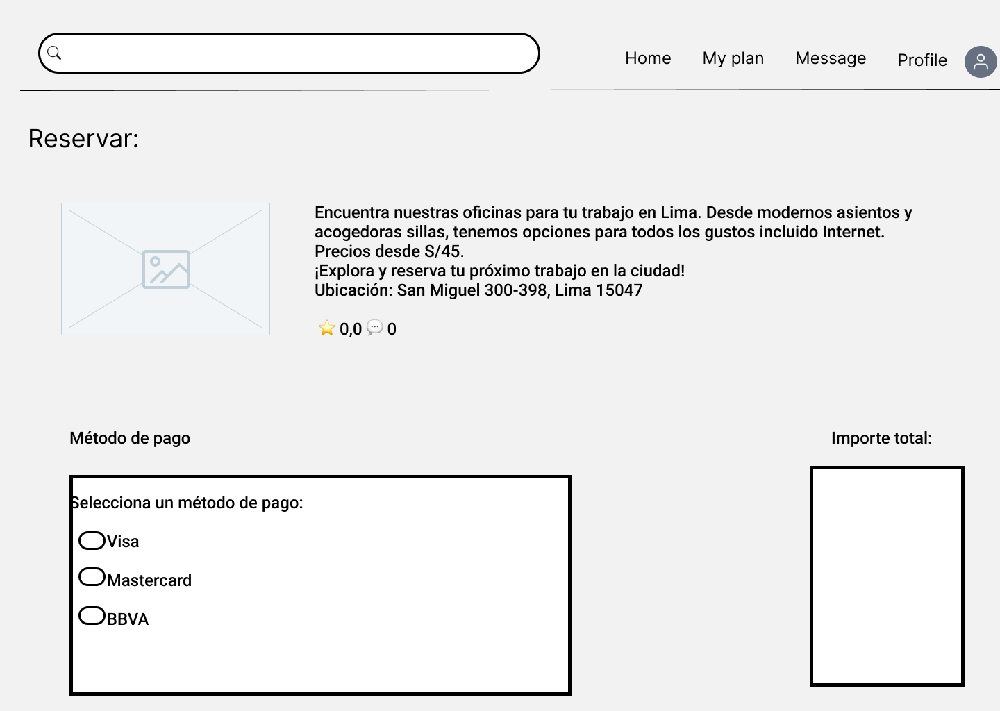
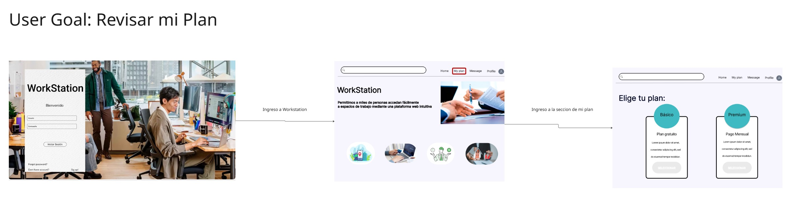
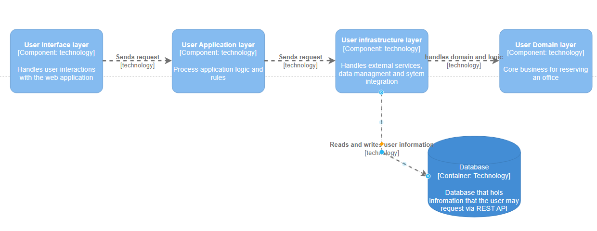
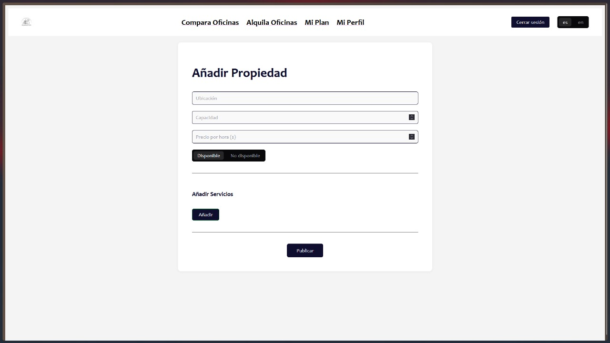

# **COURSE PROJECT**

<p align="center">
  
</p>

<p align="center"><strong>Universidad Peruana de Ciencias Aplicadas</strong></p>

<p align="center"><strong>Ingeniería de Software</strong><br>
Aplicaciones Web <br>
<strong>Profesor:</strong> Naldo Reupo-Masayon Gastulo</p>

<h2 align="center">INFORME</h2>

<h3 align="center">Startup: WorkStation</h3>
<p align="center"><strong>Producto: Worstation</strong></p>

<h3 align="center">Team Members:</h3>

<div align="center">

| **Member**                   | **Code**   |
| ---------------------------- | ---------- |
| Rodrigo Liberato Saldaña     | U202215623 |
| Emilia Durán Santander       | U201914541 |
| Jeremy Quijada Magro         | U202219657 |
| Sandro Dinklange Arevalo     | U202313419 |
| Jorge Luis Díaz Fiestas      | U20231D534 |
| Sebastián Gutarra Velapatiño | U20241A314 |

</div>

<p align="center"><strong>Abril 2025</strong></p>

# Registro de Versiones del Informe

| Versión | Fecha      | Autor(es)                                                                                        | Descripción de la modificación              |
| ------- | ---------- | ------------------------------------------------------------------------------------------------ | ------------------------------------------- |
| TB1     | 25-04-2025 | Liberato Rodrigo, Duran Emilia, Quijada Jeremy, Dinklange Sandro, Díaz Jorge y Gutarra Sebastian | Se completaron los 5 capítulos del reporte. |

# Project Report Collaboration Insights

TB1: 

# Student Outcome

| Criterio específico                                                                                 | Acciones realizadas                                                                                                                                                                                                                                                                      | Conclusiones                                                                                                                                            |
| --------------------------------------------------------------------------------------------------- | ---------------------------------------------------------------------------------------------------------------------------------------------------------------------------------------------------------------------------------------------------------------------------------------- | ------------------------------------------------------------------------------------------------------------------------------------------------------- |
| **Trabaja en equipo para proporcionar liderazgo en forma conjunta**                                 | **TB1:** Para completar el trabajo en equipo, el lider separo el contenido del reporte y las actividades que hacer semanalmente para mantener un avance continuo. De esta manera, comunicabamos nuestros avanaces semanalmente para no perder el ritmo ni la cohesion de nuestro trabajo | **TB1:** Trabajar de esta manera es eficiente, creemos que si seguimos de esta manera, seguiremos haciendo el trabajo de manera mas eficiente y eficaz. |
| **Crea un entorno colaborativo e inclusivo, establece metas, planifica tareas y cumple objetivos.** | **TB1:** Establecimos las metas semanales y planificamos las tareas de una manera justa para todos, donde no solo nos centrabamos en lo que sabiamos, sino en cosas por aprender conjuntamente.                                                                                          | **TB1:** Creemos que el trabajo resulto como esperabamos y esperamos mantener el mismo nivel para la entrega parcial.                                   |

# Contenido

- [Registro de Versiones del Informe](#registro-de-versiones-del-informe)
- [Project Report Collaboration Insights](#project-report-collaboration-insights)
- [Student Outcome](#student-outcome)

## Capítulo I: Introducción

- [1.1 Start-up Profile](#11-start-up-profile)
  - [1.1.1. Descripción de la Startup](#111-descripción-de-la-startup)
  - [1.1.2. Perfiles de integrantes del equipo](#112-perfiles-de-integrantes-del-equipo)
- [1.2. Solution Profile](#12-solution-profile)
  - [1.2.1 Antecedentes y problemática](#121-antecedentes-y-problemática)
  - [1.2.2 Lean UX Process](#122-lean-ux-process)
    - [1.2.2.1. Lean UX Problem Statements](#1221-lean-ux-problem-statements)
    - [1.2.2.2. Lean UX Assumptions](#1222-lean-ux-assumptions)
    - [1.2.2.3. Lean UX Hypothesis Statements](#1223-lean-ux-hypothesis-statements)
    - [1.2.2.4. Lean UX Canvas](#1224-lean-ux-canvas)
- [1.3. Segmentos objetivo](#13-segmentos-objetivo)

## Capítulo II: Requirements Elicitation & Analysis

- [2.1. Competidores](#21-competidores)
  - [2.1.1. Análisis competitivo](#211-análisis-competitivo)
  - [2.1.2. Estrategias y tácticas frente a competidores](#212-estrategias-y-tácticas-frente-a-competidores)
- [2.2. Entrevistas](#22-entrevistas)
  - [2.2.1. Diseño de entrevistas](#221-diseño-de-entrevistas)
  - [2.2.2. Registro de entrevistas](#222-registro-de-entrevistas)
  - [2.2.3. Análisis de entrevistas](#223-análisis-de-entrevistas)
- [2.3. Needfinding](#23-needfinding)
  - [2.3.1. User Personas](#231-user-personas)
  - [2.3.2. User Task Matrix](#232-user-task-matrix)
  - [2.3.3. User Journey Mapping](#233-user-journey-mapping)
  - [2.3.4. Empathy Mapping](#234-empathy-mapping)
  - [2.3.5. As-is Scenario Mapping](#235-as-is-scenario-mapping)
- [2.4. Ubiquitous Language](#24-ubiquitous-language)

## Capítulo III: Requirements Specification

- [3.1. To-Be Scenario Mapping](#31-to-be-scenario-mapping)
- [3.2. User Stories](#32-user-stories)
- [3.3. Impact Mapping](#33-impact-mapping)
- [3.4. Product Backlog](#34-product-backlog)

## Capítulo IV: Product Design

- [4.1. Style Guidelines](#41-style-guidelines)
  - [4.1.1. General Style Guidelines](#411-general-style-guidelines)
  - [4.1.2. Web Style Guidelines](#412-web-style-guidelines)
- [4.2. Information Architecture](#42-information-architecture)
  - [4.2.1. Organization Systems](#421-organization-systems)
  - [4.2.2. Labeling Systems](#422-labeling-systems)
  - [4.2.3. SEO Tags and Meta Tags](#423-seo-tags-and-meta-tags)
  - [4.2.4. Searching Systems](#424-searching-systems)
  - [4.2.5. Navigation Systems](#425-navigation-systems)
- [4.3. Landing Page UI Design](#43-landing-page-ui-design)
  - [4.3.1. Landing Page Wireframe](#431-landing-page-wireframe)
  - [4.3.2. Landing Page Mock-up](#432-landing-page-mock-up)
- [4.4. Web Applications UX/UI Design](#44-web-applications-uxui-design)
  - [4.4.1. Web Applications Wireframes](#441-web-applications-wireframes)
  - [4.4.2. Web Applications Wireflow Diagrams](#442-web-applications-wireflow-diagrams)
  - [4.4.2. Web Applications Mock-ups](#442-web-applications-mock-ups)
  - [4.4.3. Web Applications User Flow Diagrams](#443-web-applications-user-flow-diagrams)
- [4.5. Web Applications Prototyping](#45-web-applications-prototyping)
- [4.6. Domain-Driven Software Architecture](#46-domain-driven-software-architecture)
  - [4.6.1. Software Architecture Context Diagram](#461-software-architecture-context-diagram)
  - [4.6.2. Software Architecture Container Diagrams](#462-software-architecture-container-diagrams)
  - [4.6.3. Software Architecture Components Diagrams](#463-software-architecture-components-diagrams)
- [4.7. Software Object-Oriented Design](#47-software-object-oriented-design)
  - [4.7.1. Class Diagrams](#471-class-diagrams)
  - [4.7.2. Class Dictionary](#472-class-dictionary)
- [4.8. Database Design](#48-database-design)
  - [4.8.1. Database Diagram](#481-database-diagram)
  ## Capítulo V: Product Implementation, Validation & Deployment
- [5.1. Software Configuration Management](#51-software-configuration-management)
  - [5.1.1. Software Development Environment Configuration](#511-software-development-environment-configuration)
  - [5.1.2. Source Code Management](#512-source-code-management)
  - [5.1.3. Source Code Style Guide & Conventions](#513-source-code-style-guide--conventions)
  - [5.1.4. Software Deployment Configuration](#514-software-deployment-configuration)
- [5.2. Landing Page, Services & Applications Implementation](#52-landing-page-services--applications-implementation)

  - [5.2.1. Sprint 1 ](#521-sprint)

    - [5.2.1.1. Sprint Planning 1](#5211-sprint-planning-1)
    - [5.2.1.2. Aspect Leaders and Collaborators.](#5212-aspect-leaders-and-collaborators)
    - [5.2.1.3. Sprint Backlog 1](#5213-sprint-backlog-1)
    - [5.2.1.4. Development Evidence for Sprint Review](#5214-development-evidence-for-sprint-review)
    - [5.2.1.5. Execution Evidence for Sprint Review](#5215-execution-evidence-for-sprint-review)
    - [5.2.1.6. Services Documentation Evidence for Sprint Review](#5216-services-documentation-evidence-for-sprint-review)
    - [5.2.1.7. Software Deployment Evidence for Sprint Review](#5217-software-deployment-evidence-for-sprint-review)
    - [5.2.1.8. Team Collaboration Insights during Sprint](#5218-team-collaboration-insights-during-sprint)

  - [5.2.2. Sprint 2 ](#522-sprint-2)
    - [5.2.2.1. Sprint Planning 2](#5221-sprint-planning-2)
    - [5.2.2.2. Aspect Leaders and Collaborators.](#5222-aspect-leaders-and-collaborators)
    - [5.2.2.3. Sprint Backlog 2](#5223-sprint-backlog-2)
    - [5.2.2.4. Development Evidence for Sprint Review](#5224-development-evidence-for-sprint-review)
    - [5.2.2.5. Execution Evidence for Sprint Review](#5225-execution-evidence-for-sprint-review)
    - [5.2.2.6. Services Documentation Evidence for Sprint Review](#5226-services-documentation-evidence-for-sprint-review)
    - [5.2.2.7. Software Deployment Evidence for Sprint Review](#5227-software-deployment-evidence-for-sprint-review)
    - [5.2.2.8. Team Collaboration Insights during Sprint](#5228-team-collaboration-insights-during-sprint)

- [5.2.3. Sprint 3](#523-sprint-3)

  - [5.2.3.1. Spring Planning 3](#5231-spring-planning-3)
  - [5.2.3.2. Aspect Leaders and Collaborators](#5232-aspect-leaders-and-collaborators)
  - [5.2.3.3. Sprint Backlog 3](#5233-sprint-backlog-3)
  - [5.2.3.4. Development Evidence for Sprint Review](#5234-development-evidence-for-sprint-review)
  - [5.2.3.5. Execution Evidence for Sprint Review](#5235-execution-evidence-for-sprint-review)
  - [5.2.3.6. Services Documentation Evidence for Sprint Review](#5236-services-documentation-evidence-for-sprint-review)
  - [5.2.3.7. Software Deployment Evidence for Sprint Review](#5237-software-deployment-evidence-for-sprint-review)
  - [5.2.3.8. Team Collaboration Insights during Sprint](#5238-team-collaboration-insights-during-sprint)

- [5.3. Validation Interviews.](#53-validation-interviews)
  - [5.3.1. Diseño de Entrevistas.](#531-diseño-de-entrevistas)
  - [5.3.2. Registro de Entrevistas.](#532-registro-de-entrevistas)
  - [5.3.3. Evaluaciones según heurísticas.](#533-evaluaciones-según-heurísticas)
- [5.4. Video About-the-Product.](#54-video-about-the-product)

# Introduccion

# Capitulo 1

## 1.1 Start-Up Profile

### 1.1.1. Descripción de la Startup

WorkStation es una aplicación web innovadora diseñada para facilitar la reserva eficiente de espacios de trabajo en oficinas compartidas. Su propósito es conectar a freelancers, trabajadores remotos, startups y empresas de todos los tamaños con espacios de coworking disponibles en su ciudad o alrededor del mundo.

La plataforma permitirá a los usuarios buscar, comparar y reservar escritorios, salas de reuniones, oficinas privadas y otros recursos disponibles en tiempo real. Cada espacio contará con información detallada como ubicación, precios, horarios, disponibilidad, fotos, servicios incluidos (Wi-Fi, café, impresoras, etc.), y valoraciones de otros usuarios

Considerando la flexibildad y la adaptabilidad como puntos esenciales para el crecimiento de las startups y los trabajos freelance, WorkStation brinda una solución que compite con la rigidez de los contratos tradicionales, y propone una instancia mucho más moderna para este espacio de trabajo que las empresas necesitan.

### 1.1.2. Perfiles de integrantes del equipo

| Foto                                                                                   | Alumno                         | Descripción                                                                                                                                                                                                                                                                                                                 |
| -------------------------------------------------------------------------------------- | ------------------------------ | --------------------------------------------------------------------------------------------------------------------------------------------------------------------------------------------------------------------------------------------------------------------------------------------------------------------------- |
|                                          | Quijada Magro Jeremy Alexander | Estudiante de Ingeniería de Software que planea enfocarse en la gestión de proyectos. Con conocimientos básicos en programación web y bases de datos.                                                                                                                                                                       |
|                                                        | Liberato Saldaña Rodrigo       | Estudiante de Ingeniería de Software que planea enfocarse en Ciencia de Datos y Ciberseguridad. Planea dar apoyo activo al grupo y asumir el rol de líder para encaminar al equipo hacia el cumplimiento de sus metas.                                                                                                      |
|                                                    | Sebastián Gutarra Velapatiño   | Estudiante de 6to ciclo de Ingeniería de Software en la UPC. Se caracteriza por la perseverancia, responsabilidad, empatía y trabajo en equipo. Maneja lenguajes como C, C++, SQL y Python, y software como Visual Studio Code, Google Colab, Word y Excel.                                                               |
|                                                          | Jorge Luis Díaz Fiestas        | Estudiante de Ingeniería de Software, 5° ciclo. Destacado en trabajo en grupo y retroalimentación. Con conocimientos en Arduino, programación web (HTML, CSS, JS, React, TypeScript, Firebase), bases de datos (SQL, Firebase, Supabase, MongoDB, MariaDB) y lenguajes C/C++.                                             |
|                                                          | Emilia Durán Santander         | Estudiante de Ingeniería de Software, con interés en Ciberseguridad. Persona responsable con habilidades adquiridas en la carrera. Con conocimientos técnicos en C++, HTML y CSS.                                                                                                                                          |
|  | Sandro Dinklange Arévalo       | Estudiante de 18 años de Ingeniería de Software, cuarto ciclo en la UPC. Se considera una persona colaborativa, con gusto por la lectura. Cuenta con conocimientos en C++.                                                                                                                                                |

## 1.2. Solution Profile

### 1.2.1 Antecedentes y problemática

- **Who (¿Quiénes son los involucrados?)**  
  Los principales usuarios son freelancers, trabajadores remotos, pequeñas empresas, startups y nómadas digitales que requieren espacios de trabajo profesionales, cómodos y flexibles sin necesidad de alquilar una oficina a largo plazo.  
  Además, los propietarios y administradores de espacios de coworking forman parte clave, ya que buscan visibilidad, gestión eficiente de sus reservas y captación de nuevos clientes.

- **What (¿Qué se necesita?)**  
  Se necesita una plataforma centralizada e intuitiva que permita a los usuarios buscar, comparar, reservar y pagar por espacios de coworking en diferentes ubicaciones, con información clara y disponibilidad en tiempo real.  
  Actualmente, el proceso de reserva suele ser manual, lento y disperso en múltiples canales no estandarizados (webs propias, redes sociales, WhatsApp, etc.).

- **Where (¿Dónde ocurre el problema?)**  
  En ciudades con alta actividad profesional y creciente demanda por espacios flexibles, como Lima, Arequipa, Medellín, Bogotá o CDMX. La necesidad puede extenderse a nivel nacional e internacional a medida que el trabajo remoto se consolida.

- **When (¿Cuándo surge esta necesidad?)**  
  La necesidad es continua y puede surgir en cualquier momento. Muchos usuarios requieren espacios por horas, días o semanas. Además, algunos necesitan soluciones de último minuto para reuniones o trabajo inmediato.

- **Why (¿Por qué existe esta necesidad?)**  
  El mundo laboral ha cambiado. La pandemia aceleró el trabajo remoto y la cultura freelance. Las personas necesitan trabajar en ambientes productivos y profesionales, pero sin compromisos de largo plazo. Sin embargo, no existe una solución eficiente y masiva que integre toda la oferta disponible y facilite el proceso de reserva.

- **How (¿Cómo se puede solucionar?)**  
  Mediante el desarrollo de una aplicación web llamada WorkStation, que permita a los usuarios explorar una variedad de espacios de coworking, visualizar disponibilidad, leer reseñas, aplicar filtros, hacer reservas en tiempo real y pagar desde una sola interfaz.

- **How Much (¿Cuánto costaría y cómo se monetiza?)**  
  Los precios varían según ciudad, tipo de espacio, servicios y duración. La plataforma podrá mostrar precios claros y actualizados. El modelo de negocio se sustentará en comisiones por reserva, planes de suscripción para coworking o membresías premium para usuarios frecuentes.

### Descripción de la Problemática

En los últimos años, el trabajo remoto y el modelo freelance han experimentado un crecimiento significativo en Perú y América Latina. Según Statista (2023), más del 20% de los trabajadores peruanos realiza actividades de forma independiente o remota, y esta tendencia continúa en aumento. Sin embargo, este cambio en la modalidad laboral no ha sido acompañado por soluciones tecnológicas que respondan de manera efectiva a las necesidades de espacio físico flexible, accesible y bien ubicado.

Por otro lado, el mercado de espacios coworking también ha crecido rápidamente en Lima, con más de 300 centros operando actualmente, especialmente en distritos como Miraflores, San Isidro y Surco (Andina, 2023). A pesar de esta expansión, muchos de estos espacios enfrentan dificultades para ocupar sus instalaciones de forma constante, especialmente en horarios valle o días con baja demanda. La mayoría de propietarios aún dependen de canales informales (WhatsApp, redes sociales o referidos) para captar nuevos usuarios, lo que limita su visibilidad y su capacidad para escalar comercialmente.

Esta desconexión entre la **alta demanda de espacios temporales de trabajo** y la **oferta disponible sin digitalización adecuada** genera ineficiencias notorias: usuarios que no encuentran espacios adecuados en tiempo real, y propietarios que pierden ingresos por no contar con una plataforma de reservas automatizada. Además, la falta de sistemas de gestión y comparación centralizada crea una experiencia fragmentada, poco confiable y lenta para ambas partes.

En este contexto, **WorkStation** surge como una solución tecnológica que busca cerrar esta brecha, permitiendo a freelancers, startups y profesionales acceder fácilmente a espacios de trabajo mediante una plataforma web intuitiva, al mismo tiempo que otorga a los propietarios herramientas de visibilidad, control de disponibilidad y generación de ingresos más eficientes.

### 1.2.2 Lean UX Process

#### 1.2.2.1. Lean UX Problem Statements

##### Dominio del Problema

El proyecto WorkStation se desarrolla en el dominio de los espacios de trabajo compartidos (coworking), una industria en expansión que responde a la evolución del trabajo remoto, el crecimiento del autoempleo y la economía de los servicios digitales. A pesar de esta expansión, la interacción entre la oferta (espacios disponibles) y la demanda (profesionales independientes o empresas en crecimiento) aún se encuentra fragmentada y desorganizada, especialmente en el mercado peruano, donde no existen plataformas digitales de gran alcance que faciliten esta conexión de manera eficiente.

#### Segmentos de Cliente

1. **Freelancers, startups y profesionales remotos**: Personas entre 22 y 40 años que requieren espacios de trabajo flexibles, temporales y bien ubicados. Este segmento prioriza la autonomía, la conectividad y la comodidad, y espera poder gestionar sus reservas de manera rápida y sencilla desde una plataforma digital.
2. **Propietarios o administradores de espacios coworking**: Emprendedores o pequeñas empresas que buscan visibilidad, gestión automatizada de reservas y canales efectivos para ocupar sus instalaciones durante todo el día. Muchos de estos propietarios no cuentan con sistemas digitales propios y dependen de medios manuales o redes sociales para captar usuarios.

#### Puntos de Dolor

- **Freelancers y startups**:

  - No encuentran una oferta centralizada y confiable de espacios disponibles.
  - Carecen de filtros que les permitan comparar opciones según ubicación, precio o servicios.
  - El proceso de reserva suele ser informal, poco transparente y lento.

- **Propietarios de coworkings**:
  - Alta dependencia de canales informales para captar clientes (WhatsApp, redes sociales).
  - Ausencia de herramientas para gestionar disponibilidad en tiempo real.
  - Pérdida de ingresos por falta de reservas constantes y baja visibilidad.

#### Brecha Detectada

En Perú, no existe actualmente una plataforma digital consolidada que conecte, en tiempo real, a freelancers y startups con espacios coworking disponibles. Esta brecha genera una experiencia ineficiente tanto para quienes buscan un lugar para trabajar como para quienes lo ofrecen. A diferencia de mercados como Estados Unidos o Europa —donde plataformas como LiquidSpace o Deskpass dominan el rubro, el ecosistema local aún carece de soluciones tecnológicas adaptadas al comportamiento y necesidades del mercado peruano.

#### Visión y Estrategia

**Visión**: Crear una plataforma web que actúe como un marketplace digital para espacios de coworking, brindando a los usuarios una experiencia de reserva ágil, confiable y personalizada, y a los propietarios una solución de gestión eficiente que maximice el uso de sus instalaciones.
**Estrategia**:

- Desarrollar un producto mínimo viable (MVP) que permita validar tempranamente la propuesta de valor.
- Enfocarse en la usabilidad, accesibilidad y confiabilidad de la plataforma.
- Establecer alianzas estratégicas con coworkings emergentes de Lima.
- Implementar un modelo de monetización basado en comisión por reserva, con herramientas analíticas para los propietarios.

#### Segmento Inicial

Para validar la propuesta de valor de WorkStation, se priorizará un segmento específico en la etapa inicial del proyecto:

- **Usuarios meta**: Freelancers y profesionales digitales entre 22 y 35 años, ubicados en Lima Metropolitana, que trabajan de forma remota o de manera independiente.
- **Aliados estratégicos**: Coworkings de tamaño pequeño a mediano, ubicados en distritos céntricos como Miraflores, Barranco y San Isidro, que no cuentan con plataformas propias de gestión o marketing digital.

#### 1.2.2.2. Lean UX Problem Assumptions

- **Asumimos que los usuarios requieren flexibilidad y comodidad en sus espacios de trabajo**
- **Asumimos que los propietarios de espacios de coworking necesitan mayor visibilidad y eficiencia en la gestión de reservas**
- **Asumimos que la búsqueda y reserva de espacios de coworking es un proceso fragmentado y poco confiable**
- **Asumimos que los usuarios están dispuestos a pagar por una solución eficiente y confiable**
- **Asumimos que la digitalización mejorará la eficiencia operativa de los espacios de coworking**

#### 1.2.2.3. Lean UX Problem Hypothesis Statements

- **Hipótesis 1: Si ofrecemos una plataforma centralizada y fácil de usar para reservar espacios de coworking, entonces los freelancers y pequeñas empresas preferirán utilizarla debido a la flexibilidad y la facilidad de acceso a diferentes opciones de trabajo.**

- **Hipótesis 2: Si los propietarios de espacios de coworking obtienen mayor visibilidad y una herramienta para gestionar eficientemente las reservas, entonces experimentarán un aumento en la ocupación de sus espacios y en la satisfacción de sus clientes.**

- **Hipótesis 3: Si los usuarios pueden comparar precios, ver disponibilidad en tiempo real y leer reseñas de otros usuarios, entonces tomarán decisiones de reserva con mayor rapidez y precisión, mejorando la experiencia del cliente.**

- **Hipótesis 4: Si la plataforma cobra una comisión por reserva o un modelo de membresía, entonces se generarán ingresos recurrentes tanto para los propietarios de los espacios como para la plataforma, incentivando la adopción de la herramienta.**

- **Hipótesis 5: Si se digitaliza el proceso de gestión de reservas, entonces los propietarios de espacios de coworking podrán reducir sus costos operativos y mejorar su rentabilidad a largo plazo.**

#### 1.2.2.4. Lean UX Problem Canvas

#### 1. Business Problem

- La conexion entre las demandas crecientes de espacios trabajos flexibles y la oferta de coworkings está dividida. La mayoría de usuarios no cuentan con plataformas confiables así como los propietarios carecen de herramientas de gestión.

---

#### 2. Business Outcomes

- Aumentar de los ingresos mediantes comisiones y membresías.
- Disminuir el tiempo promedio de búsqueda de reserva de espacios.
- Ayudar a miles de peruanos a buscar un lugar para trabajar garantizando mejores resultados.

---

#### 3. Users

- Nustros clientes serán Freelancers y trabajadores remotos de entre 22 a 40 años que buscan habitaciones disponibles y acogedoras y con servicios como Wi-Fi, salas de reuniones.
- Startups y equipos pequeños que buscan espacio temporal para trabajos de colaboración o reuniones.
- Propietarios de coworking que desean captar más usuarios y administrar las reservas de manera efectiva.

---

#### 4. User Benefits

- Los usuarios contarán con salas de trabajo para satisfacer sus necesidades especiales (precio, ubicación, servicios).
- Los propietarios logran más actividad con menos esfuerzos de rendimiento y no tendrán incertidumbres.
- Con respecto a los propietarios, se reservan con más frecuencia y recomendarán el servicio a otros.

---

#### 5. Solutions

- Motor de búsqueda y filtrado de coworkings por ciudad, precio, servicios.
- Sistema de reservas con calendario en tiempo real.
- Panel para propietarios con gestión de disponibilidad, estadísticas, reseñas.
- Sistema de notificaciones (email, push) para recordatorios y confirmaciones.

---

#### 6. Hypotheses

- Si centralizamos la oferta de coworkings, los usuarios ahorrarán tiempo y confiarán más en el proceso.

- Si los propietarios digitalizan su gestión de reservas, incrementarán su ocupación y reducirán su carga operativa.

- Si los usuarios pueden ver disponibilidad, precios y reseñas en tiempo real, tomarán decisiones más informadas y rápidas.

- Si cobramos comisiones por reserva o membresías premium, el modelo será rentable y sostenible.

- Si la plataforma es ágil y confiable, se convertirá en el canal principal de reserva para usuarios frecuentes.

---

#### 7. What’s the most important thing we need to learn first?

- Primero necesitamos entender si los usuarios finales desean una plataforma de reserva centralizada, sus preferencias y necesidades para implementarlo y mejorar la experiencia.
- Necesitamos saber si les cómodo de usar ante otros métodos tradicionals.

---

#### 8. What’s the least amount of work we need to do to learn the next most important thing?

- Realizar entrevistas, feedback además de pruebas de usabilidad para explorar la relevancia de las reservas de espacios de trabajo tanto para trabajadores como los propietarios.

## 1.3. Segmentos objetivo

En el proyecto nos enfocamos en dos segmentos principales de usuarios, directamente relacionados con el dominio del problema: los propietarios de espacios de coworking y los usuarios que buscan dichos espacios, como freelancers y startups. A continuación, se describen en detalle ambos perfiles.

### Propietarios de Inmuebles (Coworkings)

Corresponde a personas naturales o jurídicas que administran o alquilan espacios acondicionados para trabajo compartido, como oficinas, salas de reuniones, escritorios flexibles, entre otros.

#### Características Demográficas

- **Ubicación:** Principalmente zonas urbanas de alto flujo empresarial, como Miraflores, San Isidro, Surco (Lima).
- **Edad promedio de los administradores:** 30 a 55 años.
- **Nivel socioeconómico:** Medio-alto a alto.
- **Tipo de propiedad:** Empresas formales, pymes inmobiliarias o propietarios individuales.

#### Datos Relevantes

- En Lima existen más de 150 espacios de coworking activos (Andina, 2023).
- El 67% de estos espacios reporta dificultades para llenar su capacidad total, especialmente en horarios valle (CoworkIntel, 2022).
- La mayoría carece de una plataforma de reservas centralizada, y operan mediante WhatsApp, redes sociales o formularios web.

#### Necesidades Clave

- Mayor visibilidad de su espacio.
- Automatización del proceso de reservas.
- Optimización de la ocupabilidad de sus ambientes.
- Acceso a métricas sobre uso y satisfacción de clientes.

---

### Freelancers y Startups

Este grupo está compuesto por trabajadores independientes, equipos pequeños de desarrollo, marketing, diseño, entre otros, así como emprendedores en etapa inicial.

#### Características Demográficas

- **Edad:** Entre 20 y 40 años.
- **Ubicación:** Centros urbanos con alta conectividad.
- **Nivel educativo:** Técnico o universitario completo.
- **Ocupación:** Diseñadores, desarrolladores, consultores, creadores de contenido, equipos de startups.
- **Ingreso promedio mensual:** S/ 2,000 – S/ 5,000 (varía por actividad y clientes).

#### Datos Relevantes

- Se estima que más de 500,000 peruanos trabajan como freelancers (Statista, 2022), y esta cifra crece con el auge del trabajo remoto postpandemia.
- Según un estudio de WeWork (2021), el 78% de los trabajadores remotos en LATAM buscan espacios fuera de casa al menos una vez por semana.
- El 60% de los freelancers jóvenes en Lima considera los coworkings como espacios que fomentan productividad y networking (PUCP, 2023).

#### Necesidades Clave

- Acceso flexible a espacios profesionales sin necesidad de contrato a largo plazo.
- Precios accesibles, según uso (por horas o días).
- Información clara sobre servicios incluidos (wifi, café, salas, etc.).
- Reseñas de otros usuarios para tomar decisiones confiables.

# Capitulo 2

## 2.1. Competidores

**WeWork:**
WeWork, fundada en 2010 en Nueva York por Adam Neumann y Miguel McKelvey, empezó como una startup de espacios de coworking. Su modelo de negocio se basaba en alquilar oficinas a largo plazo, rediseñarlas como espacios colaborativos y flexibles, y alquilarlas a empresas, freelancers y emprendedores a corto plazo.

La compañía creció rápidamente, alcanzando una valoración de $47 mil millones en 2019. Sin embargo su estruendoso intento de salir a la bolsa fracaso debido a la mala gestión y al modelo insostenible que la compañía tenia, además uno de sus fundadores renuncio. Todo esto llevo que WeWork a declararse en bancarrota en noviembre de 2023. Actualmente, bajo la nueva dirección de SoftBank, busca reestructurarse y enfocarse en rentabilidad.

**Spaces:**
Spaces fue fundada en 2008 en Ámsterdam (Países Bajos) como una marca de espacios de coworking y oficinas flexibles, enfocada en diseño innovador y comunidad. En 2016, fue adquirida por IWG plc, lo que le permitió expandirse globalmente con mayor respaldo financiero.

**CoWorker:**

Coworker.com es una plataforma global de búsqueda y comparación de espacios de coworking, fundada en 2015 por Leanne Beesley y Sam Marks . A diferencia de WeWork o Spaces, Coworker no opera sus propios espacios, sino que funciona como un marketplace que conecta a usuarios con miles de espacios de coworking en todo el mundo.

La plataforma surgió para resolver un problema clave: la falta de transparencia y acceso a información sobre espacios de trabajo flexibles. Hoy, Coworker.com lista más de 20,000 espacios en 170+ países, ofreciendo reseñas, precios y disponibilidad en tiempo real.

**Oficinas YA!**

Oficinas YA! es una plataforma líder en América Latina especializada en la búsqueda, comparación y arrendamiento de oficinas y espacios de coworking. Fue fundada en 2015 en México y se ha expandido a otros países como Colombia, Argentina y Chile, con un enfoque en facilitar el proceso de encontrar espacios de trabajo flexibles para empresas y profesionales.

### 2.1.1. Análisis competitivo

| **Competitive Analysis Landscape**        |                                                                                                                                                                                                                                                    |
| ----------------------------------------- | -------------------------------------------------------------------------------------------------------------------------------------------------------------------------------------------------------------------------------------------------- |
| **¿Por qué llevar a cabo este análisis?** | **Escriba en el recuadro la pregunta que busca responder o el objetivo de este análisis.**                                                                                                                                                         |
|                                           | **Identificar que ventajas comerciales podemos obtener por parte de nuestros competidores. Funcionalidades, estrategias de marketing o productos que podriamos agregar, Gracias a esto lograr ser un competidor estable frente a estas companias** |

| **_Competidor_**          |                                                             | WorkStation                                                                                                                                                                                                                                                                                                                                                                                                                                                                                                                                        | WeWork                                                                                                                                                                                                                                                                                                       | Spaces                                                                                                                                                                                                                 | Coworker                                                                                                                                                                                                                                                                                                                                                                                                                                                                                                                      | Oficinas Ya!                                                                                                                                                                                                                                                                                              |
| ------------------------- | ----------------------------------------------------------- | -------------------------------------------------------------------------------------------------------------------------------------------------------------------------------------------------------------------------------------------------------------------------------------------------------------------------------------------------------------------------------------------------------------------------------------------------------------------------------------------------------------------------------------------------- | ------------------------------------------------------------------------------------------------------------------------------------------------------------------------------------------------------------------------------------------------------------------------------------------------------------ | ---------------------------------------------------------------------------------------------------------------------------------------------------------------------------------------------------------------------- | ----------------------------------------------------------------------------------------------------------------------------------------------------------------------------------------------------------------------------------------------------------------------------------------------------------------------------------------------------------------------------------------------------------------------------------------------------------------------------------------------------------------------------- | --------------------------------------------------------------------------------------------------------------------------------------------------------------------------------------------------------------------------------------------------------------------------------------------------------- |
| **_Logo_**                |                                                             |                                                                                                                                                                                                                                                                                                                                                                                                                                                                                                        |                                                                                                                                                                                                                                                                                |                                                                                                                                                                                          |                                                                                                                                                                                                                                                                                                                                                                                                                                                                                             |                                                                                                                                                                                                                                                                     |
| **_Perfil_**              | Overview                                                    | Una aplicación web y móvil que ofrece servicios de su arrendaciones a empresas, freelances o startups a nivel mundial.                                                                                                                                                                                                                                                                                                                                                                                                                             | Una aplicación web y móvil que ofrece servicios de su arrendaciones a empresas, freelances o startups a nivel mundial.                                                                                                                                                                                       | Una aplicación web y móvil que ofrece servicios de su arrendaciones a empresas, freelances o startups a nivel mundial.                                                                                                 | Una aplicación web y móvil que ofrece servicios de su arrendaciones a empresas, freelances o startups a nivel mundial.                                                                                                                                                                                                                                                                                                                                                                                                        | Una aplicación web y móvil que ofrece servicios de su arrendaciones a empresas, freelances o startups a nivel mundial.                                                                                                                                                                                    |
|                           | **_Ventaja competitiva ¿Qué valor ofrece a los clientes?_** | Su propósito es conectar a freelancers, trabajadores remotos, startups y empresas de todos los tamaños con espacios de coworking disponibles en su ciudad o alrededor del mundo. La plataforma permitirá a los usuarios buscar, comparar y reservar escritorios, salas de reuniones, oficinas privadas y otros recursos disponibles en tiempo real. Cada espacio contará con información detallada como ubicación, precios, horarios, disponibilidad, fotos, servicios incluidos (Wi-Fi, café, impresoras, etc.), y valoraciones de otros usuarios | Además de servicios básicos como internet de alta velocidad, oficinas en buen estado, impresoras y cafetería ilimitada, también posee espacios flexibles y con diseños modernos, una comunidad global que permite el acceso a evento, networking y acceso a que los miembros del equipo conecten fácilmente. | Posee contratos cortos, membresías mensuales o planes flexibles que beneficien a los clientes. Oficinas con servicios adicionales, ergonómicos y decoración innovadora que ha resaltado al ganar un premio sobre eso.  | Sus funcionalidades mas resaltantes son la búsqueda inteligente que permite a los usuarios buscar y comprar precios de espacios coworking al rededor de mas de 170 paises. Ofrecen un sistema de reseñas y ratings para la comunidad. Asimismo brindan recursos para nómadas digitales, cómo guías de las ciudades de los mejores espacios coworking e información de visas o papeleo. Por ultimo, da la opción de una membresía llamada "Coworker Pass" que brinda acceso casi ilimitado a espacios y descuentos exclusivos. | Busqueda avanzada, como filtros o tipos de espacios. Asimismo birnda una visualizacion de fotos y videos 360. Ofrece oficinas virtuales, que brindan serivicio de gestion de correo y atencion personalizada de llamadas. UNa gran Flexibilidad de contratos desde horas hasta meses sin compromisos.<br> |
| **_Perfil de Marketing_** | **_Mercado objetivo_**                                      | Startups, emprendedores, freelancers, nomadas digitales o empresas tradicionales. Ademas de propietarios de inmuebles que deseen una optimizacion de ocupacion de sus ambientes.                                                                                                                                                                                                                                                                                                                                                                   | Startups, emprendedores, freelancers, nomadas digitales o empresas tradicionales.                                                                                                                                                                                                                            | Startups, emprendedores, freelancers, nómadas digitales.                                                                                                                                                               | Startups, emprendedores, freelancers, nómadas digitales o empresas tradicionales.                                                                                                                                                                                                                                                                                                                                                                                                                                             | Startups, emprendedores, freelancers, nómadas digitales o empresas tradicionales.                                                                                                                                                                                                                         |
|                           | **_Estrategias de marketing_**                              | Las propuestas que tenemos como marketing son las siguientes; anunciar la aplicación web por Google ads y redes sociales como Facebook, Instagram o en grupos de Telegram de Freelancers o Startups.                                                                                                                                                                                                                                                                                                                                               | Se promocionan por redes sociales queriendo expandir su estilo de vida creativo e innovacion en su comunidad de trabajo. Asimismo tienen eventos gracias a sus alianzas estrategicas con Microsoft y Salesforce. Por ultimo, algunos anuncios en Google Ads y SEO.                                           | Contenido en redes sociales, alianzas estratégicas, enfoque de diseño y experiencia y eventos que llaman a los clientes rápidamente.<br><br>                                                                           | La aplicación se promociona con optimización de búsquedas simples en el navegador, publica artículos y reportes acerca del coworking flexible, tiene una gran presencia en redes sociales y posee alianzas estratégicas con Selina, Outside o Airbnb for work.                                                                                                                                                                                                                                                                | Posee una presencia digital activa, con redes sociales y comunidades empresariales en Linkedin y Facebook. Tienen publicidad en Google Ads y remarketing. Por ultimo, tienen alianzas con espacios asociados en eventos conjuntos.                                                                        |
| **_Perfil de Producto_**  | **_Productos & Servicios_**                                 | Ofrecer la comunicación entre freelancers o startups con los propietarios de los inmuebles.                                                                                                                                                                                                                                                                                                                                                                                                                                                        | Ofrecen sus propias oficinas para el uso de cualquier empresa, startup o que su mercado objetivo necesite.                                                                                                                                                                                                   | Ofrecen sus propias oficinas para el uso de cualquier empresa, startup o que su mercado objetivo necesite.                                                                                                             | Ofrecen oficinas de cualquier parte del mundo para el uso de cualquier empresa, startup o que su mercado objetivo necesite.                                                                                                                                                                                                                                                                                                                                                                                                   | Ofrecen oficinas de cualquier parte del mundo para el uso de cualquier empresa, startup o que su mercado objetivo necesite.                                                                                                                                                                               |
|                           | **_Precios & Costos_**                                      | Los precios variaran dependiendo de los propietarios, ellos decidirán el tiempo que puede estar disponible el inmueble y el precio. Asimismo, se incluirán descuentos dependiendo de las fechas o si alguno de las startups o freelancers posee una membresía con nuestra propuesta.                                                                                                                                                                                                                                                               | Los precios varian entre los diferentes paquetes que posee. Los escritorios compartidos varian entre $250 a $500. Mientras que las oficinas privadas desde $800 a $3000. Pero asimismo poseen planes de solo un dia, que varian entre $25 a $30.                                                             | Varian dependiendo de la ubicación, duracion del contrato o tipo de espacio. SIn embargo, Spaces posee una membrecia llamada "Spaces Global Pass" con acceso a multiples ubicaciones que varian desde $400 a $800.<br> | La búsqueda de espacios es gratuita y disponible para todos, sin embargo la membresía tiene un costo de $50 aproximadamente. <br><br>                                                                                                                                                                                                                                                                                                                                                                                         | La empresa cobra a los espacios una comisión del 10-20%, dependiendo del costo del inmueble.<br>                                                                                                                                                                                                          |
|                           | **_Canales de distribución (Web y/o Móvil)_**               | Los canales que usan son su aplicacion web.                                                                                                                                                                                                                                                                                                                                                                                                                                                                                                        | Web/Móvil                                                                                                                                                                                                                                                                                                    | Los canales que usan son su aplicacion web y movil. Asimismo tienen ventas B2B, aliados coorporativos cmom aceleradoras, bancos y gremios empresariales.                                                               | Los canales que usan son su aplicacion web y movil. Sus redes de afiliados, como sus socios apoyan su distribucion.                                                                                                                                                                                                                                                                                                                                                                                                           | Los canales que usan son una aplicación web y móvil que ofrece servicios de su arrendaciones a empresas, freelances o startups a nivel mundial. Agentes telefónicos y aliados comerciales con inmobiliarias y desarrolladores de oficinas.                                                                |
| **_Análisis SWOT_**       | **_Fortalezas_**                                            | Startup innovadora, precios flexibles, diseno innovador y modelo escalable para futuras actualizaciones.                                                                                                                                                                                                                                                                                                                                                                                                                                           | Marca reconocida globalmente, flexibilidad y escalabilidad, red de comunidades profesionales y diseño innovador                                                                                                                                                                                              | Respaldo de IWG (solvencia financiera), diseño premium y experiencia de usuario, red global con sinergias (Regus, Signature) y modelo escalable y rentable                                                             | Modelo escalable sin costos de operar espacios físicos, base de datos global más amplia que competidores, ideal para nómadas digitales (mercado en crecimiento) y reseñas transparentes y comparación de precios                                                                                                                                                                                                                                                                                                              | Enfoque en Latinoamérica (conocimiento local), amplia red de espacios asociados, Asesoría personalizada sin costo y modelo sin costos fijos de operar espacios                                                                                                                                            |
|                           | **_Debilidades_**                                           | Pocos fondos, sin alianzas poderosas, bajos conocimientos del mercado y competidores mas experimentados en el rubro,                                                                                                                                                                                                                                                                                                                                                                                                                               | Dependencia de arrendamientos caros, alto endeudamiento, mala gestión financiera histórica y perdida de confianza post-bancarrota                                                                                                                                                                            | Menor reconocimiento global vs. WeWork, precios más altos que competidores locales, menor enfoque en "comunidad" que WeWork y crecimiento más lento que startups independientes                                        | Dependencia de espacios asociados (calidad variable), menor reconocimiento frente a marcas como WeWork, ingresos limitados si no aumenta volumen de reservas y Competencia con plataformas de reservas de espacios (ej. Deskpass)                                                                                                                                                                                                                                                                                             | Menor reconocimiento fuera de la región, dependencia de la calidad de los espacios listados, Competencia con plataformas globales (Coworker.com) y rentabilidad limitada si no escala el volumen de transacciones                                                                                         |
|                           | **_Oportunidades_**                                         | Expansion en un mercado emergente como lo seria Latino america, ideas frescas para revolucionar el mercado y futuras alianzas en camino.                                                                                                                                                                                                                                                                                                                                                                                                           | Modelo híbrido post-pandemia, expansión en mercados emergentes y alianzas con gobiernos para espacios públicos                                                                                                                                                                                               | Demanda de espacios híbridos post-pandemia, expansión en Asia y Latinoamérica y alianzas con grandes corporaciones                                                                                                     | Crecimiento del trabajo remoto y nómadas digitales, alianzas con gobiernos para promocionar destinos "workation" y expansión a mercados emergentes (Asia, Latinoamérica)                                                                                                                                                                                                                                                                                                                                                      | Crecimiento del trabajo híbrido en LATAM, alianzas con gobiernos para impulsar emprendimiento y expansión a ciudades secundarias con demanda creciente                                                                                                                                                    |
|                           | **_Amenazas_**                                              | Competencia, pocos recursos que no se puedan recuperar a corto plazo y cambios en tendencias laborales.                                                                                                                                                                                                                                                                                                                                                                                                                                            | Competencia (Spaces o locales independientes), crisis económicas reducen demanda y cambios en tendencias laborales (remote-first)                                                                                                                                                                            | Competencia de WeWork (reestructurada) y actores locales, recesión económica afecta demanda de espacios premium y cambio hacia el trabajo remoto permanente                                                            | Espacios que prefieren vender directamente (evitar comisiones), plataformas más grandes (ej. Airbnb) integrando coworking y saturación de marketplaces de coworking                                                                                                                                                                                                                                                                                                                                                           | Espacios que prefieren gestionar reservas directamente, entrada de competidores globales (ej. WeWork), crisis económicas que reduzcan la demanda de oficinas                                                                                                                                              |

### 2.1.2. Estrategias y tácticas frente a competidores

| **_MATRIZ FODA y C.A.M.E_**                                                   | **Oportunidades:** Modelo hibrido post pandemia                                                                                                                                               | **Amenazas:** posibles cambios a trabajo remoto permanentemente                                                                                                |
| ----------------------------------------------------------------------------- | --------------------------------------------------------------------------------------------------------------------------------------------------------------------------------------------- | -------------------------------------------------------------------------------------------------------------------------------------------------------------- |
| **Fortalezas:** Innovacion, publico objetivo más amplio y mayor escalabilidad | Debido al modelo hibrido podríamos expandirnos debido a que nuestro publico objetivo llega a ser mas amplio que otros competidores, además de poder innovar en este mercado no tan explorado. | Tener en cuenta que habran mas espacios libres para otros rubros, por lo que se podrian usar de maneras diferentes en otras actividades que puedan ser utiles. |
| **Debilidades:** Sin alianzas poderosas como los competidores.                | Utilizar la oportunidad de modelo hibrido para promocionar nuestra aplicación a otras y así poder formar alianzas que puedan apoyar al crecimiento de nuestra startup                         | Debido al posible cambio a trabajo remoto permanente, las alianzas que se puedan tener en un futuro pueden seguir utilizandolas para otros rubros.             |

## 2.2. Entrevistas

### 2.2.1. Diseño de entrevistas

**PROPIETARIOS DE INMUEBLES**

- 1. Nombre completo
- 2. Edad
- 3. Distrito de residencia
- 4. Profesión
- 5. Actualmente, ¿tiene propiedades adicionales disponibles o sin uso en su vivienda actual?
- 6. ¿Qué hace con esa(s) propiedad(es)? ¿Tiene algo planeado para hacer?
- 7. ¿Qué piensa de los alquileres de oficina como espacios de coworking?
- 8. ¿Qué opinaría de una aplicación que conecta a dueños de espacios en alquiler con empresas que buscan alquilar estos espacios? Estaría dispuesto(a) a usarla?
- 9.  Que beneficios le gustaría tener a usted dentro de el trato entre usted y la compañía que trabaje en la propiedad?
- 10. Que comportamientos o hábitos no estarían dispuesto(a) a aceptar de la compañía/startup que trabaje en su propiedad?
- 11. Que funcionalidades le gustaría que tenga esta aplicación web?
- 12. ¿De que manera buscaría hacer este espacio uno seguro para ambos?

**FREELANCERS/STARTUPS**

- 1. Nombre completo
- 2. Edad
- 3. Distrito de residencia
- 4. Profesión
- 5. Actualmente, ¿desde donde trabaja?
- 6.  Cree que el lugar donde trabajan afecta la productividad de su trabajo?
- 7. Que es lo que busca en un lugar de trabajo?
- 8. ¿Ha escuchado hablar de los espacios de coworking?
- 9. ¿Qué opinaría de alquilar un espacio destinado para trabajar?
- 10. ¿Qué opinaría de una aplicación que le ofrezca la posibilidad de conectarlo con varios de estos espacios disponibles?
- 11. Que funcionalidades cree que debería tener una aplicación como esta?
- 12. ¿De que manera buscaría hacer este espacio uno seguro para ambas partes?

### 2.2.2. Registro de entrevistas

**Segmento 1**
Enlace del video de la entrevista:

[](https://www.youtube.com/watch?v=1GPReTfneu4)

**Entrevistada:** Marjorie Luna Victoria  
**Edad:** 22 años  
**Ocupación:** Diseñadora gráfica  
**Ubicación:** Lima – Miraflores  
**Medio:** Meet  
**Entrevistador:** Jorge Díaz

🎬 **Inicio del video:** 0:04  
⏱️ **Duración:** 3 minutos y 42 segundos

Enlace del video de la entrevista:

[](https://www.youtube.com/watch?v=hwdyWXskYcs&ab_channel=NPCbas)

**Entrevistada:** Arlene Gutarra Velapatiño  
**Edad:** 22 años  
**Ocupación:** Estudiante de la carrera de Danza  
**Ubicación:** Lima – San Juan de Lurigancho  
**Medio:** Zoom  
**Entrevistador:** Sebastián Gutarra

🎬 **Inicio del video:** 0:04  
⏱️ **Duración:** 6 minutos y 23 segundos

Enlace del video de la entrevista:
[](https://youtu.be/F3gz5at9sc4)
**Entrevistada:** Danithza del Pino
**Edad:** 28 años  
**Ocupación:** Estudiante de la carrera de Danza  
**Ubicación:** Lima – La Molina  
**Medio:** Zoom  
**Entrevistador:** Emilia Durán

Entrevista a Propietario de inmuebles:


**Entrevistada:** Carlos Alfredo Juarez Adanaque  
**Link de la entrevista:** [Link](https://upcedupe-my.sharepoint.com/:v:/g/personal/u202215623_upc_edu_pe/EdU9VOslalpKiKT-t0m66gMBmi1Xhl03H6JkroZCMl3Img?nav=eyJyZWZlcnJhbEluZm8iOnsicmVmZXJyYWxBcHAiOiJPbmVEcml2ZUZvckJ1c2luZXNzIiwicmVmZXJyYWxBcHBQbGF0Zm9ybSI6IldlYiIsInJlZmVycmFsTW9kZSI6InZpZXciLCJyZWZlcnJhbFZpZXciOiJNeUZpbGVzTGlua0NvcHkifX0&e=JREsKE)


**Entrevistada:** Alejandra Izaguirre  
**Link de la entrevista:** [Link](https://upcedupe-my.sharepoint.com/:v:/g/personal/u202215623_upc_edu_pe/EZQz2DANI71MkOrpc1fJq3EBIRLd8PZ4sQAEEFybRm3YOg?nav=eyJyZWZlcnJhbEluZm8iOnsicmVmZXJyYWxBcHAiOiJPbmVEcml2ZUZvckJ1c2luZXNzIiwicmVmZXJyYWxBcHBQbGF0Zm9ybSI6IldlYiIsInJlZmVycmFsTW9kZSI6InZpZXciLCJyZWZlcnJhbFZpZXciOiJNeUZpbGVzTGlua0NvcHkifX0&e=t6qB71)

**Segmento 2**


**Link de la entrevista:** [Link-Entrevista](https://youtu.be/SHj6_AyGAPc)
**Entrevistado:** Miguel Quijada
**Edad:** 43 años  
**Ocupación:** Ingeniero de Software
**Ubicación:** Lima – Ate  
**Medio:** Zoom  
**Entrevistador:** Jeremy Quijada

### 2.2.3. Análisis de entrevistas

#### Freelancers

En las entrevistas para este segmento objetivo, los usuarios han utilizado con anterioridad espacios coworking para trabajar en las empresas que trabajan o de forma independiente para sus propias necesidades. Con las preguntas hemos logrado identificar que ellos estarian interesados en una aplicacion como esta y añaden que las funcionalidades que se esperan son las siguientes:

- Localicacion de espacios de trabajo
- Filtros de busqueda personalizados (Filtros como, cantidad de aforo, funcionalidad del espacio y facilidades servicios incluidos (Wi-Fi, café, impresoras, etc.))
- Valoraciones por otros usuarios
- Fotos de los inmuebles
- Calendario de disponibilidad para reservas

#### Propietarios de inmuebles

En las entrevistas de este segmento objetivo, recalcan que la aplicacion seria de mucha ayuda para encontrar a los inquilinos correctos de manera rapida, debido a que pueden decidir de una gran variedad de personas o empresas para que puedan usar estos lugares. Asimismo, Creen que la aplicacion web deberia ser de facil entendimiento para que puedan recibir los pagos adecuadamente. Algunas funcionalidades que agregaron para la aplicacion serian las siguientes:

- Contrato flexible
- Que se pueda modificar las publicaciones de manera sencilla
- Verificacion de perfiles para mas seguridad
- Sistema de pago seguro
- Chat para que haya una comunicacion activa

## 2.3. Needfinding

### 2.3.1. User Personas

Para esta sección hemos tomado en cuenta dos User Persona que corresponden a los dos segmentos objetivos nombrados anteriormente: los propietarios de inmuebles y los trabajadores independientes.


### 2.3.2. User Task Matrix

Estamos considerando los segmentos objetivos "Propietario de Inmueble" y "Trabajador independiente" como fueron definidos anteriormente como User Persona

|                                                    | **Propietario de Inmueble** |              | **Trabajador independiente** |              |
| -------------------------------------------------- | --------------------------- | ------------ | ---------------------------- | ------------ |
| Tarea                                              | Importancia                 | Frecuencia   | Importancia                  | Frecuencia   |
| Ofrecer su local                                   | 🔴 Alta                     | 🔴 Frecuente | ❌ N/A                       | ❌ N/A       |
| Buscar espacios de trabajo                         | ❌ N/A                      | ❌ N/A       | 🔴 Alta                      | 🔴 Frecuente |
| Comparar entre las opciones de espacios de trabajo | 🟡 Media                    | 🔵 Rara      | 🔴 Alta                      | 🔴 Frecuente |
| Contactarse el trabajador con el propietario       | 🔴 Alta                     | 🟡 Ocasional | 🔴 Alta                      | 🟡 Ocasional |
| Acordar precio y forma de pago                     | 🔴 Alta                     | 🟡 Ocasional | 🔴 Alta                      | 🟡 Ocasional |
| Observar situación final del local                 | 🟡 Media                    | 🟡 Ocasional | 🟡 Media                     | 🟡 Ocasional |
| Recomendar la experiencia                          | 🔵 Baja                     | 🔵 Rara      | 🟡 Media                     | 🟡 Ocasional |

### Leyenda:

Importancia
🔴 Alta
🟡 Media
🔵 Baja

Frecuencia
🔴 Frecuente
🟡 Ocasional
🔵 Rara

❌ N/A = No aplica para este usuario

Entre las tareas encontradas, la que ambos User Persona coinciden en que es importante y frecuente son tanto el contactarse mutuamente como el acordar precio y forma de pago, se debe a que ambos buscan que el préstamo del servicio se concrete y bajo condiciones favorables para ambos. Además, cada User Persona tiene su tarea particular: para el propietario es importante ofrecer su local y para el freelancer es importante buscar espacios de trabajo. Por último tenemos un tarea particular frecuente para el freelancer la cual es comparar diferentes ofertas de espacios de trabajo para ver lo que más se ajuste a su presupuesto y cuente con las características necesarias. Mientras que para el propietario, esto lo hace rara vez cuando desee ver qué precios ponen sus competidores.

### 2.3.3. User Journey Mapping

<p align="center">
  
</p>

### 2.3.4. Empathy Mapping

<p align="center">
  
</p>
### 2.3.5. As-is Scenario Mapping
**Freelancers**


**Propietarios de Inmuebles**


## 2.4. Ubiquitous Language

| Término      | Definición                                                                                                  |
| ------------ | ----------------------------------------------------------------------------------------------------------- |
| Workspace    | Un espacio físico disponible para alquiler como sitio de trabajo.                                           |
| Coworking    | Una modalidad de trabajo donde personas de distintas empresas comparten un mismo workspace.                 |
| Host         | La persona que ofrece su propiedad en alquiler.                                                             |
| Renter       | La persona que alquila este espacio.                                                                        |
| Booking      | Confirmación de un alquiler hecho por un Renter de un Workspace por un periodo de tiempo.                   |
| Rate         | La tarifa por día o por semana para alquilar el Workspace.                                                  |
| Amenities    | Adicionales que ofrezca el host como parte del Workspace. Por ejemplo, WiFi, café, aire acondicionado, etc. |
| Listing      | La publicación de un Workspace disponible incluyendo detalles como ubicación, fotos, Rates y Amenities.     |
| Check-in     | El momento en que comienza el uso del Workspace.                                                            |
| Check-out    | El momento en el que finaliza el uso del Workspace.                                                         |
| Cancellation | La anulación de una reserva, por parte de Host o Renter.                                                    |
| Contract     | El contrato que se realiza entre Renter y Host.                                                             |
| Review       | Las reseñas dadas del Renter al Host después del uso del Workspace, visibles para otros usuarios.           |


# Capitulo 3

## 3.1. To-Be Scenario Mapping

# 🗺️ To-Be Scenario Mapping

| Actor       | Acción Deseada                               | Resultado Esperado                                               | Valor para el Negocio                         |
| ----------- | -------------------------------------------- | ---------------------------------------------------------------- | --------------------------------------------- |
| Propietario | Responde mensajes de freelancers             | Coordinan pago                                                   | Mejor experiencia de usuario                  |
| Freelancer  | Compara precios y lugares                    | Obtiene una mejor elección                                       | Ese cliente seguirá usando nuestro aplicativo |
| Propietario | Obtiene fotos de cómo están dejando el local | Siente seguridad del freelancer al que alquiló                   | Mayor confianza en el aplicativo              |
| Freelancer  | Lee reseñas del local y de su propietario    | Tiene la confianza de que será una experiencia sin incomodidades | Usuarios más confiados en volver a usarlo     |

|

## 3.2. User Stories

| User Story ID | Título                                                     | Descripción                                                                                                                                                                                    | Criterios de Aceptación                                                                                                                                                                                                                                                                                            | Epic ID |
| ------------- | ---------------------------------------------------------- | ---------------------------------------------------------------------------------------------------------------------------------------------------------------------------------------------- | ------------------------------------------------------------------------------------------------------------------------------------------------------------------------------------------------------------------------------------------------------------------------------------------------------------------ | ------- |
| US-01         | Ubicacion de inmuebles                                     | Como freelancer, quiero encontrar la ubicacion de los inmuebles por localizacion para encontrar los lugares mas cercanos o convenientes                                                        | **Escenario 1**: Encontrar inmueble por ubicación <br><br> Dado que el freelancer busca un inmueble por ubicación <br><br> Entonces se muestra los inmuebles mas cercanos en la ubicacion <br><br>                                                                                                                 | EP-01   |
| US-02         | Disponibilidad de inmuebles                                | Como freelancer, quiero saber la disponibilidad actual del inmueble para hacer una eleccion correcta del tiempo que necesito el local                                                          | **Escenario 1**: Ver disponibilidad <br><br> Dado que el freelancer quiere ver la disponibilidad actual del inmueble, <br><br> Entonces se muestra la disponibilidad del inmueble para el freelancer                                                                                                               | EP-01   |
| US-03         | Filtros de busqueda                                        | Como freelancer quiero hacer una busqueda personalizada como cantidad de aforo, tipo de espacio y servicios disponibles para que pueda encontrar la mejor opcion para mi o mi equipo.          | **Escenario 1**: Busqueda de inmueble <br><br> Dado que el freelancer busca un tipo de espacio especifico <br><br> Entonces se muestran todas las opciones de los lugares con esas especificaciones                                                                                                                | EP-03   |
| US-04         | Valoraciones y opiniones                                   | Como freelancer quiero ver las valoraciones y opiniones de inmuebles sobre los espacios de trabajo para tomar una decisión informada.                                                          | **Escenario 1**: Review de un inmueble <br><br> Dado que el freelancer puede ver las valoraciones de otros usuarios de inmuebles. <br><br> Entonces puede tomar una mejor decision para encontrar el lugar adecuado                                                                                                | EP-02   |
| US-05         | Feeback constructivo                                       | Como propietario de inmueble, quiero recibir las opiniones o un feedback para reconocer posibles nuevas mejoras para el espacio de trabajo                                                     | **Escenario 1**: Recibe feedback <br><br> Dado que el propietario recibe recibir opiniones de los freelancers sobre su experiencia en el inmueble <br><br> Entonces puede hallar formas de mejorar su experiencia para futuros equipos o freelancers.                                                              | EP-04   |
| US-06         | Perfiles de inmuebles                                      | Como freelancer quiero encontrar la suficiente informacion para poder hacer una decision correcta detallada sobre cada inmueble, incluyendo fotos, ubicación, tarifas y servicios disponibles. | **Escenario 1**: Encontrar publicacion <br><br> Dado que el freelancer encuentra detalles como fotos, ubicación, tarifas y servicios disponibles <br><br> Entonces tendra una decision mas informada y adecuada para sus necesidades                                                                               | EP-03   |
| US-07         | Sistema de pagos seguros                                   | Como freelancer quiero tener la certeza de que la aplicacion web tenga un sistema de pago seguro                                                                                               | **Escenario 1**: Pago para la renta <br><br> Dado que el freelancer quiere pagar un mes adicional de renta <br><br> Entonces podra poder realizar el pago de manera segura a través de la aplicación                                                                                                               | EP-05   |
| US-08         | Sistema de devolucion                                      | Como freelancer, quiero tener la posibilidad de tener una devolucion de mi dinero si cancelo una reserva realizada antes del inicio de esta misma.                                             | **Escenario 1**: Devolucion de dinero dias antes de su uso registrado <br><br> Dado que el freelancer cancelo su reserva dias antes de su uso <br><br> Entonces el dinero que pago sera devuelto en los siguientes 15 dias.                                                                                        | EP-05   |
| US-09         | Publicacion de inmueble                                    | Como propietario de inmueble, quiero tener la facilidad de publicar un inmueble de manera sencilla y atractiva para que los freelancers lo encuentren llamativo                                | **Escenario 1**: Publicacion de inmueble <br><br> Dado que el propietario quiere publicar su inmueble con todos los datos necesarios <br><br> Entonces podra registrar toda la información necesaria, incluyendo fotos, descripción, ubicación, tarifas y servicios disponibles                                    | EP-04   |
| US-10         | Modificacion de inmueble                                   | Como propietario de inmueble quiero que se me permita actualizar la información de la publicación de manera sencilla y rápida para no arruinar la experiencia de freelancers.                  | **Escenario 1**: Modificacion de inmuebles <br><br> Dado que el propietario ha hecho remodelaciones en el lugar <br><br> Entonces podra modificar la informacion necesaria y de forma facil en la aplicacion web                                                                                                   | EP-04   |
| US-11         | Lugar libre de distracciones y ruidos                      | Como freelancer quiero estar en un lugar libre de distracciones y ruidos para obtener la mayor concentración y sacar provecho a mi tiempo de trabajo                                           | **Escenario 1**: Lugar libre de distracciones y ruidos<br><br>Dado que el freelancer desea aprovechar su tiempo y comodididad en el espacio alquilado<br><br>Entonces el local alquilado no tendrá ruidos molestos y si los tiene puede dejar una reseña sobre eso                                                 | EP-04   |
| US-12         | Precio altos                                               | Como freelancer, quiero comparar precios entre diferentes locales, para evitar precios y altos                                                                                                 | **Escenario 1**: Precios altos<br><br>Dado que el propietario coloca su precio que espera que le paguen<br><br> Entonces el usuario tendrá la posibilidad de comparar diferentes opciones de lugares, así obtener la que mejor le acomode                                                                          | EP-04   |
| US-13         | Alta demanda, la disponibilidad no abastece                | Como freelancer quiero saber la disponibilidad de los inmuebles, ya que hay horas de mayor necesidad                                                                                           | **Escenario 1**: Alta demanda, la disponibilidad no abastece<br><br>Dado que existe una demanda alta demanda de espacios de coworking en determinadas horas o dias<br><br> Entonces el aplicativo mostrará un cuadro donde se vea los horarios tomados y los horarios disponibles de los espacios                  | EP-04   |
| US-14         | No traigan personas externas                               | Como propietario quiero que el usuario no lleve a personas externas a mi local para que haya un uso correcto de mi local y siga las reglas                                                     | **Escenario 1**: No traigan a personas externas<br><br>Dado que el propietario no desea personas externas pues pueden causar desoren innecesario<br><br>Entonces se le reiteraría al freelancer esta reglas, o en caso contrario se le dejaría una reseña de mala conducta                                         | EP-04   |
| US-15         | Impuntualidad en pagos                                     | Como propietario quiero tener la certeza de que el usuario va a pagarme en el plazo establecido para evitar aquellos que son impuntuales                                                       | **Escenario 1**: Impuntualidad en pagos<br><br>Dado que el propietario quiere tener a tiempo el pago<br><br>Entonces se le reiteraría al freelancer esta reglas, o en caso contrario se le dejaría una reseña de impuntualidad                                                                                     | EP-04   |
| US-16         | Buena iluminación natural                                  | Como freelancer, quiero un ambiente con buena iluminación para que mejore mi rendimiento                                                                                                       | **Escenario 1**: Buena iluminación natural<br><br>Dado que el ambiente influye en el trabajo del freelancer<br><br>Entonces va a buscar un espacio que cumpla con esta característica                                                                                                                              | EP-04   |
| US-17         | Buena conexión a internet                                  | Como freelancer, quiero un ambiente con buena conexión a internet para que mejore mi rendimiento                                                                                               | **Escenario 1**: Buena conexión a internet<br><br>Dado que el freelancer quiere un tiempo de trabajo sin que el internet sea problema<br><br>Entonces el propietario va a poner claro la intensidad de los servicios telefónicas en ese local, o en lo contrario instalar wifi y ponerlo como caracteristica clave | EP-04   |
| US-18         | Tolerancia y respeto entre personas                        | Como freelancer, quiero que exista buena convivencia entre todos los que estemos en el coworking para sentirnos cómodos en el grupo                                                            | **Escenario 1**: Tolerancia y respeto entre personas<br><br>Dado que los freelancer compartirán espacios<br><br>Entonces esperan que todos estén comprometidos con cumplir normas básicas de convivencia                                                                                                           | EP-04   |
| US-19         | Fotos del estado del lugar al llegar y antes de entregarlo | Como propietario quiero que el freelancer mande una foto de cómo encontró el lugar y cómo lo está dejando para evitar malos entendidos                                                         | **Escenario 1**: Fotos del estado del lugar al llegar y al entregarlo<br><br>Dado que el propietario quiero tener la seguridad de que estén cuidadno su local<br><br>Entonces el freelancer va a mandar evidencia mediante fotos d cómo lo encontró y cómo lo está dejando                                         | EP-04   |
| US-20         | Un mapa para visualizar lugares                            | Como freelancer quiero un mapa para navegar a través de este y así elegir el distrito que más me convenga                                                                                      | **Escenario 1**: Mapa para visualizar lugares<br><br>Dado que el freelancer quiere hacer una búsqueda por distrito<br><br>Entonces implementar un mapa le va a facilitar la búsqueda porque asi puede ubicar mejor los puntos                                                                                      | EP-03   |
| US-21         | Amplitud del lugar                                         | Como freelancer quiero saber la amplitud del local a alquiler para ver si se acomodará a mis funciones a desempeñar                                                                            | **Escenario 1**: Amplitud del lugar<br><br>Dado que el freelancer tiene diferentes necesidades para sus actividades<br><br>Entonces el propietario debe especificar el tamaño, también se puede agregar un filtro de búsqueda por amplitud del local                                                               | EP-04   |
| US-22         | Fotos reales                                               | Como freelancer quiero ver imágenes de cómo se ve el local que voy a rentar para saber que es de mi agrado                                                                                     | **Escenario 1**: Fotos reales<br><br>Dado que el freelancer quiere ver de primera mano cómo es el local que va a alquilar<br><br>Entonces el propietario debe colocar fotos del local y actualizarlas periódicamente                                                                                               | EP-03   |
| US-23         | Servicios como estacionamiento, cafetería, entre otros     | Como freelancer quiero saber si el espacio de coworking cuenta con ciertos servicios para tomar una decisión en base a eso                                                                     | **Escenario 1**: Servicios como estacionamiento, cafetería, entre otros<br><br>Dado que el freelancer quiere tener algún servicio<br><br>Entonces habrá un filtro de búsqueda de los locales que sí cuenten con dicho servicio                                                                                     | EP-04   |
| US-24         | Cobro por hora, en vez de por día                          | Como propietario de inmueble quiero opciones en los horarios de alquiler de mi local para ofrecer opciones más flexibles                                                                       | **Escenario 1**: Cobro por hora, en vez de por día<br><br>Dado que el propietario quiere horarios y pagos más flexibles<br><br>Entonces se implementa la opción de alquilar el local por tiempos más pequeños y flexibles                                                                                          | EP-04   |
| US-25         | Sistema fácil de entender e intuitivo                      | Como propietario de inmuebles, quiero que esta propuesta de aplicación se fácil de entender para poder usarla a largo plazo                                                                    | **Escenario 1**: Sistema fácil de entender e intuitivo<br><br>Dado que el propietario tiene conocimientos básicos del uso de plataformas<br><br>Entonces se le brindará una plataforma que sea comprensible o algún tutorial interactivo para que se adapte                                                        | EP-01   |
| US-26         | Reserva rápida                                             | Como freelancer quiero que la aplicación tenga una carga rápida y esté actualizada para tener informacion precisa                                                                              | **Escenario 1**: Reserva rápida<br><br>Dado que el usuario quiere que su reserva se realice lo más pronto posible<br><br>Entonces la plataforma deberá procesar la solicitud de la manera más eficiente                                                                                                            | EP-02   |
| US-27         | Chat directo propietario y cliente                         | Como propietario quiero contactarme directamente con el usuario interesado para tener la certeza de que se concrete el acuerdo                                                                 | **Escenario 1**: Chat directo propietario y cliente<br><br>Dado que el propietario quiere tener una conversacion directa con quien va a alquilar su local<br><br>Entonces la plataforma deberá tener un chat directo entre propietarios y clientes                                                                 | EP-01   |
| US-28         | Calendario para ver la disponibilidad del espacio          | Como freelancer quiero ver en formato de calendario para navegar mejor a través de los días disponibles del inmueble                                                                           | **Escenario 1**: Calendario para ver la disponibilidad del espacio<br><br>Dado que el freelancer quiere tener un calendario para facilitar su búsqueda<br><br>Entonces se implemntará uno en la aplataforma al contratar el local                                                                                  | EP-01   |
| US-29         | Sistema de reseñas pra ambas partes                        | Como propietario, quiero saber opiniones de otros propietarios para estar más convencidos de alquilar mi local a ciertos usuarios                                                              | **Escenario 1**: Sistema de reseñas para ambas partes<br><br>Dado que tanto el freeelancer como el propietario quieren saber más contexto antes de hacer la contrata<br><br>Entonces la plataforma mostrará las reseñas                                                                                            | EP-03   |
| US-30         | Usuarios verficiados con LinkedIn o DNI                    | Como propietario quiero una forma de verificar la informacion del freelancer para estar informado de que su trabajo es serio y va con mis criterios                                            | **Escenario 1**: Usuarios verficiados con LinkedIn o DNI<br><br>DAdo que el porpietario quiere tener la seguridad de a quien está alquilando<br><br>Entonces la plataforma promoverá a sus usuarios a verificarse                                                                                                  | EP-05   |
| US-31         | Navegación por el landing page                             | Como usuario quiero explorar fácilmente el landing page para acceder a la información clave.                                                                                                   | **Escenario 1**: Acceso intuitivo al landing page<br><br> Dado que el usuario necesita navegar con facilidad<br><br> Entonces la página principal estará estructurada de forma simple y clara.                                                                                                                     | EP-05   |
| US-32         | Ver información del startup                                | Como usuario quiero conocer más sobre el proyecto para tomar una decisión informada.                                                                                                           | **Escenario 1**: Información sobre el startup<br><br> Dado que los usuarios desean más detalles<br><br> Entonces se incluirá una sección con datos relevantes de la startup.                                                                                                                                       | EP-05   |
| US-33         | Conocer los servicios                                      | Como usuario quiero revisar los servicios ofrecidos para decidir cuáles se ajustan a mis necesidades.                                                                                          | **Escenario 1**: Exploración de servicios<br><br> Dado que los usuarios necesitan opciones claras<br><br> Entonces la plataforma mostrará servicios categorizados.                                                                                                                                                 | EP-05   |
| US-34         | Contactar al equipo de soporte                             | Como usuario quiero una manera rápida de contactar al equipo para resolver dudas o problemas.                                                                                                  | **Escenario 1**: Contacto rápido con soporte<br><br> Dado que los usuarios pueden enfrentar problemas<br><br> Entonces se incluirá un botón de contacto directo en la interfaz.                                                                                                                                    | EP-05   |
| US-35         | Cambiar lenguaje entre Español e Inglés                    | Como usuario quiero la opción de cambiar el idioma de la plataforma para utilizar el idioma con el que me sienta más cómodo.                                                                   | **Escenario 1**: Cambio de idioma<br><br> Dado que algunos usuarios prefieren otro idioma<br><br> Entonces se incluirá un selector de idioma en la plataforma.                                                                                                                                                     | EP-05   |
| US-36         | Mostrar testimonios y casos de éxito                       | Como usuario quiero leer experiencias reales para ganar confianza en el proyecto.                                                                                                              | **Escenario 1**: Testimonios visibles<br><br> Dado que los usuarios buscan referencias confiables<br><br> Entonces se incluirán testimonios destacados en una sección dedicada.                                                                                                                                    | EP-05   |
| US-37         | Descargar información del proyecto                         | Como usuario quiero una opción para descargar un folleto informativo sobre el proyecto en formato digital.                                                                                     | **Escenario 1**: Folleto descargable<br><br> Dado que los usuarios prefieren tener información detallada<br><br> Entonces se incluirá una opción de descarga en la plataforma.                                                                                                                                     | EP-05   |
| US-38         | Registro de Propietarios                                   | Como propietario, quiero registrar mis datos para poder publicar oficinas y administrar mis espacios                                                                                           | **Escenario 1**: Registro exitoso de propietario <br><br> Dado que un nuevo propietario ingresa sus datos <br><br> Cuando envía el formulario <br><br> Entonces el sistema guarda los datos y retorna confirmación                                                                                                 | EP-02   |
| US-39         | Publicación de Oficinas                                    | Como propietario, quiero publicar detalles de mis oficinas disponibles para que los freelancers puedan verlas y reservarlas                                                                    | **Escenario 1**: Publicar una nueva oficina <br><br> Dado que el propietario tiene acceso al panel de oficinas <br><br> Cuando ingresa la información requerida <br><br> Entonces se publica la oficina con disponibilidad                                                                                         | EP-02   |
| US-40         | Mensajes entre usuarios                                    | Como usuario, quiero enviar y recibir mensajes para poder comunicarme con el propietario o el freelancer relacionado a una oficina                                                             | **Escenario 1**: Enviar un mensaje <br><br> Dado que un usuario accede a la conversación <br><br> Cuando redacta y envía un mensaje <br><br> Entonces el mensaje es visible para el receptor en tiempo real                                                                                                        | EP-02   |
| US-41         | Búsqueda avanzada de oficinas                              | Como freelancer, quiero filtrar oficinas por servicios, precio, capacidad y ubicación para encontrar la opción ideal                                                                           | **Escenario 1**: Búsqueda con filtros <br><br> Dado que el usuario ingresa criterios de búsqueda <br><br> Cuando ejecuta la búsqueda <br><br> Entonces el sistema retorna solo las oficinas que cumplen con los filtros seleccionados                                                                              | EP-02   |
| US-42         | Calificar experiencia de oficina                           | Como freelancer, quiero calificar la oficina y al propietario para ayudar a otros usuarios a tomar decisiones informadas                                                                       | **Escenario 1**: Enviar calificación <br><br> Dado que un freelancer finalizó su estancia <br><br> Cuando envía una calificación y comentario <br><br> Entonces esta se guarda y se refleja en el perfil del propietario y de la oficina                                                                           | EP-02   |

### Epics

| Epic ID | Título                      | Descripción                                                                                                                                                                 |
| ------- | --------------------------- | --------------------------------------------------------------------------------------------------------------------------------------------------------------------------- |
| EP-01   | Desarrollo del Landing Page | Esta enfocado en la creacion de la pagina web inicial que se presentará al consumidor para luego ser redirigido a la aplicacion web                                         |
| EP-02   | Desarrollo del Backend      | Se enfoca en la lógica de negocio, estructuras de datos, endpoints y funcionalidades que permitirán las operaciones y servicios que la aplicacion web ofrece                |
| EP-03   | Desarrollo del Frontend     | Es enfocado en la interfaz de usuario, la experiencia del cliente y la implementación de las funcionalidades visuales que permitirán la interacción con la aplicación.      |
| EP-04   | Experiencia del desarrollo  | Esta enfocada en establecer las metas y la metodología de desarrollo, incluyendo las herramientas y procesos utilizados para asegurar la calidad y eficiencia del proyecto. |
| EP-05   | Seguridad de la aplicacion  | Esta enfocado en ofrecer un entorno seguro y confiable para los usuarios, garantizando la protección de datos y la privacidad en todas las transacciones.                   |

## 3.3. Impact Mapping


## 3.4. Product Backlog

| ID  | Historia de Usuario                                                                                                                                | Prioridad |
| --- | -------------------------------------------------------------------------------------------------------------------------------------------------- | --------- |
| 1   | Como freelancer, quiero encontrar la ubicacion de los inmuebles por localizacion para encontrar los lugares mas cercanos o convenientes            | Alta      |
| 2   | Como freelancer, quiero saber la disponibilidad actual del inmueble para hacer una eleccion correcta del tiempo que necesito el local              | Alta      |
| 8   | Como freelancer, quiero tener la posibilidad de tener una devolucion de mi dinero si cancelo una reserva realizada antes del inicio de esta misma. | Media     |
| 7   | Como freelancer quiero tener la certeza de que la aplicacion web tenga un sistema de pago seguro                                                   | Alta      |

# Capitulo 4

## 4.1. Style Guidelines

En este capítulo se mostrará el desarrollo de las interfaces y procesos relacionados a la aplicación. Se tiene como objetivo ser llamativa y simple para el usuario. Para ello, se usaron colores atractivos, uso del espacio de manera dinámica independiente del dispositivo enfocado, uso de imágenes y texto que no sobrecarga de información al usuario y la separación de las herramientas según su grupo determinado.

### 4.1.1. General Style Guidelines

#### Branding:

**WorkStation** es una aplicación diseñada para conectar freelancers con espacios de trabajo adecuados a sus necesidades. Su objetivo es proporcionar opciones de alquiler flexibles, seguras y accesibles, permitiendo a los usuarios encontrar el lugar perfecto para desarrollar sus proyectos sin complicaciones.

### **Visión**

Ser la plataforma líder en la conexión entre freelancers y espacios de trabajo, facilitando el acceso a lugares ideales para potenciar la productividad.

### **Misión**

Brindar a freelancers y emprendedores espacios flexibles de trabajo a través de un sistema de alquiler sencillo, confiable y eficiente.

#### Logo:


#### Colors:

Para los colores de la aplicacion buscamos identidad visual refleja estabilidad, claridad y creatividad, creando un ambiente digital acogedor y eficiente. Un diseño limpio y moderno que genera comodidas y profesionalismo.


#### Tipografia:

La tipografía debe transmitir claridad, calidez y profesionalismo. Por esa razón decidimos usar **Roboto Flex**, ya que tiene un diseño limpio y sencillo, lo que facilita la lectura en pantallas.


#### Spacing:

Para nuestro proyecto, el espaciado es crucial para garantizar la legibilidad y accesibilidad, así que por eso tomamos estas decisiones:

- **Espaciado entre párrafos:** Equivalente a al menos el tamaño de una línea completa
- **Espaciado entre elementos interactivos:** 8-12 píxeles de espacio entre botones, enlaces o cualquier elemento clicable.
- **Márgenes y padding:** 16-24 píxeles alrededor del contenido.

#### Tono de Comunicación:

| Dimensión              | Nivel Adoptado    |
| ---------------------- | ----------------- |
| Divertido/Serio        | Medio-Serio       |
| Formal/Casual          | Semi-Formal       |
| Respetuoso/Irreverente | Muy Respetuoso    |
| Entusiasta/Sereno      | Sereno y Empático |

Decidimos mantener una comunicación clara, cálida y profesional, porque este enfoque nos permite conectar de manera efectiva con el público, especialmente en un contexto tan profesional.

### 4.1.2. Web Style Guidelines

#### **Diseño Responsive**

Para asegurar que la página se ajuste correctamente a distintos tamaños de pantalla y que el contenido siga siendo comprensible y visualmente atractivo, se empleará CSS junto con media queries. Estas herramientas permitirán definir estilos específicos según la resolución del dispositivo. Elementos fundamentales, como la barra de navegación y el pie de página, se adaptarán automáticamente para garantizar una experiencia óptima en diversos dispositivos. Siguiendo los siguientes breakpoints:

| Dispositivo | Ancho mínimo | Ejemplo de uso           |
| ----------- | ------------ | ------------------------ |
| Mobile      | ≥ 320px      | Teléfonos                |
| Tablet      | ≥ 768px      | iPad / tablets genéricas |
| Laptop      | ≥ 1024px     | Monitores y laptops      |
| Wide Screen | ≥ 1440px     | Pantallas grandes o TV   |

#### **Navegación**

Usaremos un menú de hamburguesa en dispositivos móviles para optimizar el espacio disponible, mientras que el menú horizontal nos permitirá acceder de manera inmediata a las opciones principales, mejorando la navegación y la experiencia del usuario.

#### **Imágenes**

Emplearemos los formatos de imagen JPEG y PNG para garantizar una calidad visual óptima. Asimismo, se definirán tamaños específicos y se aplicarán técnicas de compresión para optimizar el rendimiento del sitio web sin afectar la nitidez de las imágenes.

#### **Interacción del Usuario**

Se implementarán animaciones sutiles para mostrar imágenes y textos informativos sobre el servicio. En computadoras portátiles y PCs, será suficiente desplazarse por la página para visualizar todo el contenido y disfrutar de estas interacciones dinámicas

## 4.2. Information Architecture

### 4.2.1. Organization Systems

El sistema de organización de la aplicación WorkStation, diseñada para conectar freelancers con espacios de trabajo, se estructura de manera clara y eficiente para optimizar la experiencia tanto de los usuarios(freelancers) como de los propietarios que ofrecen sus locales en alquiler. A continuación, se detalla cómo se organiza la plataforma en términos de navegación, funcionalidades y flujos de usuario.


El recorrido comienza en la Landing Page, donde los usuarios pueden explorar información general sobre la aplicación. Desde ahí, pueden acceder a la opción de Inicio, que los lleva a la pantalla principal.

Si el usuario es nuevo, puede seleccionar Registro, donde tiene dos opciones:

- **Crear Cuenta**: Completar un formulario con datos personales.
- **Registrarse con Google**: Opción rápida para vincular la cuenta de Google.

Una vez completado el registro, el usuario avanza a **Iniciar Sesión**, lo que le permite acceder a su perfil dentro de WorkStation.

#### **Diferenciación de Usuarios**

Tras iniciar sesión, el sistema clasifica a los usuarios en **Freelancers** o **Propietarios**, mostrando la interfaz correspondiente según el rol seleccionado.

#### **Freelancers**

Los freelancers acceden a su Página Principal, donde tienen las siguientes opciones en la barra de navegación:

- **Explorar Espacios**: Búsqueda de locales de trabajo con filtros de precio, ubicación y características.
- **Reservas**: Historial y gestión de reservas activas o pasadas.
- **Favoritos**: Espacios guardados para futuras reservas.
- **Mensajes**: Comunicación con propietarios para coordinar detalles.
- **Perfil**: Configuración de cuenta, historial de pagos y preferencias.

#### **Propietarios**

Los propietarios, por su parte, acceden a su propia Página Principal, con opciones adaptadas a la gestión de locales:

- **Publicar Local**: Registro de espacios con fotos, tarifas y disponibilidad.
- **Gestión de Locales**: Administración de anuncios, reservas y comunicación con freelancers.
- **Mensajes**: Chat directo para resolver dudas o coordinar alquileres.
- **Perfil**: Información de cuenta y datos de pago.

### 4.2.2. Labeling Systems

Los sistemas de etiquetado seguirán la misma estructura presentada en Organization Systems. El usuario podrá seleccionar el encabezado de su interés y, al hacer clic, será dirigido automáticamente a la sección correspondiente dentro de la plataforma.

#### **Secciones y contenido de la Landing Pagee**

| **Section**      | **Contenido**                                                                           |
| ---------------- | --------------------------------------------------------------------------------------- |
| **Rent With Us** | Explicación sobre cómo los freelancers pueden encontrar y alquilar espacios fácilmente. |
| **Host With Us** | Información para propietarios interesados en publicar sus espacios en la plataforma.    |
| **Reviews**      | Opiniones y calificaciones de usuarios que han utilizado la aplicación.                 |
| **Contact Us**   | Formulario de contacto, información de soporte y preguntas frecuentes.                  |

#### **Secciones y contenido de la app para Freelancers**

| **Section**        | **Contenido**                                                         |
| ------------------ | --------------------------------------------------------------------- |
| **Home**           | Acceso a recomendaciones y espacios destacados.                       |
| **Explore Spaces** | Búsqueda con filtros (ubicación, precio, tipo de espacio).            |
| **My Bookings**    | Historial y gestión de reservas activas o pasadas.                    |
| **Favorites**      | Lista de espacios guardados por el usuario para futuras reservas.     |
| **Messages**       | Chat con propietarios para consultas y coordinaciones.                |
| **Profile**        | Configuración de cuenta, historial de pagos y ajustes personalizados. |
| **Help & Support** | Centro de asistencia, preguntas frecuentes y contacto con soporte.    |

#### **Secciones y contenido de la app para Propiestarios**

| **Section**         | **Contenido**                                                     |
| ------------------- | ----------------------------------------------------------------- |
| **Home**            | Vista general de actividad en locales y estadísticas de ingresos. |
| **Publish a Space** | Registro de espacios con fotos, tarifas y disponibilidad.         |
| **Manage Spaces**   | Administración de anuncios, reservas y actualización de precios.  |
| **Messages**        | Comunicación con freelancers interesados en los espacios.         |
| **Profile**         | Información de cuenta y datos de pago.                            |
| **Help & Support**  | Recursos y guías sobre buenas prácticas en alquiler de espacios.  |

Este sistema de etiquetado permite una navegación clara y ordenada, asegurando que los usuarios encuentren rápidamente la información y funciones que necesitan dentro de WorkStation.

### 4.2.3. SEO Tags and Meta Tags

Un sistema bien estructurado de SEO y Meta Tag es esencial para mejorar la visibilidad y los rankings de búsqueda de WorkStation. A continuación se presentan las etiquetas para las páginas principales:

#### **Landing Page SEO & Meta Tags**

```html
<title>WorkStation | Encuentra espacios de trabajo para freelancers</title>

<meta
  name="description"
  content="WorkStation conecta freelancers con espacios de trabajo flexibles. Encuentra oficinas, coworkings y salas de reunión para potenciar tu productividad."
/>
<meta
  name="keywords"
  content="coworking, alquiler oficinas, espacios de trabajo, freelancers, productividad"
/>
<meta name="author" content="WorkStation Team" />
<meta name="robots" content="index, follow" />
<meta
  property="og:title"
  content="WorkStation | Encuentra espacios de trabajo"
/>
<meta
  property="og:description"
  content="Encuentra oficinas y coworkings flexibles para freelancers y emprendedores."
/>
<meta property="og:image" content="URL_DE_LA_IMAGEN" />
<meta property="og:url" content="https://www.workstation.com" />
```

#### **Web Application SEO & Meta Tags**

```html
<title>WorkStation | Plataforma de gestión de espacios de trabajo</title>

<meta
  name="description"
  content="Administra reservas, pagos y comunicación entre freelancers y propietarios de espacios de trabajo con WorkStation."
/>
<meta
  name="keywords"
  content="gestión de alquileres, reservas de espacios, freelancers, WorkStation, coworking"
/>
<meta name="author" content="WorkStation Team" />
<meta name="robots" content="index, follow" />
<meta
  property="og:title"
  content="WorkStation | Plataforma de gestión de espacios de trabajo"
/>
<meta
  property="og:description"
  content="Optimiza la administración de espacios y facilita el alquiler para freelancers."
/>
<meta property="og:image" content="URL_DE_LA_IMAGEN" />
<meta property="og:url" content="https://app.workstation.com" />
```

### 4.2.4. Searching Systems

El Searching System de WorkStation está diseñado para ayudar a los usuarios a encontrar fácilmente la información que necesitan dentro de la aplicación, evitando la sensación de desorientación ante el volumen de datos. Para ello, se implementan las siguientes herramientas:

#### **Barra de Búsqueda Inteligente**

WorkStation contará con una barra de búsqueda global ubicada en la parte superior de la interfaz.

- Los **freelancers** podrán buscar espacios de trabajo por ubicación, precio, servicios, valoraciones y disponibilidad.
- Los **propietarios** podrán buscar estadísticas de ocupación, reservas y mensajes de clientes.
- Se implementará un sistema de **filtros avanzados** para refinar la búsqueda según necesidades específicas.

#### **Categorización de Contenido**

Para facilitar la exploración de información relevante, el contenido de WorkStation estará organizado en categorías predefinidas, permitiendo a los usuarios navegar sin necesidad de realizar búsquedas manuales.

- **Freelancers:** Categorías como “Coworking”, “Oficinas privadas”, “Salas de reuniones”, “Espacios creativos”.
- **Propietarios:** Categorías como “Mis Espacios”, “Reservas Pendientes”, “Historial de Transacciones”.

Además, se utilizará un sistema de etiquetas para agrupar espacios con características similares.

## **Búsqueda con Filtros Avanzados**

Los filtros permiten una búsqueda más precisa y personalizada dentro de la plataforma.

- **Ubicación:** Posibilidad de buscar por ciudades, distritos o cercanía.
- **Precio:** Rango ajustable de costos de alquiler.
- **Tipo de espacio:** Desde oficinas privadas hasta coworkings abiertos.
- **Servicios adicionales:** Wi-Fi, cafetería, salas de reuniones, estacionamiento.
- **Valoraciones:** Espacios con mejores reseñas de otros freelancers.

Este sistema permitirá mostrar opciones relevantes sin que el usuario tenga que buscar activamente.

### 4.2.5. Navigation Systems

Organizamos las secciones, permitiendo a los usuarios desplazarse sin dificultad entre distintas funcionalidades. La navegación está basada en una barra de menú principal, accesos rápidos y una estructura jerárquica clara que guía al usuario en su recorrido.

#### **Landing Page Navigation**

La Landing Page de WorkStation se estructura con un diseño claro y accesible, facilitando la exploración para nuevos usuarios.

##### **Elementos de Navegación en la Landing Page**

- **Menú principal fijo** en la parte superior con accesos rápidos a secciones clave.
- **Botones de acción (CTA - Call to Action)** estratégicamente ubicados para dirigir a los usuarios hacia la Web Application.
- **Enlaces internos** dentro del contenido para conectar secciones relacionadas.
- **Scroll guiado** con transiciones suaves para facilitar la lectura y exploración.

##### **Flujo de Navegación en la Landing Page**

1. **Usuarios nuevos** llegan a la Landing Page y exploran la información sobre la plataforma.
2. **Botones CTA** permiten redirigirlos a la sección correspondiente:
   - _Rent With Us:_ Para freelancers que buscan espacios.
   - _Host With Us:_ Para propietarios que desean publicar locales.
3. **Sección de Reviews** con experiencias de usuarios ayuda a generar confianza.
4. **Contact Us** ofrece canales de asistencia directa.
5. **Registro/Iniciar Sesión** para acceder a la aplicación.

#### **Web Application Navigation**

Dentro de la aplicación, la navegación se divide en dos experiencias **según el tipo de usuario**:

1. **Freelancers** que buscan espacios.
2. **Propietarios** que administran locales.

##### **Tipos de Navegación en la Web Application**

- **Menú lateral dinámico** con secciones diferenciadas según el usuario.
- **Búsqueda global** con filtros avanzados para encontrar espacios específicos.
- **Navegación basada en tarjetas** con accesos rápidos a información relevante.
- **Atajos contextuales** que sugieren acciones según el comportamiento del usuario.

#### **Flujo de Navegación en la Web Application**

##### **Para Freelancers:**

1. Inician sesión y llegan al **Dashboard** con espacios recomendados.
2. Usan **Explorar Espacios** para buscar locales con filtros específicos.
3. Seleccionan un espacio y proceden con la **Reserva**.
4. Administran sus reservas desde **Mis Reservas**.
5. Se comunican con propietarios mediante **Mensajes**.

##### **Para Propietarios:**

1. Acceden al **Panel de Gestión de Locales**.
2. Publican nuevos espacios desde **Publicar un Local**.
3. Gestionan alquileres en **Gestión de Locales**.
4. Interactúan con freelancers mediante **Mensajes**.
5. Consultan ingresos y estadísticas desde **Perfil**.

## 4.3. Landing Page UI Design

### 4.3.1. Landing Page Wireframe

### **Desktop Web Browser**

**Landing Page Home**


**Rent with us**


**Host with us**


**Reviews**


**Contact**


### **Mobile Web Browser**

**Landing Page Home**


**Rent with us**


**Host with us**


**Reviews**


**Contact**


### 4.3.2. Landing Page Mock-up

### **Desktop Web Browser**

**Landing Page Home**


**Rent with us**


**Host with us**


**Reviews**


**Contact**


### **Mobile Web Browser**

**Landing Page Home**


**Rent with us**


**Host with us**


**Reviews**


**Contact**


## 4.4. Web Applications UX/UI Design

### 4.4.1. Web Applications Wireframes

Esta sección muestra los wireframes de nuestra Startup, desarrollados bajo los principios de diseño centrado en el usuario, accesibilidad e inclusión. Se ha dado énfasis a una arquitectura de información clara y al uso de herramientas especializadas para asegurar una experiencia de usuario intuitiva y eficiente.

**Main**


**Recuperar Cuenta**


**Cambiar Contraseña**


**Registrar**


**Menú**


**Buscar**


**Reservar**


**Plan**


**Perfil**


**Editar Perfil**


**Comparar**


### 4.4.2. Web Applications Wireflow Diagrams


https://www.figma.com/design/8lA3eYptPPVn0ZyE4Kkvt8/Untitled?node-id=0-1&t=SF4C56MADxJ8g2qh-1

### 4.4.3. Web Applications Mock-ups

Los siguientes mockups representan una visión más cercana al diseño final de WorkSatation Cada pantalla ha sido cuidadosamente diseñada para reflejar una interfaz moderna, amigable e intuitiva.


### 4.4.4. Web Applications User Flow Diagrams

Los diagramas de flujo de usuario (User Flow Diagrams) son herramientas visuales fundamentales para comprender y mejorar la experiencia de usuario en aplicaciones web. Representan el recorrido que realiza un usuario al interactuar con una aplicación, desde el inicio hasta el logro de un objetivo específico, destacando decisiones, acciones y puntos clave. Estos diagramas nos ayudaran a simplificar los procesos:





## 4.5. Web Applications Prototyping


## 4.6. Domain-Driven Software Architecture

### 4.6.1. Software Architecture Context Diagram


### 4.6.2. Software Architecture Container Diagrams


### 4.6.3. Software Architecture Components Diagrams

#### User Context



#### Property Owner Context


#### Office Context


#### Messaging Context


#### Search Context


#### Rating Context


## 4.7. Software Object-Oriented Design

### 4.7.1. Class Diagrams

<p align="center">
  
</p>
### 4.7.2. Class Dictionary

Este documento describe las principales clases del modelo de datos para la aplicación, junto con sus atributos y una breve descripción de su propósito.

##  Clases del Modelo

| Clase            | Atributos                                                     | Descripción                                                      |
| ---------------- | ------------------------------------------------------------- | ---------------------------------------------------------------- |
| `Usuario`        | `id`, `nombre`, `email`, `teléfono`, `contraseña`, `tipo`     | Representa a un usuario del sistema, ya sea cliente o anfitrión. |
| `Espacio`        | `id`, `título`, `capacidad`, `precio`, `dirección_id`, etc.   | Representa un espacio físico como una oficina o coworking.       |
| `Reserva`        | `id`, `usuario_id`, `espacio_id`, `fecha_inicio`, `fecha_fin` | Registra una reserva realizada por un usuario para un espacio.   |
| `Disponibilidad` | `id`, `espacio_id`, `fecha`, `disponible`                     | Define si un espacio está disponible en una fecha específica.    |

##  Relaciones entre Clases

- Un `Usuario` puede realizar muchas `Reservas`.
- Un `Espacio` puede tener muchas `Reservas`.
- Un `Espacio` puede tener múltiples registros de `Disponibilidad`.

---

## 4.8. Database Design

El diseño de la base de datos sigue una estructura relacional normalizada (3FN), optimizada para mantener la integridad de los datos y facilitar la escalabilidad.


# Base de Datos: WorkSpaces

Este script crea la base de datos `WorkSpaces` junto con sus respectivas tablas para gestionar usuarios, espacios de trabajo, reservas, pagos, reseñas y más.

##  Estructura de la Base de Datos

### Crear Base de Datos y Seleccionar Uso

```sql
CREATE DATABASE WorkSpaces;
GO
USE WorkSpaces;
GO
```

---

###  Tabla: `users`
Registra los usuarios del sistema (clientes y anfitriones).

```sql
CREATE TABLE users (
    user_id INT IDENTITY(1,1) PRIMARY KEY,
    full_name NVARCHAR(100) NOT NULL,
    email NVARCHAR(100) UNIQUE NOT NULL,
    phone NVARCHAR(20),
    password_hash NVARCHAR(255) NOT NULL,
    user_type VARCHAR(10) NOT NULL CHECK (user_type IN ('client', 'host')),
    created_at DATETIME2 DEFAULT GETDATE()
);
```

---

### Tabla: `addresses`
Guarda la dirección física de los espacios.

```sql
CREATE TABLE addresses (
    address_id INT IDENTITY(1,1) PRIMARY KEY,
    country NVARCHAR(100),
    state NVARCHAR(100),
    city NVARCHAR(100),
    street NVARCHAR(150),
    postal_code NVARCHAR(20),
    latitude DECIMAL(10,8),
    longitude DECIMAL(11,8)
);
```

---

###  Tabla: `spaces`
Define los espacios de trabajo que los anfitriones publican.

```sql
CREATE TABLE spaces (
    space_id INT IDENTITY(1,1) PRIMARY KEY,
    host_id INT NOT NULL,
    address_id INT NOT NULL,
    title NVARCHAR(150) NOT NULL,
    description NVARCHAR(MAX),
    capacity INT NOT NULL,
    price_per_day DECIMAL(10,2) NOT NULL,
    has_wifi BIT DEFAULT 1,
    has_parking BIT DEFAULT 0,
    has_air_conditioning BIT DEFAULT 0,
    created_at DATETIME2 DEFAULT GETDATE(),
    FOREIGN KEY (host_id) REFERENCES users(user_id),
    FOREIGN KEY (address_id) REFERENCES addresses(address_id)
);
```

---

###  Tabla: `availability`
Registra la disponibilidad por día de cada espacio.

```sql
CREATE TABLE availability (
    availability_id INT IDENTITY(1,1) PRIMARY KEY,
    space_id INT NOT NULL,
    available_date DATE NOT NULL,
    is_available BIT DEFAULT 1,
    FOREIGN KEY (space_id) REFERENCES spaces(space_id),
    CONSTRAINT uq_space_date UNIQUE (space_id, available_date)
);
```

---

###  Tabla: `bookings`
Contiene las reservas hechas por los clientes.

```sql
CREATE TABLE bookings (
    booking_id INT IDENTITY(1,1) PRIMARY KEY,
    client_id INT NOT NULL,
    space_id INT NOT NULL,
    start_date DATE NOT NULL,
    end_date DATE NOT NULL,
    total_price DECIMAL(10,2) NOT NULL,
    status VARCHAR(20) DEFAULT 'pending' CHECK (status IN ('pending', 'confirmed', 'cancelled')),
    created_at DATETIME2 DEFAULT GETDATE(),
    FOREIGN KEY (client_id) REFERENCES users(user_id),
    FOREIGN KEY (space_id) REFERENCES spaces(space_id)
);
```

---

###  Tabla: `payments`
Gestiona los pagos realizados por las reservas.

```sql
CREATE TABLE payments (
    payment_id INT IDENTITY(1,1) PRIMARY KEY,
    booking_id INT NOT NULL,
    payment_date DATETIME2 DEFAULT GETDATE(),
    amount DECIMAL(10,2) NOT NULL,
    payment_method VARCHAR(20) NOT NULL CHECK (payment_method IN ('credit_card', 'paypal', 'bank_transfer')),
    payment_status VARCHAR(20) DEFAULT 'pending' CHECK (payment_status IN ('pending', 'completed', 'failed')),
    FOREIGN KEY (booking_id) REFERENCES bookings(booking_id)
);
```

---

###  Tabla: `reviews`
Permite a los usuarios dejar comentarios y puntuaciones.

```sql
CREATE TABLE reviews (
    review_id INT IDENTITY(1,1) PRIMARY KEY,
    booking_id INT NOT NULL,
    rating INT NOT NULL CHECK (rating BETWEEN 1 AND 5),
    comment NVARCHAR(MAX),
    created_at DATETIME2 DEFAULT GETDATE(),
    FOREIGN KEY (booking_id) REFERENCES bookings(booking_id)
);
```

---

###  Tabla: `space_images`
Almacena URLs de imágenes de cada espacio.

```sql
CREATE TABLE space_images (
    image_id INT IDENTITY(1,1) PRIMARY KEY,
    space_id INT NOT NULL,
    image_url NVARCHAR(255) NOT NULL,
    uploaded_at DATETIME2 DEFAULT GETDATE(),
    FOREIGN KEY (space_id) REFERENCES spaces(space_id)
);
```

---


### 4.8.1. Database Diagram

<p align="center">
  
</p>

# Capítulo 5

## 5.1 Software Configuration Management

Aqui se explicara las desiciones tecnicas que se tuvo para el desarrollo del reporte y el primer entregable, es decir, la Landing Page. Estas convenciones son impportantes para que se tenga al tanto las herramientas utilizadas, buenas practicas y el proceso del despliege de la landing page.

### 5.1.1 Software Development Environment Configuration

#### Herramientas utilizadas

- Figma: Plataforma de diseño colaborativo utilizada para crear interfaces de usuario (UI) y prototipos interactivos. Para el desarrollo de la aplicacion web se utilizo para hacer el Mock-up, wireframes y el modelo final.
- UXPressia: Herramienta para crear mapas de experiencia del usuario, como user personas, customer journey maps y impact maps.
- Visual Studio code: Editor de código fuente ligero y extensible, ideal para programar en múltiples lenguajes. Se utilizo para modificar el README.md.
- Git: Sistema de control de versiones que permite gestionar y registrar cambios en el código fuente de un proyecto.
- Github: Plataforma basada en Git para alojar repositorios de código y colaborar con otros desarrolladores. Se utilizo para agilizar nuestros avances en el README.md y para tener todo mas organizado.
- Visual Paradigm Online: Herramienta en línea para modelado visual de software, como diagramas UML, BPMN, etc. Se utilizo para hacer los diagramas de contexto, contenedores y componentes.
- MySQL: Sistema de gestión de bases de datos relacional, utilizado para almacenar, consultar y administrar datos. Se utilizo para la creacion de la base de datos y su diagrama.
- StarUML: Software para modelado UML que facilita la creación de diagramas de clases, casos de uso, secuencia, entre otros. Se utilizo para realizar el modelo del diagrama de clases.
- WhatsApp: Aplicación de mensajería instantánea, útil para la comunicación rápida en equipos de trabajo.
- Markdown: Lenguaje de marcado ligero usado para dar formato a texto plano, comúnmente en documentación técnica y README de repositorios. Fue el lenguaje en el que se realizo el documento.

### 5.1.2. Source Code Management

Para la gestion de codigo, realizamos nuestros avances en una plataforma que sea posible de rastrear y facil de manejar como lo seria **GitHub**. Asimismo, se uso **Git** para tener facilidad editar nuestros documentos. A continuacion los repositorios utilizados para este sprint:

- Organizacion: [https://github.com/WorkStation-MarronCoders](https://github.com/WorkStation-MarronCoders)
- Reporte: [https://github.com/WorkStation-MarronCoders/work_station_markdown.git](https://github.com/WorkStation-MarronCoders/work_station_markdown.git)
- Landing page: [https://github.com/WorkStation-MarronCoders/landing-page-workstation.git](https://github.com/WorkStation-MarronCoders/landing-page-workstation.git)

#### Gitflow

Gitflow es una estrategia de ramificación (branching) en Git que define un separa el flujo de trabajo para una mejor organizacion, esto para que los trabajos colaborativos se puedan desarrollar de la mejor manera. Separa las diferentes fases del desarrollo (nuevas funcionalidades, pruebas, correcciones) en distintas branches. Las branches permiten trabajar en paralelo en diferentes aspectos del proyecto sin afectar el código principal. En Gitflow, cada tipo de rama tiene una función específica.

| Rama    | Función                                                                                                                                      |
| ------- | -------------------------------------------------------------------------------------------------------------------------------------------- |
| master  | Contiene el código en producción. Cada versión estable y lista para liberar se guarda aquí.                                                  |
| develop | Rama principal de desarrollo. Aquí se integran nuevas funcionalidades antes de liberar.                                                      |
| feature | Se usa para desarrollar nuevas funcionalidades. Se crea a partir de develop y al terminar se fusiona de nuevo allí.                          |
| release | Rama de preparación para lanzar una versión. Se crea desde develop y permite hacer pruebas, ajustes y documentación antes de pasar a master. |
| hotfix  | Se usa para corregir errores críticos en producción. Se crea desde master y luego se fusiona en master y develop.                            |

#### Conventional commits

Los commits convencionales son una forma de realizar mensajes en formato estandarizado en trabajo colaborativos como GitHub .Facilita la lectura del historial y la generación automática de versiones (releases). Para este projecto, se realizaron multiples commits siguiendo los tipos a continuacion para que el historial sea el mas adecuado acerca de nuestros avances durante las primeras 4 semanas.

| Tipo     | Descripción                                                                | Ejemplo                                             |
| -------- | -------------------------------------------------------------------------- | --------------------------------------------------- |
| feat     | Añade una nueva funcionalidad al sistema.                                  | feat(auth): añadir login con Google                 |
| fix      | Corrige un error.                                                          | fix(api): corregir error al obtener usuarios        |
| docs     | Cambios en la documentación (README, comentarios, etc.).                   | docs(readme): actualizar sección de instalación     |
| style    | Cambios que no afectan la lógica del código (espacios, formato, comas).    | style(ui): reordenar imports y quitar espacios      |
| refactor | Cambios en el código que no corrigen bugs ni agregan funciones.            | refactor(utils): simplificar función de validación  |
| test     | Añade o modifica pruebas.                                                  | test(routes): agregar pruebas para rutas protegidas |
| chore    | Tareas del mantenimiento del proyecto (build, dependencias, configs, etc.) | chore: actualizar dependencias con npm              |

### 5.1.3. Source Code Style Guide & Conventions.

El kebab-case es un estilo de escritura donde las palabras se separan con guiones (-) y todas las letras están en minúsculas. Este estilo se usa comúnmente en nombres de archivos, rutas web y clases CSS. Se decidio por el uso en este proyecto debido a la legibilidad y facilidad para entender, favorece la consistencia en proyectos colaborativos y es una convencion muy popular.

`Nombre normal: UserProfileComponent 
En kebab-case: user-profile-component`

Se usa de la siguiente manera

| Uso común                                                 | Ejemplo                   |
| --------------------------------------------------------- | ------------------------- |
| Nombres de archivos                                       | login-page.component.html |
| Clases CSS                                                | .nav-bar, .error-message  |
| URLs                                                      | /user-profile/settings    |
| Nombres de componentes (en frameworks como Vue o Angular) | `<user-profile-card>`     |

#### HMTL, CSS y JS

Para el uso de los siguientes lenguajes primarios para desarrollar nuestra solucion, se utilizaron las siguientes uenas practicas

##### HTML

Uso de etiquetas semánticas (`<header>, <section>, <article>, <footer>`, etc.), todos los atributos en minúscula, nombres de clase en kebab-case e indentación consistente (2 o 4 espacios, sin tabs). A continuacon un ejemplo

```html
<!DOCTYPE html>
<html lang="es">
  <head>
    <meta charset="UTF-8" />
    <title>Mi página</title>
  </head>
  <body>
    <header class="main-header">
      <h1>Bienvenido</h1>
    </header>
    <section class="user-profile">
      <p>Hola, usuario</p>
    </section>
  </body>
</html>
```

##### CSS

El uso de kebab-case para clases, uso de selectores específicos pero no demasiados largos, uso de variables CSS con el siguiente termino (--main-color). A continuacion un ejemplo

```css
:root {
  --primary-color: #3498db;
}

.main-header {
  background-color: var(--primary-color);
  padding: 1rem;
  text-align: center;
}

.user-profile {
  margin: 2rem 0;
  font-size: 1.2rem;
}
```

##### JS

Uso de camelCase para variables y funciones, asimismo el uso PascalCase para clases y componentes y constantes en UPPER_SNAKE_CASE. Las variables siempre deben ser declaradas con let o const, evitando el var. Por ultimo usar las funciones flecha cuando sea posible. A continuacion un ejemplo:

```js
const API_URL = "https://api.example.com/users";

function fetchUserData(userId) {
  return fetch(`${API_URL}/${userId}`)
    .then((response) => response.json())
    .then((data) => {
      console.log("Datos del usuario:", data);
    })
    .catch((error) => console.error("Error:", error));
}
```

### 5.1.4. Software Deployment Configuration.

En este punto se describen los pasos para hacer el despliegue de la Landing Page utilizando GitHub Pages utilizando el repositorio anteriormente mencionado.

Primero en la seccion de configuraciones del repositorio, se abre la seccion de Pages.


Se selecciona la main branch donde se encuentra la ultima actualizacion del codigo en HTML, CSS y JS. Por ultimo se guardan las configuraciones

Luego de unos segundos la aplicacion se ha desplegado, siendo el simbolo de confirmacion el check al lado del nombre del repositorio

A continuacion, un vistazo de la landing page:


## 5.2. Landing Page, Services & Applications Implementation.

### 5.2.1. Sprint 1

#### 5.2.1.1. Sprint Planning 1.

El Sprint Planning 1 es una reunión esencial para iniciar el primer sprint de un proyecto, donde el equipo define los objetivos y la estrategia para cumplirlos. En este caso, nuestro objetivo principal es implementar la landing page de la aplicación, asegurando una presentación efectiva del producto.

| Sprint #                           | Sprint 1                                                                                                                                                                                                                                                                            |
| ---------------------------------- | ----------------------------------------------------------------------------------------------------------------------------------------------------------------------------------------------------------------------------------------------------------------------------------- |
| **Date**                           | 2025-04-22                                                                                                                                                                                                                                                                          |
| Time                               | 1:00 PM                                                                                                                                                                                                                                                                             |
| Location                           | Virtual - Meet                                                                                                                                                                                                                                                                      |
| Prepared By                        | Jeremy Quijada                                                                                                                                                                                                                                                                      |
| Attendees (to planning meeting)    | Jeremy Quijada, Rodrigo Liberato, Emilia Duran, Sandro Arevalo, Jorge Diaz, Sebastian Gutarra                                                                                                                                                                                       |
| Sprint n - 1 Review Summary        | Este es el primer Sprint, por lo que este campo no aplica.                                                                                                                                                                                                                          |
| Sprint n - 1 Retrospective Summary | Este es el primer Sprint, por lo que este campo no aplica.                                                                                                                                                                                                                          |
| Sprint 1 Goal                      | Nuestra prioridad en este sprint es implementar la landing page de nuestra aplicación. Creemos que esto brindará una presentación satisfactoria de nuestro producto a los posibles usuarios. Esto se confirmará cuando las visitas a nuestra landing page superen un cierto índice. |
| Sprint 1 Velocity                  | Nuestro equipo puede aceptar hasta 17 Story Points.                                                                                                                                                                                                                                 |
| Sum of Story Points                | La suma de Story Points atendidos es de 15.                                                                                                                                                                                                                                         |

#### 5.2.1.2. Aspect Leaders and Collaborators.

Durante este sprint, nuestro objetivo fue definir nuestros puntos base para realizar una solucion acertada a lo que el usuario necesite. La investigacion, entrevistas y datos recolectados ayudaron a que se pueda generar una vision mas clara del objetivo en el grupo. Por ello aqui se presentan los roles que cada uno de los participantes tuvo a lo largo de este sprint.

| Team Member (Last Name, First Name) | GitHub Username  | Aspect Name 1 (L/C) |
| ----------------------------------- | ---------------- | ------------------- |
| Liberato Saldaña Rodrigo            | Libeman10        | L                   |
| Emilia Durán Santander              | emiliadurans     | C                   |
| Jeremy Quijada Magro                | jhonson2021      | C                   |
| Sandro Dinklange Arevalo            | Sandro0406       | C                   |
| Jorge Luis Díaz Fiestas             | LuisDiazpe       | C                   |
| Sebastián Gutarra Velapatiño        | SebastianGutarra | C                   |

#### 5.2.1.3. Sprint Backlog 1.

Para el primer sprint, desarrollamos la estructura y las funcionalidades básicas de la landing page, así como el diseño visual y la barra de navegación.

| **Sprint #**   | Sprint 1                                |                    |                                                                       |                                                                           |                      |                  |            |
| -------------- | --------------------------------------- | ------------------ | --------------------------------------------------------------------- | ------------------------------------------------------------------------- | -------------------- | ---------------- | ---------- |
| **User Story** |                                         | **Work-Item/task** |                                                                       |                                                                           |                      |                  |            |
| **ID**         | **Título**                              | **ID**             | **Título**                                                            | **Descripción**                                                           | **Estimación (hrs)** | **Assigned to**  | **Status** |
| US-31          | Conocer los servicios                   | T01                | Crear una página para que se puedan conocer los servicios.            | Permitir a los usuarios explorar los servicios que ofrece el proyecto.    | 1                    | Rodrigo Liberato | Done       |
| US-32          | Revisar Reseñas sobre la aplicación     | T02                | Crear una sección para poder conocer la misión y visión del proyecto. | Proporcionar una visión clara de los objetivos y valores fundamentales.   | 1.5                  | Luiz Díaz        | Done       |
| US-33          | Cambiar Lenguaje entre Español e Inglés | T03                | Crear una sección para ver las preguntas frecuentes                   | Simplificar las consultas de los usuarios mediante preguntas frecuentes.  | 2                    | Rodrigo Liberato | Done       |
| US-34          | Navegación por el landing page          | T04                | Crear una sección para ver los equipos profesionales de los asilos    | Destacar la experiencia y especialización del equipo profesional.         | 1                    | Luiz Díaz        | Done       |
| US-35          | Ver información del startup             | T05                | Crear un formulario para solicitar más información del proyecto.      | Facilitar la comunicación directa entre los usuarios y el proyecto.       | 1.5                  | Rodrigo Liberato | Done       |
| US-36          | Conocer los servicios                   | T06                | Crear una sección para mostrar testimonios y casos exitosos.          | Presentar historias inspiradoras para ganar confianza en el proyecto.     | 2                    | Luiz Díaz        | Done       |
| US-37          | Contactar al equipo de soporte          | T07                | Crear una opción para descargar un folleto con información relevante. | Ofrecer a los usuarios información detallada del proyecto en formato PDF. | 1                    | Rodrigo Liberato | Done       |

#### 5.2.1.4. Development Evidence for Sprint Review.

En este punto evidenciaremos el desarrollo y el apoyo por parte de los participantes del equipo en el desarrollo del frontend estático de la Landing Page de nuestro proyecto.


#### 5.2.1.5. Execution Evidence for Sprint Review.

| **Epic / Story ID** | **Título**                     | **Criterios de Aceptación**                                                                                                                        |
| ------------------- | ------------------------------ | -------------------------------------------------------------------------------------------------------------------------------------------------- |
| US31                | Navegación por el landing page | Dado que el usuario está en la página principal, cuando haga clic en cualquier ítem del menú, entonces va redirigido a la sección correspondiente. |
| US32                | Ver información del startup    | Dado que voy a "Sobre Nosotros", cuando hago scroll, entonces veo informacion sobre la startup como misión y visión.                               |
| US33                | Conocer los servicios          | Dado que voy a "Nuestros Servicios", cuando hago scroll, entonces veo informacion sobre los servicos que ofrece la aplicación.                     |
| US34                | Contactar al equipo de soporte | Dado que completo el formulario, cuando hago clic en "Enviar", entonces recibo un email de confirmación.                                           |

En este punto presentamos la evidencia de ejecución de la Landing Page desarrollada en el Sprint 1.

Enlace de la Landing Page: https://workstation-marroncoders.github.io/landing-page-workstation/


#### 5.2.1.6. Services Documentation Evidence for Sprint Review.

Durante este Sprint, nos enfocamos exclusivamente en el desarrollo del frontend estático de la Landing Page del proyecto AgeCare. En consecuencia, no se implementaron endpoints ni funcionalidades relacionadas con servicios web o APIs RESTful.

La creación de la documentación de Web Services mediante OpenAPI/Swagger se programará para Sprints futuros, una vez que comience la implementación del backend del sistema.

#### 5.2.1.7. Software Deployment Evidence for Sprint Review.

Se realizó el despliegue de la landing page del proyecto WorkStation, marcando el primer paso hacia la publicación progresiva de los productos del sistema. Este trabajo tuvo como objetivo validar visualmente los avances en diseño e interacción con el cliente y el equipo docente.

**Actividades Realizadas**

- Configuración del repositorio GitHub y definición de la estructura inicial de carpetas.
- Activación de GitHub Pages como servicio de despliegue estático, apuntando al contenido de la rama main.
- Publicación exitosa de la landing page, accesible mediante una URL pública.

**Evidencias Visuales**

- Configuración del repositorio GitHub y estructura inicial de carpetas.

  - Creamos un repositorio para la landing page dentro de la organizacion. La configuramos para que sea de tipo publico:

  

  - Una vez dentro copiamos la direccion HTTPS del repositorio y la clonamos en nuestro entorno local con el comando git clone. Preparamos una estructura de carpetas similar a la siguiente en nuestra maquina:

  

- Activación de GitHub Pages como servicio de despliegue estático, apuntando al contenido de la rama main.

  - En la configuración del repositorio, se seleccionó la rama main como fuente para GitHub Pages. Esto se realizó desde la pestaña "Settings" > "Pages" en GitHub.

  - Se verificó que la URL generada por GitHub Pages estuviera activa y mostrara correctamente el contenido de la landing page.

  

- Publicacion exitosa de la Landing Page

  

  

  

#### 5.2.1.8. Team Collaboration Insights during Sprint.

Para este sprint, las tareas de diseño, implementación y documentación de la landing page se distribuyó entre los integrantes del equipo. La implementación y despliegue de la landing page fue llevado a cabo principalmente por Luis Diaz.


### 5.2.2. Sprint 2

#### 5.2.2.1. Sprint Planning 2.

El Sprint Planning 2 fue una reunion inicial y una al finalizar para mantener la constacia del trabajo para este entregable, donde se definieron los nuevos objetivos a lograr para la creacion del Frontend, anadir todas las funcionalidades y que sea desplegada utilizando alguno de los servicios Cloud.

| Sprint #                           | Sprint 2                                                                                                                                                                                                                        |
| ---------------------------------- | ------------------------------------------------------------------------------------------------------------------------------------------------------------------------------------------------------------------------------- |
| **Date**                           | 2025-05-12                                                                                                                                                                                                                      |
| Time                               | 3:00 PM                                                                                                                                                                                                                         |
| Location                           | Virtual - Meet                                                                                                                                                                                                                  |
| Prepared By                        | Rodrigo Liberato                                                                                                                                                                                                                |
| Attendees (to planning meeting)    | Jeremy Quijada, Rodrigo Liberato, Emilia Duran, Sandro Arevalo, Jorge Diaz, Sebastian Gutarra                                                                                                                                   |
| Sprint n - 2 Review Summary        | Durante este sprint se propuso de objetivo seguir las historias de usuario para crear el Frontend de la aplicacion web Workstation. Asimismo desplegarla y brindar una FAKE API para que se demuestren algunas funcionalidades. |
| Sprint n - 2 Retrospective Summary | La ejeciccion del Sprint fue efectiva, logrando completar todas las tareas planificadas del frontend y desplegarlo.                                                                                                             |
| Sprint 2 Goal                      | Nuestra prioridad en este sprint es desplegar el Frontend de nuestra aplicación. Esto dara una mejor visualizacion de nuestra solucion y confirmará que una solucion como esta sera tendencia en estos ultimos años.            |
| Sprint 2 Velocity                  | Nuestro equipo puede aceptar hasta 10 Story Points.                                                                                                                                                                             |
| Sum of Story Points                | La suma de Story Points atendidos es de 10.                                                                                                                                                                                     |

#### 5.2.2.2. Aspect Leaders and Collaborators.

Para este sprint se mantivieron los todos los colaboradores del equipo y los mismos cargos.

| Team Member (Last Name, First Name) | GitHub Username  | Aspect Name 1 (L/C) |
| ----------------------------------- | ---------------- | ------------------- |
| Liberato Saldaña Rodrigo            | Libeman10        | L                   |
| Emilia Durán Santander              | emiliadurans     | C                   |
| Jeremy Quijada Magro                | jhonson2021      | C                   |
| Sandro Dinklange Arevalo            | Sandro0406       | C                   |
| Jorge Luis Díaz Fiestas             | LuisDiazpe       | C                   |
| Sebastián Gutarra Velapatiño        | SebastianGutarra | C                   |

#### 5.2.2.3. Sprint Backlog 2.

| **Sprint #**   | Sprint 2                                          |        |                                              |                                                                                                                                                                                                |                      |                              |            |
| -------------- | ------------------------------------------------- | ------ | -------------------------------------------- | ---------------------------------------------------------------------------------------------------------------------------------------------------------------------------------------------- | -------------------- | ---------------------------- | ---------- |
| **User Story** |                                                   |        |                                              |                                                                                                                                                                                                |                      |                              |            |
| **ID**         | **Título**                                        | **ID** | **Título**                                   | **Descripción**                                                                                                                                                                                | **Estimación (hrs)** | **Assigned to**              | **Status** |
| US-02          | Disponibilidad de inmuebles                       | T08    | Ver disponibilidad del inmueble              | Como freelancer, quiero saber la disponibilidad actual del inmueble para hacer una elección correcta del tiempo que necesito el local.                                                         | 3                    | Rodrigo Liberato             | Pendant    |
| US-03          | Filtros de búsqueda                               | T09    | Implementar filtros personalizados           | Como freelancer quiero hacer una búsqueda personalizada como cantidad de aforo, tipo de espacio y servicios disponibles para que pueda encontrar la mejor opción para mí o mi equipo.          | 2                    | Sandro Dinklange             | Done       |
| US-04          | Valoraciones y opiniones                          | T10    | Mostrar valoraciones y opiniones             | Como freelancer quiero ver las valoraciones y opiniones de inmuebles sobre los espacios de trabajo para tomar una decisión informada.                                                          | 2                    | Sandro Dinklange             | Pendant    |
| US-06          | Perfiles de inmuebles                             | T11    | Crear perfil detallado de inmueble           | Como freelancer quiero encontrar la suficiente información para poder hacer una decisión correcta detallada sobre cada inmueble, incluyendo fotos, ubicación, tarifas y servicios disponibles. | 2                    | Emilia Duran                 | Done       |
| US-09          | Publicación de inmueble                           | T12    | Publicar inmueble fácilmente                 | Como propietario de inmueble, quiero tener la facilidad de publicar un inmueble de manera sencilla y atractiva para que los freelancers lo encuentren llamativo.                               | 2                    | Jorge Luis Díaz              | Done       |
| US-10          | Modificación de inmueble                          | T13    | Modificar datos del inmueble                 | Como propietario de inmueble quiero que se me permita actualizar la información de la publicación de manera sencilla y rápida para no arruinar la experiencia de freelancers.                  | 2                    | Jorge Luis Díaz              | Pendant    |
| US-12          | Precio altos                                      | T14    | Comparar precios entre inmuebles             | Como freelancer, quiero comparar precios entre diferentes locales, para evitar precios altos.                                                                                                  | 2                    | Jorge Luis Díaz              | Done       |
| US-20          | Un mapa para visualizar lugares                   | T15    | Mostrar mapa interactivo                     | Como freelancer quiero un mapa para navegar a través de este y así elegir el distrito que más me convenga.                                                                                     | 3                    | Sebastián Gutarra Velapatiño | Pendant    |
| US-22          | Fotos reales                                      | T16    | Visualizar imágenes reales del inmueble      | Como freelancer quiero ver imágenes de cómo se ve el local que voy a rentar para saber que es de mi agrado.                                                                                    | 3                    | Sebastián Gutarra Velapatiño | Pendant    |
| US-25          | Sistema fácil de entender e intuitivo             | T17    | Interfaz fácil e intuitiva                   | Como propietario de inmuebles, quiero que esta propuesta de aplicación sea fácil de entender para poder usarla a largo plazo.                                                                  | 2                    | Jeremy Quijada               | Done       |
| US-26          | Reserva rápida                                    | T18    | Optimizar tiempos de carga                   | Como freelancer quiero que la aplicación tenga una carga rápida y esté actualizada para tener información precisa.                                                                             | 2                    | Rodrigo Liberato             | Done       |
| US-27          | Chat directo propietario y cliente                | T19    | Activar chat entre propietario y usuario     | Como propietario quiero contactarme directamente con el usuario interesado para tener la certeza de que se concrete el acuerdo.                                                                | 2                    | Rodrigo Liberato             | Pendant    |
| US-28          | Calendario para ver la disponibilidad del espacio | T20    | Mostrar disponibilidad en formato calendario | Como freelancer quiero ver en formato de calendario para navegar mejor a través de los días disponibles del inmueble.                                                                          | 2                    | Jeremy Quijada Magro         | Pendant    |
| US-29          | Sistema de reseñas para ambas partes              | T21    | Implementar reseñas para propietarios        | Como propietario, quiero saber opiniones de otros propietarios para estar más convencido de alquilar mi local a ciertos usuarios.                                                              | 2                    | Jeremy Quijada Magro         | Done       |

#### 5.2.2.4. Development Evidence for Sprint Review.

En este punto se evidencian los commits hechos para el lado de Frontend de la aplicación y las mejoras que se tuvieron para la Landing Page.
| Repository | Branch | Commit ID | Commit Message | Commit Message Body | Committed on (Date) |
|--------------------------------------------------------------------------------------------------------------------|----------------|-----------|---------------------------------------------------------------------------------------------------------------------|----------------------|----------------------|
| [https://github.com/WorkStation-MarronCoders/landing-page.git](https://github.com/WorkStation-MarronCoders/landing-page.git) | develop | 7d2e94b | fix: spacing in section and card-group | - | 14/05/25 |
| | develop | 10979a1 | /fix Responsive | - | 08/05/25 |
| | develop | b42ff0a | Added: navbar selection, description and pictures | - | 24/04/25 |
| | develop | 0320bde | Merge pull request #5 from WorkStation-MarronCoders/develop | - | 24/04/25 |
| | feature/diseño-landing | abb7797 | Merge pull request #4 from WorkStation-MarronCoders/feature/diseño-landing | - | 24/04/25 |
| | develop | b9dadeb | docs(license): add Apache License 2.0 for MarronCoders project | - | 24/04/25 |
| | develop | d80d9ac | Merge pull request #3 from WorkStation-MarronCoders/develop | - | 24/04/25 |
| | feature/diseño-landing | dfa0c4e | Merge pull request #2 from WorkStation-MarronCoders/feature/diseño-landing | - | 24/04/25 |
| | develop | 3b1c46b | Created initial project folder structure: css/, js/, Images/, Interfaces/, and added base HTML structure... | - | 24/04/25 |
| | develop | c7dab1e | Merge pull request #1 from WorkStation-MarronCoders/develop | - | 24/04/25 |
| | develop | 970aa04 | initialize project structure with basic layout | - | 24/04/25 |

##### Frontend

| Repository                                                                                                           | Branch  | Commit ID | Commit Message                                                                                                | Commit Message Body | Committed on (Date) |
| -------------------------------------------------------------------------------------------------------------------- | ------- | --------- | ------------------------------------------------------------------------------------------------------------- | ------------------- | ------------------- |
| [https://github.com/WorkStation-MarronCoders/frontend.git](https://github.com/WorkStation-MarronCoders/frontend.git) | develop | c1d892f   | feat: added properties-view to show the information of the properties owners may have.                        | -                   | 14/05/25            |
|                                                                                                                      | develop | cbf682a   | fix: button colors                                                                                            | -                   | 14/05/25            |
|                                                                                                                      | develop | ee76bb5   | fix: design of properties                                                                                     | -                   | 14/05/25            |
|                                                                                                                      | develop | 665f76e   | fix: dashboard, index and locale json                                                                         | -                   | 14/05/25            |
|                                                                                                                      | develop | 53ef2e9   | fix: searching context, routes and register button                                                            | -                   | 14/05/25            |
|                                                                                                                      | develop | 6c24428   | feat(profile): added profile page and route                                                                   | -                   | 14/05/25            |
|                                                                                                                      | develop | 968d885   | feat(add-property): add background image form-bg.png to assets/backgrounds and update add-property page       | -                   | 14/05/25            |
|                                                                                                                      | develop | a472ae5   | feat(add-property): add new form fields, improve CSS styling, and include Navbar component                    | -                   | 14/05/25            |
|                                                                                                                      | develop | 7991862   | fix: add button to dashboard                                                                                  | -                   | 13/05/25            |
|                                                                                                                      | develop | 884c717   | fix: design of plans page                                                                                     | -                   | 13/05/25            |
|                                                                                                                      | develop | ce58d83   | fix: routes                                                                                                   | -                   | 13/05/25            |
|                                                                                                                      | develop | 334d109   | fix: change text color on button                                                                              | -                   | 13/05/25            |
|                                                                                                                      | develop | 969af34   | feat(properties): update the-dashboard.page.vue: fixing styles                                                | -                   | 13/05/25            |
|                                                                                                                      | develop | dbee2d6   | feat(properties): update add-property.page.vue, the-dashboard.page.vue, and i18n files (en.json, es.json)     | -                   | 13/05/25            |
|                                                                                                                      | develop | b9439fb   | refactor(properties): update add-property.page.vue, the-dashboard.page.vue, and i18n files (en.json, es.json) | -                   | 13/05/25            |
|                                                                                                                      | develop | a995d6e   | feat(properties): add add-property.page.vue under properties/presentation folder                              | -                   | 13/05/25            |
|                                                                                                                      | develop | 318e96b   | feat: added plans page and logo image                                                                         | -                   | 13/05/25            |
|                                                                                                                      | develop | b8d684d   | feat: added dashboard and images                                                                              | -                   | 10/05/25            |
|                                                                                                                      | develop | 91f6d2c   | feat: added login, register, change password and recover account pages                                        | -                   | 07/05/25            |

#### 5.2.2.5. Execution Evidence for Sprint Review.

Aqui se encuentran los avances que se tuvo para esta entrega acerca del Frontend de la aplicacion.


#### 5.2.2.6. Services Documentation Evidence for Sprint Review.

| Nombre de Endpoint | Acciones Implementadas | Sintaxis de llamada                                       | Especificación de parámetros                         | Ejemplo de llamada                                                                      | Explicación del Response                  |
| ------------------ | ---------------------- | --------------------------------------------------------- | ---------------------------------------------------- | --------------------------------------------------------------------------------------- | ----------------------------------------- |
| properties         | GET                    | `` var response = await axios.get(`${PropertiesAPI}`)  `` | Se necesita la creacion de .env con la URL de la API | `` const response = await axios.post(`${PropertiesAPI}`, property); return response; `` | Se retorna toda la informacion de la API. |

#### 5.2.2.7. Software Deployment Evidence for Sprint Review.

Para este entregable se hizo el uso de Firebase para desplegar la aplicacion. Aqui se muestra como se hizo.


Se creo el repositorio de Github donde se almacenaran y se veran todos los cambios del proyecto a medida del tiempo.

Asimismo, se intalo la dependencia de Firebase para desplegar la aplicacion y se configuro el proyecto.


Por ultimo se utilizo:

`firebase deploy`

Para desplegar la aplicacion.


Link: [https://frontend-workstation.web.app](https://frontend-workstation.web.app)

#### 5.2.2.8. Team Collaboration Insights during Sprint.

Para este trabajo, se hicieron tanto mejoras en el documento README, como en el diseño de la landing page y en el codigo del frontend. Aqui los insights.

##### README


##### Landing Page


##### Frontend


### 5.2.3. Sprint 3

#### 5.2.3.1. Spring Planning 3

El Sprint Planning 2 fue una reunion inicial y una al finalizar para mantener la constacia del trabajo para este entregable, donde se definieron los nuevos objetivos a lograr para la creacion del Frontend, anadir todas las funcionalidades y que sea desplegada utilizando alguno de los servicios Cloud.

| Sprint #                           | Sprint 2                                                                                                                                                                                                                                                          |
| ---------------------------------- | ----------------------------------------------------------------------------------------------------------------------------------------------------------------------------------------------------------------------------------------------------------------- |
| **Date**                           | 2025-06-16                                                                                                                                                                                                                                                        |
| Time                               | 6:00 PM                                                                                                                                                                                                                                                           |
| Location                           | Virtual - Meet                                                                                                                                                                                                                                                    |
| Prepared By                        | Rodrigo Liberato                                                                                                                                                                                                                                                  |
| Attendees (to planning meeting)    | Jeremy Quijada, Rodrigo Liberato, Emilia Duran, Sandro Arevalo, Jorge Diaz, Sebastian Gutarra                                                                                                                                                                     |
| Sprint n - 3 Review Summary        | Durante la reunion se vieron los errores de la entrega pasada y los nuevos objetivos para la siguiente entrega. Asimismo se dividieron las responsabilidades para la creacion del backend.                                                                        |
| Sprint n - 3 Retrospective Summary | La ejecucion del Sprint fue semi exitosa, debido a que se logro desplegar el Backend en Azure y adaptarlo a nuestras necesidades del Frontend. Sin embargo, muchos de los endpoints no fueron terminados a tiempo y ni siquiera tuvieron tiempo para verificarse. |
| Sprint 3 Goal                      | Nuestra prioridad en este sprint es desplegar el Backend de nuestra aplicación para poder tener una conexion con la base de datos.                                                                                                                                |
| Sprint 3 Velocity                  | Nuestro equipo puede aceptar hasta 5 Story Points.                                                                                                                                                                                                                |
| Sum of Story Points                | La suma de Story Points atendidos es de 5.                                                                                                                                                                                                                        |

#### 5.2.3.2. Aspect Leaders and Collaborators

Para este sprint se mantivieron los todos los colaboradores del equipo y los mismos cargos.

| Team Member (Last Name, First Name) | GitHub Username  | Aspect Name 1 (L/C) |
| ----------------------------------- | ---------------- | ------------------- |
| Liberato Saldaña Rodrigo            | Libeman10        | L                   |
| Emilia Durán Santander              | emiliadurans     | C                   |
| Jeremy Quijada Magro                | jhonson2021      | C                   |
| Sandro Dinklange Arevalo            | Sandro0406       | C                   |
| Jorge Luis Díaz Fiestas             | LuisDiazpe       | C                   |
| Sebastián Gutarra Velapatiño        | SebastianGutarra | C                   |

#### 5.2.3.3. Sprint Backlog 3

| **Sprint #**   | Sprint 3                         |        |                                |                                                                                                                             |                      |                 |            |
| -------------- | -------------------------------- | ------ | ------------------------------ | --------------------------------------------------------------------------------------------------------------------------- | -------------------- | --------------- | ---------- |
| **User Story** |                                  |        |                                |                                                                                                                             |                      |                 |            |
| **ID**         | **Título**                       | **ID** | **Título**                     | **Descripción**                                                                                                             | **Estimación (hrs)** | **Assigned to** | **Status** |
| US-38          | Registro de Propietarios         | T22    | Registrar nuevo propietario    | Como propietario, quiero registrar mis datos para poder publicar oficinas y administrar mis espacios                        | 4                    |                 | Done       |
| US-39          | Publicación de Oficinas          | T23    | Publicar oficina disponible    | Como propietario, quiero publicar detalles de mis oficinas disponibles para que los freelancers puedan verlas y reservarlas | 5                    |                 | Done       |
| US-40          | Mensajes entre usuarios          | T24    | Comunicación entre usuarios    | Como usuario, quiero enviar y recibir mensajes para poder comunicarme con el propietario o el freelancer                    | 6                    |                 | Done       |
| US-41          | Búsqueda avanzada de oficinas    | T25    | Filtros de búsqueda de oficina | Como freelancer, quiero filtrar oficinas por servicios, precio, capacidad y ubicación para encontrar la opción ideal        | 6                    |                 | Done       |
| US-42          | Calificar experiencia de oficina | T26    | Enviar calificación de oficina | Como freelancer, quiero calificar la oficina y al propietario para ayudar a otros usuarios a tomar decisiones informadas    | 4                    |                 | Done       |

#### 5.2.3.4. Development Evidence for Sprint Review

En este punto se evidenciaran los commits hechos en los repositorios del Backend y las mejoras que se agregaron al Frontend con respecto a la ultima entrega

Backend:
| Repository | Branch | Commit ID | Commit Message | Commit Message Body | Committed on (Date) |
|--------------------------------------------------------------------------------------------------------|---------|-----------|------------------------------------------------------------------------------------------------------------------------|----------------------|----------------------|
| [https://github.com/WorkStation-MarronCoders/backeend.git](https://github.com/WorkStation-MarronCoders/backeend.git) | Main | 1646596 | fix(OfficeController): swapped int for Guid | - | ~Jun 14, 2025 |
| [https://github.com/WorkStation-MarronCoders/backeend.git](https://github.com/WorkStation-MarronCoders/backeend.git) | Main | 7798169 | feat(OfficeContext): fix commands and swapped id from int to guid. Added validators | - | ~Jun 14, 2025 |
| [https://github.com/WorkStation-MarronCoders/backeend.git](https://github.com/WorkStation-MarronCoders/backeend.git) | Main | 976b969 | Merge pull request #4 from WorkStation-MarronCoders/hot-fix | Verified | ~Jun 14, 2025 |
| [https://github.com/WorkStation-MarronCoders/backeend.git](https://github.com/WorkStation-MarronCoders/backeend.git) | Main | 826d816 | Merge pull request #3 from WorkStation-MarronCoders/develop | Verified | ~Jun 14, 2025 |
| [https://github.com/WorkStation-MarronCoders/backeend.git](https://github.com/WorkStation-MarronCoders/backeend.git) | Main | e181344 | Merge pull request #2 from WorkStation-MarronCoders/develop | Verified | ~Jun 14, 2025 |
| [https://github.com/WorkStation-MarronCoders/backeend.git](https://github.com/WorkStation-MarronCoders/backeend.git) | Main | a15e487 | Merge pull request #1 from WorkStation-MarronCoders/feature/Rating-Context | Verified | ~Jun 14, 2025 |
| [https://github.com/WorkStation-MarronCoders/backeend.git](https://github.com/WorkStation-MarronCoders/backeend.git) | Main | 789b631 | Add Rating context: model, repository, service, controller and API endpoints | - | Jun 11, 2025 |
| [https://github.com/WorkStation-MarronCoders/backeend.git](https://github.com/WorkStation-MarronCoders/backeend.git) | Main | 4ber459 | feat(Shared): added dbset to Office entity and OfficeService entity | - | Jun 10, 2025 |
| [https://github.com/WorkStation-MarronCoders/backeend.git](https://github.com/WorkStation-MarronCoders/backeend.git) | Main | 68a9380 | feat(OfficeContext): added added relations to OfficeService entity | - | Jun 10, 2025 |
| [https://github.com/WorkStation-MarronCoders/backeend.git](https://github.com/WorkStation-MarronCoders/backeend.git) | Main | ced4157 | feat: added Office Context | - | Jun 7, 2025 |
| [https://github.com/WorkStation-MarronCoders/backeend.git](https://github.com/WorkStation-MarronCoders/backeend.git) | Main | 49er498 | feat: added Shared Context and configuration | - | ~Jun 3, 2025 |
| [https://github.com/WorkStation-MarronCoders/backeend.git](https://github.com/WorkStation-MarronCoders/backeend.git) | Main | 4776714 | Fix: Adding Controller | - | Jun 20, 2025 |
| [https://github.com/WorkStation-MarronCoders/backeend.git](https://github.com/WorkStation-MarronCoders/backeend.git) | Main | 419995c | fix: builders | - | Jun 20, 2025 |
| [https://github.com/WorkStation-MarronCoders/backeend.git](https://github.com/WorkStation-MarronCoders/backeend.git) | Main | 486e883 | Fast: Adding User Context | - | Jun 20, 2025 |
| [https://github.com/WorkStation-MarronCoders/backeend.git](https://github.com/WorkStation-MarronCoders/backeend.git) | Main | eccbdae | fix(OfficeContext): Fixed Context to be able to be shown in Postman | - | Jun 19, 2025 |
| [https://github.com/WorkStation-MarronCoders/backeend.git](https://github.com/WorkStation-MarronCoders/backeend.git) | Main | 7984249 | fix(Shared): fixed FindByIdAsync function to work with Guid instead of int | - | Jun 19, 2025 |

Frontend:

| Repository                                                                                                           | Branch | Commit ID     | Commit Message                                      | Commit Message Body | Committed on (Date) |
| -------------------------------------------------------------------------------------------------------------------- | ------ | ------------- | --------------------------------------------------- | ------------------- | ------------------- |
| [https://github.com/WorkStation-MarronCoders/frontend.git](https://github.com/WorkStation-MarronCoders/frontend.git) | -      | (no mostrado) | feat: added responsive and aria-label to every page | -                   | Jun 19, 2025        |

#### 5.2.3.5. Execution Evidence for Sprint Review


#### 5.2.3.6. Services Documentation Evidence for Sprint Review

| Nombre de Endpoint   | Acciones Implementadas | Sintaxis de llamada                                                           | Especificación de parámetros                               | Ejemplo de llamada                                                                                             | Explicación del Response                                 |
| -------------------- | ---------------------- | ----------------------------------------------------------------------------- | ---------------------------------------------------------- | -------------------------------------------------------------------------------------------------------------- | -------------------------------------------------------- |
| users                | GET                    | `` const response = await axios.get(`${UsersAPI}`); ``                        | Se requiere token de autenticación                         | `` const response = await axios.get(`${UsersAPI}`); ``                                                         | Retorna lista de todos los usuarios registrados          |
| users                | POST                   | `` const response = await axios.post(`${UsersAPI}`, newUser); ``              | newUser debe contener nombre, email, contraseña            | `` const response = await axios.post(`${UsersAPI}`, { name: "Ana", email: "ana@x.com", password: "1234" }); `` | Retorna el nuevo usuario creado                          |
| users                | PUT                    | `` const response = await axios.put(`${UsersAPI}/${userId}`, updatedData); `` | userId requerido, updatedData con campos válidos           | `` const response = await axios.put(`${UsersAPI}/123`, { name: "Ana María" }); ``                              | Retorna el usuario actualizado                           |
| users                | DELETE                 | `` const response = await axios.delete(`${UsersAPI}/${userId}`); ``           | userId es requerido                                        | `` const response = await axios.delete(`${UsersAPI}/123`); ``                                                  | Elimina el usuario correspondiente                       |
| offices              | GET                    | `` const response = await axios.get(`${OfficesAPI}`); ``                      | Ninguno                                                    | `` const response = await axios.get(`${OfficesAPI}`); ``                                                       | Retorna lista de oficinas                                |
| offices              | POST                   | `` const response = await axios.post(`${OfficesAPI}`, newOffice); ``          | newOffice con ubicación, capacidad, costo, servicios       | `` const response = await axios.post(`${OfficesAPI}`, { ubicacion: "Lima", capacidad: 4 }); ``                 | Retorna la oficina creada                                |
| offices              | PUT                    | `` const response = await axios.put(`${OfficesAPI}/${officeId}`, update); ``  | officeId, y objeto con cambios                             | `` const response = await axios.put(`${OfficesAPI}/10`, { capacidad: 5 }); ``                                  | Retorna la oficina modificada                            |
| offices              | DELETE                 | `` const response = await axios.delete(`${OfficesAPI}/${officeId}`); ``       | officeId                                                   | `` const response = await axios.delete(`${OfficesAPI}/10`); ``                                                 | Confirma eliminación de la oficina                       |
| messages             | GET                    | `` const response = await axios.get(`${MessagesAPI}`); ``                     | Se recomienda autenticación                                | `` const response = await axios.get(`${MessagesAPI}`); ``                                                      | Retorna todos los mensajes disponibles                   |
| messages             | POST                   | `` const response = await axios.post(`${MessagesAPI}`, message); ``           | message debe incluir remitente, destinatario y contenido   | `` const response = await axios.post(`${MessagesAPI}`, { from: 1, to: 2, text: "Hola" }); ``                   | Retorna el mensaje enviado                               |
| messages             | PUT                    | `` const response = await axios.put(`${MessagesAPI}/${msgId}`, edit); ``      | msgId requerido, edit con nuevos valores                   | `` const response = await axios.put(`${MessagesAPI}/3`, { text: "Hola de nuevo" }); ``                         | Retorna el mensaje actualizado                           |
| messages             | DELETE                 | `` const response = await axios.delete(`${MessagesAPI}/${msgId}`); ``         | msgId requerido                                            | `` const response = await axios.delete(`${MessagesAPI}/3`); ``                                                 | Confirma eliminación del mensaje                         |
| ratings              | GET                    | `` const response = await axios.get(`${RatingsAPI}`); ``                      | Ninguno                                                    | `` const response = await axios.get(`${RatingsAPI}`); ``                                                       | Retorna todas las calificaciones registradas             |
| ratings/byId         | GET                    | `` const response = await axios.get(`${RatingsAPI}/${ratingId}`); ``          | ratingId requerido                                         | `` const response = await axios.get(`${RatingsAPI}/15`); ``                                                    | Retorna calificación específica por ID                   |
| ratings/byOfficeName | GET                    | `` const response = await axios.get(`${RatingsAPI}/office/${name}`); ``       | name = nombre de oficina                                   | `` const response = await axios.get(`${RatingsAPI}/office/OficinaA`); ``                                       | Retorna todas las calificaciones asociadas a esa oficina |
| ratings              | POST                   | `` const response = await axios.post(`${RatingsAPI}`, newRating); ``          | newRating con puntaje, comentario, ID de oficina y usuario | `` const response = await axios.post(`${RatingsAPI}`, { score: 5, comment: "Excelente", officeId: 3 }); ``     | Retorna la calificación creada                           |
| ratings              | PUT                    | `` const response = await axios.put(`${RatingsAPI}/${ratingId}`, update); ``  | ratingId requerido, objeto de actualización                | `` const response = await axios.put(`${RatingsAPI}/5`, { score: 4 }); ``                                       | Retorna la calificación modificada                       |
| ratings              | DELETE                 | `` const response = await axios.delete(`${RatingsAPI}/${ratingId}`); ``       | ratingId requerido                                         | `` const response = await axios.delete(`${RatingsAPI}/5`); ``                                                  | Confirma la eliminación de la calificación               |

#### 5.2.3.7. Software Deployment Evidence for Sprint Review

Se utilizo Azure para el deploy del backend. Se hizo de la siguiente manera:


Aqui el URL del Backend.

[http://workstation-webapi-f6h3e4aqgxa6d5e7.canadacentral-01.azurewebsites.net](http://workstation-webapi-f6h3e4aqgxa6d5e7.canadacentral-01.azurewebsites.net)

#### 5.2.3.8. Team Collaboration Insights during Sprint


### 5.2.4. Sprint 4

#### 5.2.4.1. Sprint Planning 4

| Sprint #                           | Sprint 4 |
| ---------------------------------- | -------- |
| **Date**                           | 2025-07-06 |
| **Time**                           | 08:00 PM |
| **Location**                       | Reunión virtual vía Google Meet |
| **Prepared By**                    | Jorge Luis Díaz Fiestas |
| **Attendees (to planning meeting)**|  Liberato Rodrigo, Duran Emilia, Quijada Jeremy, Dinklange Sandro, Díaz Jorge y Gutarra Sebastian  |
| **Sprint n - 4 Review Summary**    | En el Sprint 3 se avanzó en la creación y prueba de los endpoints principales del backend. Se establecieron rutas clave para la gestión de oficinas, usuarios y reservas. El product owner indicó que el foco debe ser completar la integración full-stack para una demo funcional. |
| **Sprint n - 4 Retrospective Summary** | Se reconoció que hubo una buena asignación de tareas, pero faltó sincronización entre frontend y backend. Se acordó mejorar la documentación interna y validar los endpoints antes de integrarlos. El equipo propuso revisar avances dos veces por semana. |
| **Sprint 4 Goal**                  | Integrar el backend con el frontend, optimizar el backend y lograr el despliegue completo y funcional de la aplicación tipo Airbnb enfocada en oficinas. |
| **Sprint 4 Velocity**              | 36 Story Points |
| **Sum of Story Points**            | 40 Story Points |

#### 5.2.4.2. Aspect Leaders and Collaborators

| Team Member (Last Name, First Name) | GitHub Username       | Frontend Integration | Backend Optimization | Deployment & Infrastructure |
| ----------------------------------- | --------------------- | -------------------- | -------------------- | ---------------------------- |
| Quijada Magro, Jeremy Alexander     | jhonson2021           | C                    | C                    | L                            |
| Liberato Saldaña, Rodrigo           | Libeman10             | C                    | L                    | C                            |
| Gutarra Velapatiño, Sebastián       | sebastiangutarra      | C                    | C                    | C                            |
| Díaz Fiestas, Jorge Luis            | LuisDiazpe            | L                    | C                    | C                            |
| Durán Santander, Emilia             | emiliadurans          | C                    | C                    | C                            |
| Dinklange Arévalo, Sandro           | Sandro0406            | C                    | C                    | C                            |


#### 5.2.4.3. Sprint Backlog 4

| **Sprint #**   | Sprint 4   |        |            |                 |                      |                 |            |
| -------------- | ---------- | ------ | ---------- | --------------- | -------------------- | --------------- | ---------- |
| **User Story** |            |        |            |                 |                      |                 |            |
| **ID**         | **Título**                     | **ID**   | **Título**                         | **Descripción**                                                                                         | **Estimación (hrs)** | **Assigned to**             | **Status**   |
| US-01          | Ubicación de inmuebles         | T4-1.1  | Mostrar oficinas por ubicación     | Implementar endpoint para filtrar oficinas por ubicación y mostrar resultados en frontend.             | 6 hrs                 | Jorge Luis Díaz Fiestas     | Hecho        |
|                |                                | T4-1.2  | Mapa interactivo                   | Mostrar ubicación geográfica usando mapa en el frontend (ej. Leaflet o Google Maps).                   | 6 hrs                 | Sandro Dinklange            | En progreso  |
| US-02          | Disponibilidad de inmuebles    | T4-2.1  | Verificar disponibilidad           | Crear lógica backend para retornar horarios disponibles de una oficina.                               | 5 hrs                 | Rodrigo Liberato            | Hecho        |
|                |                                | T4-2.2  | Visualizar calendario              | Mostrar calendario con disponibilidad en el frontend.                                                  | 6 hrs                 | Emilia Durán                | Pendiente    |
| US-06          | Perfiles de inmuebles          | T4-3.1  | Detalles de inmueble               | Mostrar información completa de un inmueble (fotos, precio, aforo, etc.).                             | 7 hrs                 | Jorge Luis Díaz Fiestas     | En progreso  |
| US-38          | Registro de Propietarios       | T4-4.1  | Crear formulario de registro       | Formulario en frontend para registrar propietarios y conexión con backend.                             | 5 hrs                 | Sebastián Gutarra           | Hecho        |
| US-39          | Publicación de oficinas        | T4-5.1  | Backend para nueva oficina         | Endpoint para publicar una oficina con fotos, tarifas y descripción.                                  | 6 hrs                 | Jeremy Quijada              | Hecho        |
|                |                                | T4-5.2  | UI para publicación                | Crear vista en frontend para que el propietario publique su oficina.                                  | 6 hrs                 | Sandro Dinklange            | Pendiente    |
| US-42          | Calificar experiencia de oficina| T4-6.1 | Enviar calificación desde frontend | Crear formulario de calificación (puntuación y comentario).                                            | 4 hrs                 | Emilia Durán                | En progreso  |
|                |                                | T4-6.2 | Guardar y mostrar reseñas          | Backend para almacenar reseñas y frontend para visualizarlas.                                          | 5 hrs                 | Rodrigo Liberato            | Pendiente    |


#### 5.2.4.4. Development Evidence for Sprint Review

Backend:

| Repository        | Branch   | Commit ID | Commit Message                          | Commit Message Body                                                                                      | Committed on (Date) |
| ----------------- | -------- | ----------| ---------------------------------------- | --------------------------------------------------------------------------------------------------------- | ------------------- |
| workstation-app   | develop  | f7a8c9d   | Merge pull request #2 from develop       | Se fusionó la rama `develop` al main consolidando los cambios de contexto Rating y Office.                | 2025-06-12          |
| workstation-app   | feature/Rating-Context | d9c3e0a   | Add Rating context                      | Se agregó el modelo, repositorio, servicio, controlador y endpoints del contexto Rating.                  | 2025-06-12          |
| workstation-app   | develop  | a2b1f6c   | feat(Shared): added dbset to Office     | Se añadió el `DbSet` de Office y se conectó con `OfficeService`.                                         | 2025-06-11          |
| workstation-app   | develop  | b5e2d7f   | feat(OfficeContext): add relations      | Se agregaron relaciones entre Office y OfficeService.                                                    | 2025-06-11          |
| workstation-app   | develop  | 4f9c01a   | feat: added Office Context              | Implementación inicial del contexto de oficinas.                                                          | 2025-06-10          |
| workstation-app   | develop  | 1c3d9e8   | feat: added Shared Context              | Se agregó contexto compartido y configuraciones generales.                                                | 2025-06-07          |
| workstation-app   | develop  | 8a6f21d   | feat: added complex validations         | Se implementaron validaciones avanzadas para el módulo Services.                                          | 2025-06-07          |
| workstation-app   | develop  | 2b7e0cf   | fix: added swagger documentation        | Se añadió Swagger para documentación automática de la API.                                                | 2025-07-01          |
| workstation-app   | main     | 9e3f1da   | Add/update Azure deployment workflow    | Se añadió o actualizó la configuración de despliegue en Azure App Service.                               | 2025-06-20          |
| workstation-app   | develop  | 0ac45bc   | fix(OfficeContext): Postman compatibility| Ajustes en OfficeContext para ser visible correctamente en Postman.                                      | 2025-06-20          |
| workstation-app   | develop  | 38bfe1a   | Feat: Adding User Context               | Se creó el contexto de usuarios (modelo, servicio y repositorio base).                                    | 2025-06-20          |
| workstation-app   | develop  | 7ac9b8e   | Fix: Adding Controller                  | Se añadió un nuevo controlador para la entidad correspondiente.                                           | 2025-06-20          |
| workstation-app   | develop  | 6cbd3ef   | fix: builders                           | Ajustes menores en los builders de entidades.                                                             | 2025-06-20          |
| workstation-app   | develop  | 5bc83ad   | fix(Shared): Guid fix in FindByIdAsync  | Se modificó el método `FindByIdAsync` para utilizar `Guid` en vez de `int`.                               | 2025-06-19          |

Frontend:

| Repository     | Branch   | Commit ID | Commit Message                                | Commit Message Body                                                                                             | Committed on (Date) |
| -------------- | -------- | ----------| --------------------------------------------- | -------------------------------------------------------------------------------------------------------------- | ------------------- |
| frontend-web   | develop  | 3fae2d1   | feat(profile): added update user function     | Se agregó funcionalidad para actualizar datos del perfil desde la interfaz y conectarlo al backend.            | 2025-07-05          |
| frontend-web   | develop  | 8b4c902   | feat(searchContext): backend connection       | Se integró el buscador y filtros con el backend para mostrar resultados dinámicos de oficinas.                 | 2025-07-05          |
| frontend-web   | develop  | b89e11f   | feat(Profile): show user info from backend    | Se conectó la vista de perfil con el backend para mostrar datos reales del usuario logueado.                   | 2025-07-05          |
| frontend-web   | develop  | 1ac409c   | feat: imported Toast, added UpdateOffice      | Se implementó la notificación Toast y vista para actualización de propiedades por parte del propietario.       | 2025-07-04          |
| frontend-web   | develop  | 9fbc211   | fix(Properties): fixed Get, Post, Delete      | Se corrigieron errores de conexión en las operaciones CRUD sobre propiedades.                                  | 2025-07-04          |
| frontend-web   | develop  | 7e4a813   | fix: adapted frontend to backend              | Se ajustó el frontend para conectarlo con la estructura y rutas del backend.                                   | 2025-07-02          |
| frontend-web   | develop  | 298d20e   | feat: added responsive and aria-labels        | Se mejoró la accesibilidad y responsividad en todas las páginas.                                               | 2025-06-19          |
| frontend-web   | develop  | 59b31a0   | feat: added properties-view                   | Se agregó la vista que muestra las propiedades registradas por los propietarios.                               | 2025-05-14          |
| frontend-web   | develop  | f2d8eaf   | feat(add-property): improved UI and layout    | Se mejoró el formulario de publicación de oficinas incluyendo nuevos campos, estilos CSS y Navbar.             | 2025-05-14          |
| frontend-web   | develop  | 6143adc   | feat: added dashboard and images              | Se añadió el panel principal con vistas de navegación inicial para el usuario autenticado.                     | 2025-05-10          |
| frontend-web   | develop  | c6fa8bc   | feat: login, register, password recovery      | Se crearon las vistas para login, registro, cambio y recuperación de contraseña.                               | 2025-05-07          |


#### 5.2.4.5. Execution Evidence for Sprint Review

A continuación, se muestran las evidencias de ejecución correspondientes al Sprint Review:

  
  
  
  


#### 5.2.4.6. Services Documentation Evidence for Sprint Review

| Nombre de Endpoint               | Acciones Implementadas | Sintaxis de llamada                                          | Especificación de parámetros                          | Ejemplo de llamada                                                | Explicación del Response                                                   |
| -------------------------------- | ---------------------- | ------------------------------------------------------------ | ----------------------------------------------------- | ----------------------------------------------------------------- | -------------------------------------------------------------------------- |
| Crear Rating                     | POST                   | `/api/workstation/Rating`                                   | Body: `CreateRatingCommand`                           | POST `/api/workstation/Rating` con body `{ "officeId": 1, "rating": 5 }` | Retorna 201 Created con el objeto Rating creado.                          |
| Obtener Ratings por Oficina      | GET                    | `/api/workstation/Rating/office/{officeId}`                 | Path: `officeId` (int)                                | GET `/api/workstation/Rating/office/3`                              | Lista de calificaciones asociadas a la oficina 3.                         |
| Obtener Promedio de Rating       | GET                    | `/api/workstation/Rating/office/{officeId}/average`         | Path: `officeId` (int)                                | GET `/api/workstation/Rating/office/3/average`                      | Devuelve el promedio de las calificaciones de la oficina 3.               |
| Obtener Todos los Usuarios       | GET                    | `/api/workstation/User`                                     | Ninguno                                               | GET `/api/workstation/User`                                        | Lista completa de usuarios registrados.                                   |
| Obtener Usuario por ID           | GET                    | `/api/workstation/User/{id}`                                | Path: `id` (int)                                      | GET `/api/workstation/User/2`                                      | Detalles del usuario con ID 2.                                            |
| Actualizar Usuario               | PUT                    | `/api/workstation/User/{id}`                                | Path: `id` (int), Body: `UpdateUserCommand`           | PUT `/api/workstation/User/2` con body `{...}`                     | Actualiza los datos del usuario especificado.                             |
| Eliminar Usuario                 | DELETE                 | `/api/workstation/User/{id}`                                | Path: `id` (int)                                      | DELETE `/api/workstation/User/2`                                   | Elimina al usuario con ID 2. Retorna 204 No Content.                      |
| Registrar Usuario                | POST                   | `/api/workstation/User/sign-up`                             | Body: `CreateUserCommand`                             | POST `/api/workstation/User/sign-up` con body `{...}`              | Retorna 201 Created con los datos del nuevo usuario.                      |
| Login de Usuario                 | POST                   | `/api/workstation/User/login`                               | Body: `LoginCommand`                                  | POST `/api/workstation/User/login` con body `{ "email": "test@mail.com", "password": "1234" }` | Retorna un token JWT si las credenciales son válidas.                     |


#### 5.2.4.7. Software Deployment Evidence for Sprint Review
  
  


#### 5.2.4.8. Team Collaboration Insights during Sprint

##### Report

##### Frontend

##### Backend

## 5.3. Validation Interviews.

### 5.3.1. Diseño de Entrevistas.

##### Freelancer

- Que aspectos de mejora puedes encontrar en la aplicacion?
- ¿La información mostrada sobre cada oficina (capacidad, servicios, costo) fue suficiente para tomar una decisión?
- ¿Hubo algún paso en la navegación que te resultó confuso o poco intuitivo?
- Que otra funcionalidad o algo visible deberiamos agregar?

##### Propietarios de Oficinas

- ¿Que aspectos de mejora puedes encontrar en la aplicacion?
- ¿La información mostrada sobre cada perfil fue suficiente para tomar una decisión?
- ¿Hubo algún paso en la navegación que te resultó confuso o poco intuitivo?
- ¿Que otra funcionalidad o algo visible deberiamos agregar?

### 5.3.2. Registro de Entrevistas.

Entrevista numero 1: Arturo Salinas


URL: [https://upcedupe-my.sharepoint.com/:v:/g/personal/u202215623_upc_edu_pe/Ea0X1x8G5LVDk5lJbnkuELQBxqBnMRC8m-LE9-zoBNeUtA?nav=eyJyZWZlcnJhbEluZm8iOnsicmVmZXJyYWxBcHAiOiJPbmVEcml2ZUZvckJ1c2luZXNzIiwicmVmZXJyYWxBcHBQbGF0Zm9ybSI6IldlYiIsInJlZmVycmFsTW9kZSI6InZpZXciLCJyZWZlcnJhbFZpZXciOiJNeUZpbGVzTGlua0NvcHkifX0&e=u5hOS0](https://upcedupe-my.sharepoint.com/:v:/g/personal/u202215623_upc_edu_pe/Ea0X1x8G5LVDk5lJbnkuELQBxqBnMRC8m-LE9-zoBNeUtA?nav=eyJyZWZlcnJhbEluZm8iOnsicmVmZXJyYWxBcHAiOiJPbmVEcml2ZUZvckJ1c2luZXNzIiwicmVmZXJyYWxBcHBQbGF0Zm9ybSI6IldlYiIsInJlZmVycmFsTW9kZSI6InZpZXciLCJyZWZlcnJhbFZpZXciOiJNeUZpbGVzTGlua0NvcHkifX0&e=u5hOS0)

Para esta entrevista, se eligio a un propietario de oficina, se mostro las funcionalidades y las deficiencias de la aplicacion para que asi se puedan realizar las preguntas. Gracias a esta entrevista se logro hallar valiosa informacion que utilizaremos para mejorar nuestro producto para que llege a ser funcional en un entorno real.

Entrevista Numero 2: Marjorie Victoria

URL[https://upcedupe-my.sharepoint.com/:v:/g/personal/u202215623_upc_edu_pe/Eb77g7qhxdxFiFY6AOufgmUBm0v-5Lr3aBsRV43ROD6VVw?nav=eyJyZWZlcnJhbEluZm8iOnsicmVmZXJyYWxBcHAiOiJPbmVEcml2ZUZvckJ1c2luZXNzIiwicmVmZXJyYWxBcHBQbGF0Zm9ybSI6IldlYiIsInJlZmVycmFsTW9kZSI6InZpZXciLCJyZWZlcnJhbFZpZXciOiJNeUZpbGVzTGlua0NvcHkifX0&e=erwOnD](https://upcedupe-my.sharepoint.com/:v:/g/personal/u202215623_upc_edu_pe/Eb77g7qhxdxFiFY6AOufgmUBm0v-5Lr3aBsRV43ROD6VVw?nav=eyJyZWZlcnJhbEluZm8iOnsicmVmZXJyYWxBcHAiOiJPbmVEcml2ZUZvckJ1c2luZXNzIiwicmVmZXJyYWxBcHBQbGF0Zm9ybSI6IldlYiIsInJlZmVycmFsTW9kZSI6InZpZXciLCJyZWZlcnJhbFZpZXciOiJNeUZpbGVzTGlua0NvcHkifX0&e=erwOnD)

Para esta entrevista, se eligio a una persona que busca y compara precios de oficinas, se mostro las funcionalidades y las deficiencias de la aplicacion para que asi se puedan realizar las preguntas. Se nos pidio optimizar la aplicacion para futuras iteraciones que la aplicacion recibira. Con esto tendremos en cuenta mejores oportunidades de mejora para la siguiente version.

Entrevista Numero 3: Javier Arevalo

URL: https://youtu.be/D3GxAFLeHeE
Con respeto a esta entrevista, elegimos a un propietario de oficina, nos contó su experiencia sobre el uso de nuestra plataforma. Se nos pidió mejor las interfaces y agrandar los textos. Esta retroalimentación sirve para optimizar la aplicación en futuras iteraciones, priorizando una experiencia más completa y eficaz para los propietarios en la siguiente versión. 

### 5.3.3. Evaluaciones según heurísticas.
#### Escala de Severidad

| Nivel | Descripción |
|-------|-------------|
| 1     | Problema superficial: Es poco común o fácil de sortear por el usuario. No requiere atención inmediata, salvo que haya tiempo disponible. |
| 2     | Problema menor: Puede presentarse con mayor frecuencia o resultar algo más complicado para el usuario. Es recomendable resolverlo, aunque con baja prioridad, en futuras versiones. |
| 3     | Problema mayor: Sucede con regularidad o el usuario no puede resolverlo por sí mismo. Debe ser atendido con prioridad alta.. |
| 4     | Problema muy grave: errores que impiden que el usuario continúe utilizando la herramienta. Debe repararse antes del lanzamiento.. |

#### Tabla Resumen

| # | Problema                                                                 | Escala de severidad | Heurística/Principio violado       | Tarea evaluada                                  |
|---|---------------------------------------------------------------------------|----------------------|-------------------------------------|-------------------------------------------------|
| 1 |   Diseño inconsistente entre lo estético y minimalista           |1                   |Diseño estético y minimalista      |Navegación entre login y dashboard 
| 2 |      Espacio vacío excesivo en la vista de perfil| 1                    | Diseño estético y minimalista         | Visualizar perfil    |Visualizar perfil
| 3 |    El diseño y los elementos visuales no son del todo consistentes: el login tiene una estética moderna, pero las demás vistas no. | 2                     |Flexibilidad y eficiencia del usuario          |Visualizar página      |

#### Recomendaciones

- **Problema 1: Diseño inconsistente entre lo estético y minimalista**  
  - **Tarea Evaluada:** Navegación entre login y dashboard
  - **Recomendación:** Unificar la línea gráfica entre pantallas. El diseño del login es moderno y atractivo, pero contrasta fuertemente con el resto de vistas.

- **Problema 2: Espacio vacío excesivo en la vista de perfil**  
  - **Tarea Evaluada:** Visualizar perfil
  - **Recomendación:**  Optimizar el espacio con una mejor distribución de la información. Se pueden agrupar los datos del usuario en tarjetas, añadir un avatar más visible, y mostrar botones de acción adicionales

- **Problema 3: El diseño y los elementos visuales no son del todo consistentes**  
  - **Tarea Evaluada:** Visualizar página  
  - **Recomendación:** Además de unificar el estilo visual, incorporar componentes reutilizables  lo que permite la curva de aprendizaje al reconocer patrones visuales comunes.

## 5.4. Video About-the-Product.


## 5.5. Video About-the-Team.

URL: [https://upcedupe-my.sharepoint.com/:v:/g/personal/u202313419_upc_edu_pe/EWIM5YGTn_BEk9UTLIswGLwBlB3_K6YBjTY6IEHnhMF1EA?e=6tQGF1](https://upcedupe-my.sharepoint.com/:v:/g/personal/u202313419_upc_edu_pe/EWIM5YGTn_BEk9UTLIswGLwBlB3_K6YBjTY6IEHnhMF1EA?e=6tQGF1)

# Conclusiones y recomendaciones

## Conclusiones

1. **Integración efectiva entre backend y frontend**  
   Se logró una conexión estable entre ambas capas del sistema, permitiendo la comunicación fluida a través de API REST. Esto facilitó operaciones fundamentales como el registro de usuarios, búsquedas filtradas de oficinas, reservas y gestión de propiedades.

2. **Evolución y robustez del backend**  
   A través de la implementación de contextos como Office, User y Rating, y la incorporación de validaciones complejas, se fortaleció la lógica del servidor. Esto asegura una base sólida para futuras escalas funcionales y técnicas.

3. **Despliegue completo y funcional**  
   La aplicación fue desplegada exitosamente en la nube, lo que permite su disponibilidad pública y uso desde múltiples dispositivos. El proceso incluyó la automatización del flujo de integración y despliegue continuo.

4. **Colaboración y liderazgo bien distribuidos**  
   La asignación clara de líderes y colaboradores por cada aspecto del proyecto permitió una mayor eficiencia en el trabajo en equipo. Esto redujo los tiempos de resolución de tareas y mejoró la coordinación general.

5. **Implementación de funcionalidades clave**  
   Se implementaron satisfactoriamente características esenciales como autenticación de usuarios, filtros de búsqueda, sistema de publicaciones, valoraciones, sistema de reservas y visualización de oficinas. Esto representa un avance tangible hacia el producto final.

## Recomendaciones

1. **Realizar pruebas de usabilidad con usuarios finales**  
   Se recomienda validar el comportamiento de la aplicación desde la perspectiva de los usuarios reales, a fin de identificar mejoras en usabilidad, tiempos de respuesta y flujos de navegación.

2. **Documentar la API y estructura del sistema**  
   Es indispensable contar con documentación técnica clara, incluyendo la definición de endpoints, estructuras de datos, modelos, casos de uso y configuraciones de despliegue.

3. **Optimizar el rendimiento y reforzar la seguridad**  
   Se sugiere aplicar técnicas de compresión de datos, gestión adecuada de errores, validación de entradas, cifrado de credenciales y uso de encabezados seguros para reforzar la seguridad del sistema.

4. **Implementar herramientas de monitoreo y métricas**  
   La integración de soluciones de monitoreo permitirá observar el estado del sistema en tiempo real, detectar errores y evaluar el uso del sistema por parte de los usuarios.

5. **Planificar nuevos sprints enfocados en crecimiento funcional**  
   A partir del feedback obtenido, se recomienda definir próximos sprints orientados a funcionalidades adicionales como notificaciones, gestión avanzada de pagos, alertas de disponibilidad, y mejoras en la experiencia de usuario.

